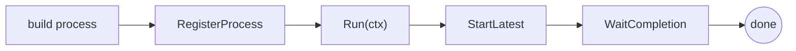

# The engine (Thresher)

The **Thresher** is gobpm's runtime. You build a process definition, hand it to
the engine to register, start the engine, then launch instances and wait for
them. Everything else in these guides runs on top of this lifecycle. Full
program: [`examples/basic-process/`](../../../examples/basic-process/).

## What it is

One `Thresher` value owns a registry of process definitions and every running
instance. Its job is a fixed sequence: **register** a definition (validate it
into an immutable launch template), **run** the engine goroutine, **start** an
instance from a template, and **wait** for that instance to finish. The engine
runs concurrently; a `*InstanceHandle` is your read-only window onto one
instance.



## Build it

Create the engine by id. The constructor takes functional options (see
below) — none are required for the defaults:

```go
engine, err := thresher.New("basic-process-engine")
if err != nil {
    return fmt.Errorf("create engine: %w", err)
}
```

Register your built process, then start the engine goroutine under a context:

```go
if _, err := engine.RegisterProcess(proc); err != nil {
    return fmt.Errorf("register process: %w", err)
}

ctx, cancel := context.WithTimeout(context.Background(), 5*time.Second)
defer cancel()

if err := engine.Run(ctx); err != nil {
    return fmt.Errorf("run engine: %w", err)
}
```

Launch an instance of the latest registered version and block until it reaches
a terminal state:

```go
h, err := engine.StartLatest(proc.ID())
if err != nil {
    return fmt.Errorf("start process: %w", err)
}

state, err := h.WaitCompletion(ctx)
if err != nil {
    return fmt.Errorf("waiting for completion: %w", err)
}

fmt.Printf("✓ basic-process completed (%s): "+
    "start → service task (read property + RUNTIME var) → end\n", state)
```

> **Note:** Call `data.CreateDefaultStates()` once, before building any
> data-carrying elements — it registers the standard data states (`Ready`,
> `Unavailable`, …) that process properties instantiate with.

## Run it

```bash
cd examples/basic-process && go run .
```

After the engine's startup banner and config dump, the instance runs the task
and completes:

```
INFO ProcessLifecycle Registered process_id=7529709890222987772 version=1
INFO EngineState Starting
INFO HubState Started
INFO EngineState Started
INFO InstanceState Created instance_id=8360685402112941243
INFO InstanceState Active instance_id=8360685402112941243
  ▶ hello, dr.Dobermann (instance started at 2026-07-26 20:18:43.471255821 …)
INFO InstanceState Completed instance_id=8360685402112941243
✓ basic-process completed (Completed): start → service task (read property + RUNTIME var) → end
```

## How it works

The four calls map to four responsibilities:

- **`RegisterProcess`** validates the definition and snapshots it into an
  immutable launch template, assigning it a version. Every instance clones that
  template into its own node graph, so registration happens once and launches
  are cheap. It returns a `*ProcessRegistration` you can start directly.
- **`Run(ctx)`** brings the engine goroutine and the event hub up; the engine's
  lifecycle is tied to `ctx`. Cancelling `ctx` (here, the 5-second timeout)
  cascade-terminates running instances and unblocks the hub.
- **`StartLatest(key)`** launches one instance of the newest registered version
  and returns an `*InstanceHandle`. The instance runs its own goroutines
  (tracks) until an end event.
- **`WaitCompletion(ctx)`** blocks until the instance reaches a terminal state
  (`Completed` or `Terminated`), returning that state. It is backed by the
  instance's terminal done-channel — a guaranteed, never-dropped signal — so it
  replaces any manual done channel or grace sleep.

The handle is observation-only: it exposes `State()`, `ID()`, `Data()`,
`History()`, `Tokens()`, and `Cancel()` — never the instance itself — so a host
cannot corrupt a running instance.

## Options & variations

`thresher.New` accepts functional options that swap in engine subsystems; the
defaults (in-memory repository, `slog.Default()` logger, in-memory message
broker) need no options. Common ones:

- `thresher.WithLogger(l)` — replace the logger.
- `thresher.WithoutBanner()` / `thresher.WithoutStartupConfig()` — silence the
  startup banner and the config dump shown above.
- `thresher.WithMessageBroker(b)`, `thresher.WithClock(ck)`,
  `thresher.WithDataStore(ref, store)` — substitute subsystems.

Starting instances has three entry points:

- `StartLatest(key)` — newest registered version (used above).
- `StartVersion(key, version)` — a specific 1-based version by `(key, version)`.
- `StartProcess(reg)` — start from a `*ProcessRegistration` handle directly.

To register but defer the first launch, pass `thresher.WithManualStart()` to
`RegisterProcess`. When you are done, `engine.Shutdown(ctx)` gracefully stops
the engine, cascade-terminating instances and draining the hub.

> **Warning:** `Run`, `StartLatest`, and `WaitCompletion` all take a context.
> Give them one with a deadline (or cancel it yourself) — a bare
> `context.Background()` will let `WaitCompletion` block forever if an instance
> never terminates.

## See also

- Full example: [`examples/basic-process/`](../../../examples/basic-process/)
- Next: [Your first process](../getting-started/first-process.md) · [Running & observing](../getting-started/running-and-observing.md)
- Then: [Process, instance, track, token](execution-model.md) — how a definition becomes running work.
