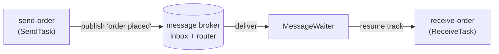

# Events & the hub

BPMN work rarely runs start-to-finish in one straight line: a task waits for a
message, a boundary event arms a timer, a signal fans out to every listener. In
gobpm the piece that makes those *waits* work is the **event hub** — the engine's
central router between elements that produce events and elements that wait on
them. This page shows how a message travels from a SendTask to a ReceiveTask, and
what the hub does in between. Full program:
[`examples/message-send-receive/`](../../../examples/message-send-receive/).

## What it is

Two moving parts sit under every catching event:

- The **event hub** (`EventHub`) — when an element wants to catch an event, it
  registers with the hub, which creates a per-element **waiter** running in its
  own goroutine. When a matching event fires, the waiter notifies the element's
  track so it can resume.
- The **message broker** (`*membroker.Broker`, one of the engine's default
  services) — an in-memory inbox plus correlation router. A SendTask *publishes*
  an envelope to the broker; the broker delivers it to the subscription whose
  keys match, buffering it if no one is waiting yet.

Timers and signals flow through the same hub — a timer waiter fires on a clock
tick, a signal waiter fires on a broadcast — so the routing model below is the
one shared shape behind every catching event.



## Build it

A **SendTask** carries a `Message`; sending it publishes the bound property to
the broker under the message's name:

```go
send, err := activities.NewSendTask("send-order",
    bpmncommon.MustMessage("order placed",
        data.MustItemDefinition(values.NewVariable(""),
            foundation.WithID("order_out"))),
    activities.WithoutParams())
```

A **ReceiveTask** carries a `Message` with the *same name* — that name is the
subscription key. When the task activates it registers a waiter on the hub and
parks; on arrival it binds the payload into scope (here as `order_in`):

```go
receive, err := activities.NewReceiveTask("receive-order",
    bpmncommon.MustMessage("order placed",
        data.MustItemDefinition(values.NewVariable(""),
            foundation.WithID("order_in"))),
    activities.WithParameters(data.Output, outParam))
```

Both tasks live on **one track**, wired in a straight line, so the send runs to
completion before the receive subscribes:

```go
for _, l := range [][2]flow.Element{
    {start, send}, {send, receive}, {receive, confirm}, {confirm, end},
} {
    if err := link(l[0], l[1]); err != nil {
        return err
    }
}
```

The broker buffers the published envelope in its inbox until the receive
subscribes — so a same-track send-then-receive still connects.

## Run it

```bash
cd examples/message-send-receive && go run .
```

After the engine's startup banner, the message crosses the broker and the
ReceiveTask binds the payload:

```
  ✓ send-order published "ORD-2026-001"
  ✓ receive-order bound it into received-order = "ORD-2026-001"
✓ message-demo completed: the message travelled the broker from the SendTask to the ReceiveTask
```

> **Note:** The startup banner (engine id + a config dump listing
> `messageBroker: *membroker.Broker`) and the per-state `INFO` lines are the
> engine's operator log — filter them out to see the two `✓` lines above.

## How it works

Registration and delivery are the two halves of every catch:

- **Register.** When the ReceiveTask activates, it calls the hub's
  `RegisterEvent` with itself (an `EventProcessor`) and its message definition.
  The hub spins up a **MessageWaiter** in a dedicated goroutine, keyed by the
  message name, and subscribes it on the broker. The track parks.
- **Deliver.** The SendTask publishes the `"order placed"` envelope to the
  broker. The broker's router matches it to the waiting subscription and hands it
  off; the waiter fires (`WaiterFired`) and resumes the parked track, which binds
  the payload and runs on.
- **Buffer.** If nothing is subscribed yet — exactly the same-track case here —
  the broker holds the envelope in a **bounded** inbox and delivers it the moment
  a matching subscription appears. The inbox drops the oldest entry past its cap,
  so uncorrelated messages can't grow without bound.

The broker delivers **most-specific-first**: a subscription whose key-set carries
the message's correlation key is preferred over a bare name match, which is what
lets a follow-up message route to the one conversation that owns it rather than
to an engine-level instance-starter.

> **Note:** In this example a trailing `confirm` ServiceTask signals a `done`
> channel so the driver reads the result only after the receive has resumed —
> otherwise `main` would race the engine goroutines. In real code you wait on the
> instance handle, not on scope internals.

## Options & variations

- **Timers.** A timer event registers a `TimeWaiter` on the same hub; it fires on
  a clock tick instead of a broker delivery. See [Timer](../events/timer.md).
- **Signals.** A signal broadcast fires *every* matching signal waiter at once
  (fan-out), where a message goes to one subscriber. See
  [Signal](../events/signal.md).
- **Correlation.** To route a message to a specific running instance rather than
  any listener, attach correlation keys; the broker's most-specific delivery
  picks the owning conversation. See
  [Correlation & conversations](../operating/correlation.md).
- **Intermediate vs. task.** The same message plumbing backs intermediate
  message catch/throw events, not just Send/Receive tasks. See
  [Message](../events/message.md).

## See also

- Full example: [`examples/message-send-receive/`](../../../examples/message-send-receive/)
- Related: [Message](../events/message.md) · [Signal](../events/signal.md) · [Timer](../events/timer.md)
- Then route to the right instance: [Correlation & conversations](../operating/correlation.md)
