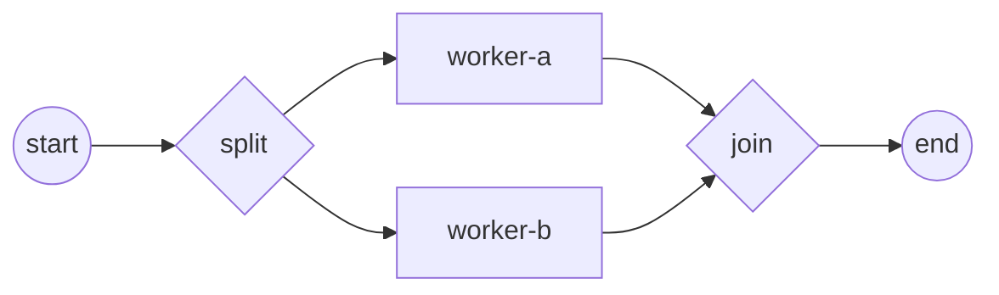

# Process, instance, track, token

A **process** is a definition you build once; running it produces an
**instance**, and inside that instance the work advances as **tokens** carried
along **tracks**. Understanding these four words is enough to reason about why
branches run concurrently and where a process waits. This page grounds them in a
parallel-gateway process that forks two branches and rejoins them. Full program:
[`examples/parallel-gateway/`](../../../examples/parallel-gateway/).

## What it is

- **Process** — the static model: flow nodes (events, tasks, gateways) wired by
  sequence flows. It never runs; it is registered as a launch template.
- **Instance** — one live execution of that definition. Each `StartLatest` clones
  the template and gives you an independent run with its own data and state.
- **Token** — the moving "here is where control is" marker. It enters at a start
  event and flows node → node along the sequence flows.
- **Track** — the goroutine that carries a token. A diverging parallel gateway
  spawns a track per outgoing branch, so the branches run *concurrently*; a
  converging gateway waits for every inbound track before a single token leaves.



One token starts at `start`. The diverging `split` forks it into two tracks —
`worker-a` and `worker-b` run at the same time. The converging `join` blocks
until both tracks arrive, then lets one token continue to `end`.

## Build it

The fork and join are two `ParallelGateway` nodes with opposite directions. The
branches between them are ordinary service tasks:

```go
split, _ := gateways.NewParallelGateway(
    gateways.WithDirection(gateways.Diverging))

workerA, _ := newWorker("worker-a", done)
workerB, _ := newWorker("worker-b", done)

join, _ := gateways.NewParallelGateway(
    gateways.WithDirection(gateways.Converging))
```

Add every node to the process, then wire the sequence flows that shape the
fork/join:

```go
for _, e := range []flow.Element{start, split, workerA, workerB, join, end} {
    proc.Add(e)
}

// start ─> split ─┬─> worker-a ─┬─> join ─> end
//                 └─> worker-b ─┘
for _, l := range [][2]flow.Element{
    {start, split},
    {split, workerA}, {split, workerB},
    {workerA, join}, {workerB, join},
    {join, end},
} {
    link(l[0], l[1])
}
```

Each worker's operation is a plain Go functor; it prints when its track runs, so
the output makes concurrency visible:

```go
op, _ := gooper.New(name+"-op",
    func(_ context.Context, _ service.DataReader, _ *data.ItemDefinition) (*data.ItemDefinition, error) {
        fmt.Printf("  ▶ %s executed\n", name)
        done <- name
        return nil, nil
    })
```

## Run it

```bash
cd examples/parallel-gateway && go run .
```

After the engine's startup banner, both branches run, the join synchronizes, and
the instance completes:

```
2026/07/26 20:18:43 INFO InstanceState Created instance_id=373513594881132422
2026/07/26 20:18:43 INFO InstanceState Active instance_id=373513594881132422
  ▶ worker-a executed
  ▶ worker-b executed
2026/07/26 20:18:43 INFO InstanceState Completed instance_id=373513594881132422
✓ parallel-demo completed: split forked both branches, join synchronized, one token reached End
```

## How it works

Registering the process snapshots it into an immutable launch template;
`StartLatest` clones that template into one instance and returns a handle:

```go
engine.RegisterProcess(proc)          // definition → immutable launch template
engine.Run(ctx)                       // engine goroutine comes up
engine.StartLatest(proc.ID())         // one instance; its tracks start running
```

- The instance walks its own copy of the node graph. It begins with a single
  **track** carrying one **token** out of `start`.
- Reaching the **diverging** gateway, the instance forks: one **new track per
  outgoing branch**. That is why `worker-a` and `worker-b` execute concurrently —
  each runs on its own goroutine (the order they print in is not fixed).
- The **converging** gateway is a barrier: it counts inbound tracks and holds
  until *every* branch has arrived. Only then does a single token pass to `end` —
  the branch tokens are merged, not duplicated.
- When the last token reaches the end event, the instance transitions
  `Created → Active → Completed` (visible in the `InstanceState` log lines).

> **Note:** The two branches share the instance's data plane but run on separate
> tracks. Because their functors here only print and signal a channel, they are
> independent; if branches wrote the same data path you would need to design for
> that concurrency (see the data-plane guide).

## Options & variations

- **Direction** — `gateways.WithDirection(gateways.Diverging)` forks;
  `Converging` synchronizes. A gateway with one direction only does that job; use
  a matched pair to fork-then-join.
- **Branch count** — add more `{split, workerN}` / `{workerN, join}` links and the
  fork/join scales; the join still waits for all of them.
- **Many instances** — call `StartLatest` again for a second, fully independent
  instance; each has its own tracks, tokens, and data.
- **Other joins** — a parallel join waits for *all* branches. Exclusive routes
  *one*, inclusive waits for the branches it actually activated. The token model
  is the same; only the gating differs.

## See also

- Full example: [`examples/parallel-gateway/`](../../../examples/parallel-gateway/)
- Related: [Parallel (AND) gateway](../gateways/parallel.md) · [The engine (Thresher)](engine.md) · [Your first process](../getting-started/first-process.md)
