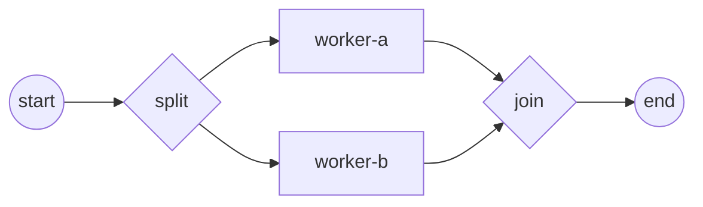

# Process, instance, track, token

Four words describe everything the engine does at runtime. A **process** is a
definition you build once; running it produces an **instance**; inside that
instance control advances as **tokens** carried along **tracks**. Get these
straight and you can reason about why branches run concurrently, where a process
waits, and what a running instance will let you observe.

This page explains the runtime *behavior* and the **public contract** you touch
to observe it — the `thresher.InstanceHandle` window and its projection types.
The instance machinery itself lives in `internal/instance` and is not an API you
call; its rationale is [ADR-001 — execution model](../../design/ADR-001-execution-model.md).
The worked run is a parallel-gateway process:
[`examples/parallel-gateway/`](../../../examples/parallel-gateway/).

## The four terms

| Term | What it is | Lifetime |
|---|---|---|
| **Process** | The static model — flow nodes (events, tasks, gateways) wired by sequence flows. It never runs; you register it as a launch template. | Built once, registered, reused. |
| **Instance** | One live execution of that definition. Each start clones the template into an independent run with its own data and state. | Created → runs → Completed / Terminated. |
| **Token** | The "here is where control is" marker. It enters at a start event and flows node → node along the sequence flows. In gobpm a token is a *derived projection* of a track's position, not a stored object. | Alive while its track advances; Consumed when merged or ended. |
| **Track** | The goroutine that carries a token. A diverging parallel gateway spawns one track per outgoing branch, so branches run *concurrently*; a converging gateway waits for every inbound track before one token leaves. | One per active branch. |



One token starts at `start`. The diverging `split` forks it into two tracks —
`worker-a` and `worker-b` run at the same time. The converging `join` blocks
until both tracks arrive, then lets one token continue to `end`.

## From definition to running work

Registering a process snapshots it into an immutable launch template; a start
call clones that template into one instance and hands back a **handle**:

```go
reg, _ := engine.RegisterProcess(proc) // definition → immutable launch template
engine.Run(ctx)                        // engine goroutine comes up
h, _ := engine.StartLatest(proc.ID())  // one instance; its tracks start running
```

- `RegisterProcess` validates the model and freezes it as a snapshot. The
  snapshot is a *launch template*, not a durable checkpoint — instance tracks,
  scopes, and history are not stored in it (durable persistence is future work;
  see the snapshot notes in [ADR-001](../../design/ADR-001-execution-model.md)).
- Each start clones the snapshot into a fresh instance with its own node graph,
  data plane, and state. Call a start method again for a second, fully
  independent instance.
- The three start entry points differ only in *which* registered version they
  launch:

| Method | Launches |
|---|---|
| `StartLatest(key string) (*InstanceHandle, error)` | the latest registered version of `key`. |
| `StartVersion(key string, version int) (*InstanceHandle, error)` | a specific pinned version. |
| `StartProcess(reg *ProcessRegistration) (*InstanceHandle, error)` | the exact registration you hold. |

Each returns an `*InstanceHandle` — your read-only window onto that run. See
[Registering & versioning](../operating/registering-and-versioning.md).

## How tracks and tokens move

Inside the instance the four terms come to life:

- The instance begins with a **single track** carrying **one token** out of the
  start event.
- Reaching a **diverging** gateway the instance forks: **one new track per
  outgoing branch**. Each track is its own goroutine, so the branches execute
  concurrently — the order they interleave in is not fixed.
- A **converging** gateway is a barrier: it counts inbound tracks and holds
  until *every* branch has arrived. Only then does one token pass onward — the
  branch tokens are **merged, not duplicated**. The absorbed track records a
  merge edge to the survivor (visible in the token history's `MergedInto`).
- When the last token reaches an end event, the instance transitions
  `Created → Active → Completed`.

> A wait node (an event catch, a User Task, an external-worker Service Task)
> **parks** its track rather than blocking a goroutine — the token sits in the
> `WaitForEvent` state until the awaited thing arrives, then the track resumes.
> This is why an idle instance holds no busy goroutines. See
> [How events are processed](events-and-hub.md).

## Run it

```bash
cd examples/parallel-gateway && go run .
```

After the engine's startup banner, both branches run, the join synchronizes, and
the instance completes:

```
2026/07/27 09:15:11 INFO InstanceState Created instance_id=4674360034859073246
2026/07/27 09:15:11 INFO InstanceState Active instance_id=4674360034859073246
  ▶ worker-a executed
  ▶ worker-b executed
2026/07/27 09:15:11 INFO InstanceState Completed instance_id=4674360034859073246
✓ parallel-demo completed: split forked both branches, join synchronized, one token reached End
```

The `InstanceState` log lines are the same lifecycle values the handle reports —
`Created → Active → Completed`.

## The instance contract: `InstanceHandle`

You never touch the internal instance object. Every start method returns a
`thresher.InstanceHandle` — a read-only window that exposes observation only, so
a host cannot corrupt a running instance. The members you reach for most:

| Member | Role |
|---|---|
| `State() InstanceState` | the current lifecycle state, read lock-free. |
| `WaitCompletion(ctx) (InstanceState, error)` | block until the instance finishes (or `ctx` ends); returns the terminal state. |
| `Cancel(ctx) (InstanceState, error)` | request cancellation; tracks are torn down, ending in `Terminated`. |
| `Tokens() []TokenView` | live positions — where every token currently sits. |

The full surface:

| Member | Role |
|---|---|
| `ID() string` | the instance id. |
| `Data() service.DataReader` | read the instance's data plane by name. |
| `History() []TokenPath` | every track's recorded path, including finished (Consumed) tracks, with fork lineage and per-step timings. |
| `Observe(o Observer) *Subscription` | subscribe to this instance's facts (state changes, data changes, node visits). |
| `Suspend(ctx) error` / `Resume(ctx) error` | pause / resume the run. |

> `InstanceHandle` wraps the internal instance **by reference** — it stays live
> as the instance runs, so `State()` and `Tokens()` reflect the current moment,
> not a snapshot taken at start.

## The lifecycle vocabulary: `InstanceState`

`InstanceState` is a `string`-typed, **open** vocabulary — consumers must
tolerate unknown values, because the set grows additively as new subsystems land
(no breaking change). The values today:

| Constant | Value | Meaning |
|---|---|---|
| `StateCreated` | `"Created"` | cloned, not yet running. |
| `StateActive` | `"Active"` | running its tracks. |
| `StateCompleted` | `"Completed"` | all tracks ended normally. |
| `StateTerminating` | `"Terminating"` | tearing tracks down after a cancel. |
| `StateTerminated` | `"Terminated"` | finished via cancellation. |

## The token projections: `TokenView`, `TokenPath`

A token is a *derived projection* of a track's control-flow position, not a
stored object. Two flat views expose it:

`Tokens()` returns the live positions:

```go
type TokenView struct {
    NodeID   string
    NodeName string
    State    TokenState // Alive | WaitForEvent | Consumed | Invalid
}
```

`History()` returns each track's full recorded path:

```go
type TokenPath struct {
    TrackID    string
    ParentID   string      // the track this one forked from
    MergedInto string      // survivor track it was absorbed into at a join ("" if none)
    Terminal   TokenState
    Steps      []StepVisit // NodeID/NodeName/State/At per visited node
}
```

`TokenState` is the projected value — `Alive` (advancing), `WaitForEvent`
(parked at a wait node), `Consumed` (merged at a join or ended), or `Invalid`.
`ParentID` and `MergedInto` together record the fork/merge lineage: a diverging
gateway sets a child's `ParentID`; a converging gateway sets the absorbed
track's `MergedInto` to the survivor.

## See also

- Full example: [`examples/parallel-gateway/`](../../../examples/parallel-gateway/)
- Related: [How events are processed](events-and-hub.md) · [Scope & the data plane](scope-and-data.md) · [The engine (Thresher)](engine.md) · [Parallel (AND) gateway](../gateways/parallel.md)
- In practice: [Registering & versioning](../operating/registering-and-versioning.md)
- Design: [ADR-001 — execution model](../../design/ADR-001-execution-model.md)
- Full API: `go doc github.com/dr-dobermann/gobpm/pkg/thresher`
