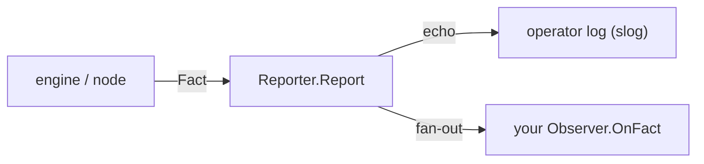

# Observability

Every meaningful thing the engine does — an engine starting, an instance
completing, a data element changing — surfaces as one **Fact**. gobpm shows
those Facts two ways at once: a synchronous **operator log** for a human tailing
output, and an asynchronous **observer** stream your code subscribes to. This
page wires an observer, filters it to a single Fact kind, and explains the split.
Full program: [`examples/data-change/`](../../../examples/data-change/).

## What it is

A **Fact** is the single canonical event type — identity, kind, phase and timing
only, never process payload values (the masking rule). A **Reporter** is the one
producer behind every Fact: on the hot path it *echoes* the Fact to the operator
log (an `slog` line) **and** fans it out to any registered **Observers**. You
implement `OnFact` once and register it; the engine's default sink already logs,
so the engine is visible before you subscribe to anything.



## Build it

An observer is any type with `OnFact(observability.Fact)`. Filter on the Fact's
`Kind` and read kind-specific identifiers out of `Details` by the `Attr*` keys:

```go
type dataChangePrinter struct{}

func (p *dataChangePrinter) OnFact(f observability.Fact) {
    if f.Kind != observability.KindDataChange {
        return
    }

    fmt.Printf("  ▶ %s %s @%s\n",
        f.Phase, f.Details[observability.AttrDataPath], f.NodeName)
}
```

Register it on the engine with `Observe`, which returns a `Subscription` you
cancel when done:

```go
engine, _ := thresher.New("data-change-engine",
    thresher.WithoutBanner(), thresher.WithoutStartupConfig())

sub := engine.Observe(&dataChangePrinter{})
defer sub.Cancel()
```

## Run it

```bash
cd examples/data-change && go run .
```

The two service tasks each commit `receipt`; the observer prints only the
`DataChange` Facts, while the engine's log echoes the lifecycle Facts:

```
2026/07/26 20:18:45 INFO EngineState Starting
2026/07/26 20:18:45 INFO HubState Started
2026/07/26 20:18:45 INFO EngineState Started
2026/07/26 20:18:45 INFO ProcessLifecycle Registered process_id=… version=1
2026/07/26 20:18:45 INFO InstanceState Created instance_id=…
2026/07/26 20:18:45 INFO InstanceState Active instance_id=…
  produce → commit receipt={sum:5}
  ▶ Value_Added receipt @produce
  reprice → commit receipt={sum:6}
2026/07/26 20:18:45 INFO InstanceState Completed instance_id=…
  ▶ Value_Updated receipt.sum @reprice
  ✓ completed (Completed)
```

The `INFO …` lines are the operator log; the `▶` lines are your observer. The
first commit is one `Value_Added` at the `receipt` root (a new subtree is one
change, not one per leaf); the re-commit is one `Value_Updated` at the changed
leaf `receipt.sum`.

## How it works

- **Two sinks, one Fact.** The Reporter both echoes to the log and fans out to
  observers. The echo is a synchronous logger call on the execution path; the
  fan-out is buffered per observer and drained by its own goroutine — so a slow
  `OnFact` never stalls the engine. If the observer falls behind its buffer,
  excess Facts are **dropped** (see `Subscription.Dropped()`), not queued
  without bound.
- **Kind and Phase.** `Kind` classifies the event by object class
  (`KindEngineState`, `KindInstanceState`, `KindDataChange`, …); `Phase` names
  the transition within a kind (`Started`, `Completed`, `Value_Updated`, …).
  Both are open vocabularies — a consumer must tolerate unknown values, because
  kinds and phases grow additively.
- **Log level is derived, not set per-call.** Lifecycle milestones echo at
  `Info`, flow tracing at `Debug`; failure phases escalate — a failed instance
  or an uncaught fault at `Error`, a job that exhausted its retries at `Warn`.
- **Some kinds are observer-only.** `KindDataChange` never reaches the operator
  log — its roughly ten-writes-per-node volume would drown flow tracing even at
  `Debug` (the flood guard). An observer is the *only* way to see it, which is
  why this example needs one.

> **Note:** `sub.Cancel()` drains the buffered Facts before it returns. The
> example calls it explicitly after `WaitCompletion` so both `DataChange` lines
> land before the final status prints — otherwise the async fan-out might trail
> the synchronous log.

## Options & variations

- **Scope the stream.** `engine.Observe(o)` watches the engine-wide stream; a
  per-instance handle exposes `h.Observe(o)` for just that instance's Facts
  (its `Details` already carry `instance_id`).
- **Read identifiers from `Details`.** Kind-specific data lives in the `Details`
  map, keyed by the `Attr*` constants — `AttrDataPath`, `AttrInstanceID`,
  `AttrNodeID`, and so on. The same keys name both a Fact's `Details` and its
  log echo, so the two streams correlate.
- **Retarget the operator log.** `thresher.WithLogger(l)` swaps the sink logger
  (default `slog.Default()`); any `observability.Logger` — the leveled subset of
  `*slog.Logger` — works. Raise the log threshold to `Info` to mute the `Debug`
  flow tracing; a `nil` logger is rejected, never silently silencing the engine.
- **Silence the startup noise.** `WithoutBanner()` drops the ASCII wordmark and
  `WithoutStartupConfig()` drops the config dump — both used here so the Facts
  are the only output.

## See also

- Full example: [`examples/data-change/`](../../../examples/data-change/)
- Related: [Scope & the data plane](scope-and-data.md) · [The engine (Thresher)](engine.md)
- In practice: [Observability in practice](../operating/observability.md) — subscribe, filter, tune the log level.
