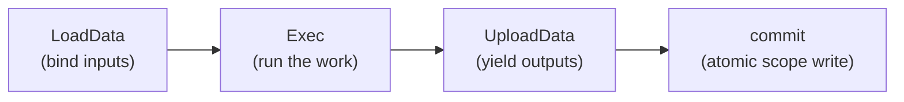

# How a process executes

Once an instance is running, its work advances one node at a time. A **track**
(the goroutine that carries a token — see [Process, instance, track,
token](execution-model.md)) drives each node through the same fixed sequence:
bind its inputs, run it, yield its outputs, commit. This page explains that per-node
cycle at the developer level — the observable behavior and the **public
contracts** a model node implements — so you can reason about *when* your
operation reads data, *when* its outputs become visible, and *why* a failed node
leaves no partial state behind.

You never call these contracts yourself; the track does. But every task, event,
and gateway implements them, and understanding the cycle is what makes the rest
of the manual (data phases, boundary events, compensation) legible.

## The per-node cycle

For every node it reaches, the track runs four phases in order:

| Phase | Contract | What happens |
|---|---|---|
| **LoadData** | `exec.NodeDataConsumer` | Instantiate the node's inputs and properties in a fresh execution **Frame**; fill inputs from incoming data associations. |
| **Exec** | `exec.NodeExecutor` | Run the node's work; return the outgoing sequence flows to follow. |
| **UploadData** | `exec.NodeDataProducer` | Fill the node's output instances in the Frame; push outgoing data associations. |
| **commit** | (internal) | Atomically write the Frame's outputs to the instance's container scope. |

The key idea is the **execution Frame**: a per-execution working set that a node
reads and writes in isolation. Reads resolve *frame-first*, then walk up the
instance's container scopes; writes go to the frame and reach the shared scope
**only at commit**. This is what gives each node execution a clean, isolated view
and makes the commit atomic — the rationale lives in
[ADR-010 — Process data model](../../design/ADR-010-process-data-model.md) §2.1–2.3
and the layering in [ADR-012 — Execution layering](../../design/ADR-012-execution-layering.md).



> A node that fails — returns an error from any phase — commits **nothing**. Its
> Frame is discarded, so the container scope never observes a partial output.
> Atomicity is per-node-execution, not something you arrange (ADR-010 §2.3).

## The contracts a node implements

These three interfaces (from `pkg/exec`) are what the track calls. A task
implements all three; a pure control node like a gateway implements only
`NodeExecutor`.

### NodeExecutor — run the node

```go
type NodeExecutor interface {
    Exec(
        ctx context.Context,
        re renv.RuntimeEnvironment,
    ) ([]*flow.SequenceFlow, error)
}
```

`Exec` runs a single node and returns its **valid outgoing sequence flows** on
success, or an error on failure. The returned flows are what the track follows
next — a gateway returns the subset its decision selected; a plain task returns
all of its outgoing flows.

### NodeDataConsumer — bind inputs (LoadData)

```go
type NodeDataConsumer interface {
    flow.Node
    LoadData(context.Context, Frame) error
}
```

`LoadData` instantiates the node's inputs and properties in the Frame and fills
the inputs from the node's incoming data associations. The track calls it
**before** the node executes.

### NodeDataProducer — yield outputs (UploadData)

```go
type NodeDataProducer interface {
    flow.Node
    UploadData(context.Context, Frame) error
}
```

`UploadData` fills the node's output instances in the Frame and pushes the
outgoing data associations. The track calls it **after** a successful execution,
right before the Frame commit.

## The runtime environment a node executes against

`Exec` receives a `renv.RuntimeEnvironment` — the environment the node runs
against, built **per execution** by the track. It is the single handle through
which a node reads data, produces values, reaches the engine's wired extensions,
and triggers instance-level control. Most nodes touch only a few of its members.

| Member | Use |
|---|---|
| `GetData(name)` / `GetDataByID(id)` | read process data by name / id (via the embedded `service.DataReader`). |
| `Put(dd ...data.Data)` | store node-produced values in the frame; they reach the scope at commit. |
| `InstanceID() string` | the running instance's id. |
| `EventProducer()` | emit an event into the instance's event flow. |
| `Terminate()` | abnormally end the whole instance (a Terminate End Event, BPMN §13.5.6). |

`RuntimeEnvironment` embeds `EngineRuntime`, which exposes the engine's resolved
extension set — `Logger()`, `Clock()`, `ExpressionEngine()`,
`WorkerDispatcher()`, `RuleEngine()`, `ScriptEngine()`, and the rest. Those are
shared across all instances; the data surface is the per-execution part. The full
control surface (`Escalate`, `Compensate`, `Cancel`) and every extension accessor
are catalogued in `go doc`.

> The reads resolve frame-first and walk the instance's container scopes; writes
> via `Put` reach the container scope only at the frame commit. Same rule as the
> Frame — the environment is just the node-facing peer of it (ADR-012 §2.3).

## The Frame surface

`LoadData` / `UploadData` operate on a `exec.Frame` — the narrow public view of
the data-plane frame (the implementation lives in `internal/scope`). A node sees
only what it needs to instantiate and read its own data:

| Method | Role |
|---|---|
| `InstantiateInputs(defs)` / `InstantiateOutputs(defs)` | create the node's input / output instances. |
| `LoadProperties(defs)` | create the node's property instances. |
| `Inputs()` / `Outputs()` | the instantiated input / output parameters. |
| `GetData(name)` / `GetDataByID(id)` | resolve data, frame-first then walking the scopes. |

## Run it

The [`basic-process`](../../../examples/basic-process/) example is a minimal
`start → service task → end` where the task's operation reads process data
through this cycle: `LoadData` makes the `user_name` property and the runtime
variable resolvable, `Exec` runs the functor, and — because the functor produces
no output — commit is a no-op.

```go
task, _ := activities.NewServiceTask("work", op, activities.WithoutParams())
```

Running it (banner elided) shows the instance advancing `Created → Active →
Completed`, with the functor's read landing between the two data phases:

```
INFO InstanceState Created instance_id=4425642140267283287
INFO InstanceState Active instance_id=4425642140267283287
  ▶ hello, dr.Dobermann (instance started at 2026-07-27 09:14:10 …)
INFO InstanceState Completed instance_id=4425642140267283287
```

## Synchronizing joins

A converging parallel or inclusive gateway does more than `Exec`: it must
**synchronize** several incoming flows before it fires. Such a node implements
`exec.SynchronizingJoin` — `NodeExecutor` plus an `Arrive` method the loop calls
per inbound token to ask "is the join complete yet?". The token model is
unchanged; only the gating differs. See [Process, instance, track,
token](execution-model.md) for the fork/join walkthrough.

## See also

- Example: [`examples/basic-process/`](../../../examples/basic-process/)
- Related guides: [Process, instance, track, token](execution-model.md) · [Scope & the data plane](scope-and-data.md) · [The engine (Thresher)](engine.md)
- Design: [ADR-010 — Process data model](../../design/ADR-010-process-data-model.md) · [ADR-012 — Execution layering](../../design/ADR-012-execution-layering.md)
- Full API: `go doc github.com/dr-dobermann/gobpm/pkg/exec` · `go doc github.com/dr-dobermann/gobpm/pkg/renv`
