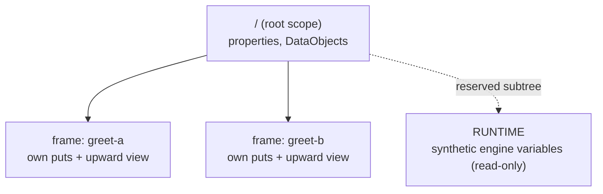

# Scope & the data plane

Every running process carries data — properties you seed at build time, results
your tasks produce, runtime facts the engine synthesizes. In gobpm all of it
lives in one **data plane**: a per-instance tree of container scopes keyed by
path. Your Go code never reaches into that tree; it reads **by name** through a
narrow, read-only surface — `service.DataReader` — and the plane resolves the
name for you by walking the tree. This page shows where the data sits, what the
public read surface is, and how a name becomes a value. The internal *why* lives
in [ADR-010](../../design/ADR-010-process-data-model.md) (the data model) and
[ADR-011](../../design/ADR-011-process-data-flow.md) (the data flow); the
runnable program is [`examples/process-data/`](../../../examples/process-data/).

## What it is

A running instance owns a **scope tree** (`internal/scope`, described here only
as behavior — it is not an API you call). The root scope (`/`) holds the
process's **properties** and **DataObjects**. Each activity that runs — a task,
a sub-process — opens a child **frame** under its path (`/`, `/subprocess`,
`/subprocess/task`) and drops it when it finishes. A frame is one node
execution's private working set *plus* a view up the tree: it resolves a plain
name **frame-first**, then walks up its container chain until the name is found
— the structural visibility of BPMN §10.4.



Two addressing modes share this one plane:

| Read | Form | Resolves to |
|---|---|---|
| **Named data** | a plain name — `user_name` | the default scope: the frame first, then the container walk up to the root property/DataObject. |
| **Source read** | a path-qualified name — `SOURCE/addr` | a named data source; the first segment picks the source, the rest is its own address space. |

The engine's `RUNTIME` subtree is one such source — a reserved, read-only supply
of synthetic variables (`STARTED_AT`, `STATE`, `TRACKS_CNT`) synthesized on each
read, so every read observes live engine state.

## The read surface — `service.DataReader`

Every read of the data plane goes through one public interface. A Go operation
receives it as its `r` argument; the instance handle exposes the same interface
for host-side reads after a run. It is read-only by construction — no writes, no
lifecycle, no events.

```go
type DataReader interface {
    // GetData resolves a datum by name (a plain name reads the default scope;
    // "SOURCE/addr" reads a named data source).
    GetData(name string) (data.Data, error)

    // GetDataByID resolves a datum by its ItemDefinition id.
    GetDataByID(id string) (data.Data, error)

    // GetSources lists the named data sources reachable through the reader.
    GetSources() []string

    // List enumerates variable names at the default scope (empty path) or a
    // named source.
    List(path string) ([]string, error)
}
```

Most reads need only the first member:

| Member | When you reach for it |
|---|---|
| `GetData(name)` | read a property/DataObject by plain name, or a source var by `SOURCE/addr`. |
| `GetDataByID(id)` | read by the ItemDefinition id rather than the element name (same frame-first walk). |
| `List(path)` | enumerate names at the default scope (`""`) or inside a named source. |
| `GetSources()` | discover the named sources (like `RUNTIME`) a reader can reach. |

`GetData` returns a `data.Data` — the read model shared by properties,
parameters, and DataObjects. Its `Value()` gives the live value; `State()` its
data state; `ItemDefinition()` the underlying item.

```go
type Data interface {
    foundation.BaseObject
    foundation.Namer

    Value() Value                     // the live value
    State() SrcState                  // Ready / Unavailable / …
    ItemDefinition() *ItemDefinition  // the underlying item
}
```

## Build it

Seed a process **property** at the root — it lands in the instance's root scope
at start, and every branch resolves it through its own frame:

```go
proc, err := process.New("data-demo",
    data.WithProperties(
        data.MustProperty("user_name",
            data.MustItemDefinition(
                values.NewVariable("dr.Dobermann"),
                foundation.WithID("user_name")),
            data.ReadyDataState)))
```

Inside a task's Go operation, reach data through the `service.DataReader` — by
plain name for the property, by `RUNTIME/…` path for an engine variable:

```go
// the process property, by plain name ...
who, err := r.GetData("user_name")
if err != nil {
    return nil, fmt.Errorf("read user_name: %w", err)
}

// ... and an engine runtime variable, by its RUNTIME path.
started, err := r.GetData("RUNTIME/STARTED_AT")
if err != nil {
    return nil, fmt.Errorf("read RUNTIME/STARTED_AT: %w", err)
}
```

To land a **result** back in the plane, declare a task output and bind a
DataObject to it. The operation returns the value; the output association copies
it into the DataObject, which lives in the instance's scope:

```go
outParam := data.MustParameter(name+" result",
    data.MustItemAwareElement(
        data.MustItemDefinition(
            values.NewVariable(""),
            foundation.WithID(resID)),
        data.UnavailableDataState))

st, err := activities.NewServiceTask(name, op,
    activities.WithParameters(data.Output, outParam))

resDO, err := dataobjects.New(name+"-result", /* item definition */, nil)
if err := resDO.AssociateSource(st, []string{resID}, nil); err != nil {
    return nil, nil, fmt.Errorf("bind %s result object: %w", name, err)
}
```

After the instance finishes, read the DataObject back **by name** through the
same `DataReader` — this time from the instance handle:

```go
d, err := h.Data().GetData(res.do.Name())     // h.Data() is a service.DataReader
got := d.Value().Get(bg).(string)
```

## Run it

```bash
cd examples/process-data && go run .
```

Two parallel branches each read the `user_name` property and the `STARTED_AT`
runtime variable, produce a greeting, and land it in their own DataObject; the
results are then read back by name through the handle (banner and config dump
omitted):

```
  ▶ greet-a produced "Hello, dr.Dobermann!" (instance started 2026-07-27 09:14:23 …)
  ▶ greet-b produced "Welcome, dr.Dobermann!" (instance started 2026-07-27 09:14:23 …)
  ✓ greet-a-result = "Hello, dr.Dobermann!"
  ✓ greet-b-result = "Welcome, dr.Dobermann!"
✓ data-demo completed: the property fed both branches through their frames; each result reached its per-instance DataObject in scope, read back by name
```

## How name resolution works

Name resolution is the whole behavior. When `r.GetData("user_name")` runs inside
a branch:

1. The name is **plain** (no `/`), so it resolves against the default scope.
2. Resolution is **frame-first**: the branch's own frame is checked, then the
   walk climbs its container chain (`/greet-a` → `/`) until the name is found.
3. `user_name` isn't in the branch frame, so the walk finds it at the **root**,
   where the process property was seeded.

A **path-qualified** name (`RUNTIME/STARTED_AT`) is dispatched differently. The
plane splits it on the first `/` (`data.PathSeparator`): the head names a
**source** and the tail is passed verbatim to that source's own address space.
`RUNTIME` is served by the instance itself — its variables are synthesized on
each read, so every read observes live engine state. That subtree is read-only:
a commit or an attempt to open a scope under it is rejected.

Because each branch has its **own frame**, two parallel branches reading the
same root property never collide, and each branch's produced result flows into
its **own** per-instance DataObject at frame commit. Writes are scoped to the
frame and committed all-or-nothing; the root property is shared for reading but
not overwritten by branch work. Cross-track serialization is the plane's own
job — a frame is owned by exactly one execution and is not safe for concurrent
use, but the plane serializes commits.

> The root scope (`/`) holds properties and DataObjects. A frame that opens
> under it (a sub-process or task path) *adds* a layer and drops it when the
> activity finishes — so data is visible only within the scope that owns it,
> plus everything above it on the walk.

## Sources & the RUNTIME subtree

A **source** is a read-only named data supply reached with a path-qualified
read. The public seam is `data.SourceProvider` — an embedding application can
register its own source (a business object, a JSON document) and have
`SOURCE/addr` dispatch to it:

```go
type SourceProvider interface {
    // Get resolves addr within the provider's address space.
    Get(addr string) (Data, error)

    // Names lists the addresses the provider currently serves.
    Names() []string
}
```

The reserved `RUNTIME` source is built in. It is served by the running instance
and exposes three synthetic variables, each computed on read:

| Path | Meaning |
|---|---|
| `RUNTIME/STARTED_AT` | the instant the instance started. |
| `RUNTIME/STATE` | the instance's current state. |
| `RUNTIME/TRACKS_CNT` | the number of live tracks. |

The subtree is strictly read-only — read these, but never write there.

## Variations

- **Read by ID** — `GetDataByID(id)` resolves against the ItemDefinition id
  rather than the element name, using the same frame-first walk.
- **List what's reachable** — `List("")` enumerates names at the default scope;
  `List("RUNTIME")` (or any source name) enumerates that source; `GetSources()`
  lists the sources a reader can reach.
- **Properties vs DataObjects** — a property is a seeded input at the root; a
  DataObject is a named container in the same root scope that a task output
  association fills. Both resolve by name through the plane.

## See also

- Example: [`examples/process-data/`](../../../examples/process-data/)
- [Your first process](../getting-started/first-process.md) — the smallest read of a property + a `RUNTIME` variable.
- [How a process executes](process-execution.md) — the data phases (`LoadData`/`Exec`/`UploadData`/commit) that open and close frames.
- [Process, instance, track, token](execution-model.md) — how frames belong to the tracks that run them.
- [Data Objects](../data/data-objects.md) — scope-resident named containers in depth.
- Design: [ADR-010 — process data model](../../design/ADR-010-process-data-model.md) · [ADR-011 — process data flow](../../design/ADR-011-process-data-flow.md)
- Full API: `go doc github.com/dr-dobermann/gobpm/pkg/model/service` · `go doc github.com/dr-dobermann/gobpm/pkg/model/data`
