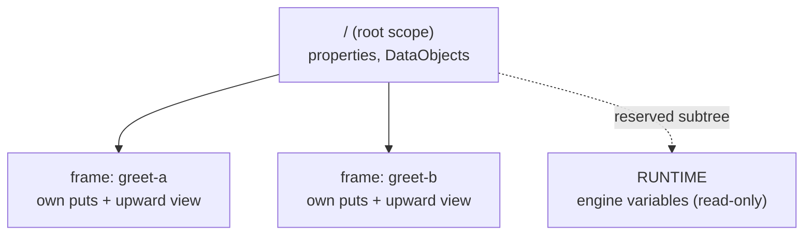

# Scope & the data plane

Every process carries data — properties you seed, results your tasks produce,
runtime facts the engine supplies. In gobpm all of it lives in a **data plane**:
a tree of scopes keyed by path. Your Go code never touches that tree directly;
it reads and writes **by name** through a narrow data surface, and the plane
resolves the name for you. This page shows where data sits and how a name
becomes a value. Full program:
[`examples/process-data/`](../../../examples/process-data/).

## What it is

A running instance owns a **scope tree**. The root (`/`) holds the process's
**properties** and **DataObjects**. Each activity that runs — a task, a
sub-process — opens a child **frame** under its path (`/`, `/subprocess`,
`/subprocess/task`). A frame is a task's private working set *plus* a view up
the tree: it resolves a plain name **frame-first**, then walks up its container
chain until the name is found.



Two things share this one plane:

- **Named data** — a plain name (`user_name`) resolves against the default
  scope: the frame first, then up the container walk to the root property.
- **Sources** — a path-qualified name (`SOURCE/addr`) reads a named data
  source. The engine's `RUNTIME` subtree is one such source, holding synthetic,
  read-only variables like `STARTED_AT`.

## Build it

Seed a process **property** at the root — it lands in the instance's root scope
at start, and every branch resolves it through its own frame:

```go
proc, err := process.New("data-demo",
    data.WithProperties(
        data.MustProperty("user_name",
            data.MustItemDefinition(
                values.NewVariable("dr.Dobermann"),
                foundation.WithID("user_name")),
            data.ReadyDataState)))
```

Inside a task's Go operation, reach data through the read-only `DataReader` —
by plain name for the property, by `RUNTIME/…` path for an engine variable:

```go
// the process property, by plain name ...
who, err := r.GetData("user_name")
if err != nil {
    return nil, fmt.Errorf("read user_name: %w", err)
}

// ... and an engine runtime variable, by its RUNTIME path.
started, err := r.GetData("RUNTIME/STARTED_AT")
if err != nil {
    return nil, fmt.Errorf("read RUNTIME/STARTED_AT: %w", err)
}
```

To land a **result** back in the plane, declare a task output and bind a
DataObject to it. The operation returns the value; the output association copies
it into the DataObject, which lives in the instance's scope:

```go
outParam := data.MustParameter(name+" result",
    data.MustItemAwareElement(
        data.MustItemDefinition(
            values.NewVariable(""),
            foundation.WithID(resID)),
        data.UnavailableDataState))

st, err := activities.NewServiceTask(name, op,
    activities.WithParameters(data.Output, outParam))

resDO, err := dataobjects.New(name+"-result", /* item definition */, nil)
if err := resDO.AssociateSource(st, []string{resID}, nil); err != nil {
    return nil, nil, fmt.Errorf("bind %s result object: %w", name, err)
}
```

After the instance finishes, read the DataObject back **by name** from that
instance's own scope through the handle:

```go
d, err := h.Data().GetData(res.do.Name())
got := d.Value().Get(bg).(string)
```

## Run it

```bash
cd examples/process-data && go run .
```

Two parallel branches each read the property, produce a greeting, and land it in
their own DataObject; the results are read back by name (banner and config dump
omitted):

```
  ▶ greet-b produced "Welcome, dr.Dobermann!" (instance started 2026-07-26 20:18:41 …)
  ▶ greet-a produced "Hello, dr.Dobermann!" (instance started 2026-07-26 20:18:41 …)
  ✓ greet-a-result = "Hello, dr.Dobermann!"
  ✓ greet-b-result = "Welcome, dr.Dobermann!"
✓ data-demo completed: the property fed both branches through their frames; each result reached its per-instance DataObject in scope, read back by name
```

## How it works

Name resolution is the whole story. When `r.GetData("user_name")` runs inside a
branch:

1. The name is **plain** (no `/`), so it resolves against the default scope.
2. Resolution is **frame-first**: the branch's own frame is checked, then the
   walk climbs its container chain (`/greet-a` → `/`) until the name is found.
3. `user_name` isn't in the branch frame, so the walk finds it at the **root**,
   where the process property was seeded.

A **path-qualified** name (`RUNTIME/STARTED_AT`) is dispatched differently: the
first segment names a **source**, and the rest addresses within it. `RUNTIME` is
a reserved subtree served by the engine — its variables are synthesized on each
read, so every read observes live engine state.

Because each branch has its **own frame**, two parallel branches reading the same
root property never collide, and each branch's produced result flows into its
**own** per-instance DataObject at frame commit. Writes are scoped to the frame
and committed all-or-nothing; the root property is shared for reading but not
overwritten by branch work.

> **Note:** The root scope (`/`) holds properties and DataObjects. A frame that
> opens under it (a sub-process or task path) *adds* a layer and drops it when
> the activity finishes — so data is visible only within the scope that owns it,
> plus everything above it on the walk.

## Options & variations

- **Read by ID instead of name** — `GetDataByID(id)` resolves against the
  ItemDefinition id rather than the element name, using the same frame-first
  walk.
- **List what's reachable** — `List("")` enumerates names at the default scope;
  `GetSources()` lists the named sources (like `RUNTIME`) a reader can reach.
- **Runtime variables** — the `RUNTIME` subtree is **read-only**; a commit or an
  attempt to open a scope under it is rejected. Read `RUNTIME/STARTED_AT` and
  the other engine variables, but never write there.
- **DataObjects vs properties** — a property is a seeded input at the root; a
  DataObject is a named container in the same root scope that a task output
  association fills. Both resolve by name through the plane.

## See also

- Full example: [`examples/process-data/`](../../../examples/process-data/)
- [Your first process](../getting-started/first-process.md) — the smallest read of a property + `RUNTIME` variable.
- [Process, instance, track, token](execution-model.md) — how frames belong to the tracks that run them.
- [Data Objects](../data/data-objects.md) — scope-resident named containers in depth.
