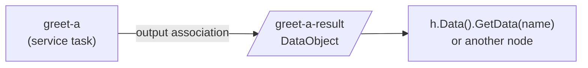

# Data Objects

A **DataObject** is a named container that lives in an instance's scope and
holds a value a task produces. You register it on the process, wire a task
output into it with a data association, and read it back by name — from another
node or from the instance handle. Full program:
[`examples/process-data/`](../../../examples/process-data/).

## What it is

Where a **property** is data you seed at build time, a **DataObject** is data a
node writes at run time. It is per-instance — each instance clones its own copy,
so concurrent instances never share DataObject state. A task's *output
association* copies the task's result into the object; from then on the object
is just another scope-resident value reachable by name.



## Build it

Create the object from an item definition, then associate the producing task as
its source. The `sourceIDs` slice names the task output ids whose values flow
into the object:

```go
resDO, err := dataobjects.New(name+"-result",
    data.MustItemDefinition(
        values.NewVariable(""),
        foundation.WithID(resID)),
    nil)

// task output → DataObject
err = resDO.AssociateSource(st, []string{resID}, nil)
```

The task must declare the matching output the association reads. The output
parameter's id (`resID`) is what ties the two together:

```go
outParam := data.MustParameter(name+" result",
    data.MustItemAwareElement(
        data.MustItemDefinition(
            values.NewVariable(""),
            foundation.WithID(resID)),
        data.UnavailableDataState))

st, _ := activities.NewServiceTask(name, op,
    activities.WithParameters(data.Output, outParam))
```

Register the DataObject on the process alongside the flow nodes, so every
instance seeds its own copy into scope:

```go
for _, e := range []flow.Element{
    start, split, greetA, greetB, endA, endB, resultA, resultB,
} {
    proc.Add(e)
}
```

## Run it

```bash
cd examples/process-data && go run .
```

Two parallel branches each produce a greeting and land it in their own
per-instance DataObject; the program reads each one back by name:

```
  ▶ greet-a produced "Hello, dr.Dobermann!" (instance started 2026-07-26 …)
  ▶ greet-b produced "Welcome, dr.Dobermann!" (instance started 2026-07-26 …)
  ✓ greet-a-result = "Hello, dr.Dobermann!"
  ✓ greet-b-result = "Welcome, dr.Dobermann!"
✓ data-demo completed: the property fed both branches through their frames;
  each result reached its per-instance DataObject in scope, read back by name
```

## How it works

The task runs, returns an item definition carrying the output id, and the
producer stage copies that value along the association into the DataObject in
scope. Reading it back is the ordinary by-name resolve — nothing DataObject-
specific:

```go
d, err := h.Data().GetData(res.do.Name())
got, _ := d.Value().Get(bg).(string)
```

- **Registration seeds per-instance copies.** Because the DataObject is added to
  the process, each instance clones it into its own scope at start; the branch
  results land in that instance's objects, not a shared one.
- **The id is the wiring.** `AssociateSource(st, []string{resID}, nil)` matches
  the object's source to the task output whose id is `resID`. Mismatch the ids
  and nothing flows.
- **Commit is asynchronous.** The value reaches the object when the producing
  frame commits — the example waits for both branches, then a brief grace,
  before reading the objects back.

> **Note:** `data.CreateDefaultStates()` must run once before building any
> data-carrying element — it registers the standard data states (`Ready`,
> `Unavailable`, …). Skip it and construction fails.

## Options & variations

- **Transformation.** The third argument to `AssociateSource` is a
  `data.FormalExpression`; pass `nil` for a straight copy, or an expression to
  transform the value as it flows into the object.
- **DataObject vs property.** A property is seeded at build time and read
  immediately; a DataObject is written by a node at run time. Both are
  scope-resident and read by name through the same resolver.
- **DataObject vs Data Store.** A DataObject is per-instance and dies with the
  instance; a [Data Store](data-store.md) is engine-global and outlives every
  instance. The task wiring (a `DataAssociation`) is identical.
- **Read from outside.** The same value is reachable from the instance handle
  via `h.Data().GetData(name)`, not only from inside an operation.

## See also

- Full example: [`examples/process-data/`](../../../examples/process-data/)
- Related: [Working with data — overview](overview.md) · [Data Store](data-store.md) · [Structural data](structural.md)
