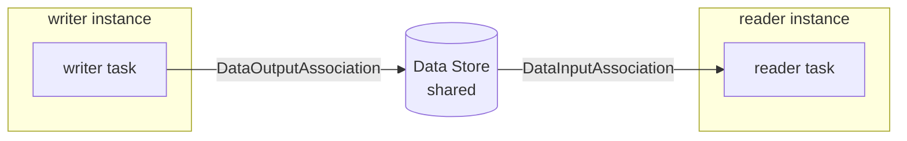

# Data Store

A **Data Store** is storage that outlives any single process instance and is
shared across every instance in the running engine. Reach for it when a value
must survive the instance that produced it — a counter, a cache, a hand-off
between two otherwise unrelated processes. Full program:
[`examples/data-store/`](../../../examples/data-store/).

## What it is

A `DataObject` lives inside one instance's scope and dies with it. A **Data
Store** does not: it is registered on the engine under a name, and processes
reach it through a `DataStoreReference`. One instance writes; a *separate*
instance — even from a different process — reads the same value back.



The store is registered once on the `Thresher`; both processes name the same
`storeRef`, so the reference resolves to one shared backing store.

## Build it

Register an in-memory store on the engine under a ref (here `"shared"`):

```go
eng, err := thresher.New("data-store-demo",
    thresher.WithDataStore(storeRef, memstore.New()))
```

The **writer** task carries an output parameter; a `DataStoreReference` binds
that output to the store (Node → DataStore) via `AssociateSource`:

```go
ref, err := datastores.New("counter", storeRef, idef(), data.ReadyDataState)
if err != nil {
    return nil, err
}
if err := ref.AssociateSource(writer, []string{itemID}, nil); err != nil {
    return nil, err
}
```

The **reader** task, in its own process, references the *same* `storeRef` and
binds the store to its input (DataStore → Node) via `AssociateTarget`:

```go
ref, err := datastores.New("counter", storeRef, idef(), data.ReadyDataState)
if err != nil {
    return nil, err
}
if err := ref.AssociateTarget(reader, nil); err != nil {
    return nil, err
}
```

Both references are built the same way; only the association direction differs.
Inside the reader's Go function, the value arrives by id like any other input:

```go
d, err := r.GetDataByID(itemID)
if err != nil {
    return nil, err
}
if v, ok := d.Value().Get(ctx).(int); ok {
    seen <- v
}
```

## Run it

```bash
cd examples/data-store && go run .
```

After the engine banner, the writer instance completes, then the reader
instance reads back what the writer left in the store:

```
✓ writer instance stored 42 in DataStore "shared" key "counter"
✓ reader instance read 42 from the shared DataStore
✓ data-store demo: the value outlived the writer instance and crossed into the reader through the engine-global store
```

## How it works

The engine holds the store; instances only hold references to it.

- **`thresher.WithDataStore(ref, store)`** registers one store under `ref`. Call
  it once per distinct store; the store outlives every instance and is shared
  across them. A store is any `datastore.DataStore` — the in-memory `memstore`,
  or a durable adapter.
- **`datastores.New(name, storeRef, idef, state)`** builds a
  `DataStoreReference`. Two references with the same `storeRef` point at the
  same backing store, so a value written through one is visible through the
  other — across instances and across processes.
- **`AssociateSource(node, items, …)`** wires a node's output *into* the store
  (a `DataOutputAssociation`); **`AssociateTarget(node, …)`** wires the store
  *into* a node's input (a `DataInputAssociation`).
- The reader runs in a **different instance** than the writer, launched after
  the writer completes — yet it still sees `42`. That is the whole point: the
  value crossed the instance boundary through the engine-global store.

> **Note:** A `DataStoreReference` is *not* a per-instance `DataObject`. If you
> only need data to live for one instance's lifetime, use a Data Object or a
> process property — they are scoped and die with the instance.

## Options & variations

- **Backing store.** `memstore.New()` is in-memory and non-durable; swap in any
  `datastore.DataStore` implementation (for example a durable adapter) under the
  same ref without touching process code.
- **Replacing a store.** Registering an already-used `ref` replaces the previous
  store — useful in tests, deliberate in production.
- **Direction.** A single reference does one direction per association; use
  `AssociateSource` to write and `AssociateTarget` to read. A process can hold
  both against the same store if it needs read-modify-write.

## See also

- Full example: [`examples/data-store/`](../../../examples/data-store/)
- Related: [Overview](overview.md) · [Native Go structs](native-structs.md) · Compare with per-instance data in [`examples/process-data/`](../../../examples/process-data/)
