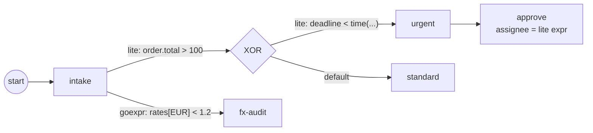

# Expressions

An **expression** computes a value — a boolean or a string — from process
data, at the moment the engine reaches it. You reach for one to decide *which*
sequence flow a gateway or task takes, or to *derive* a value such as a user
task's assignee. gobpm routes every expression to an engine by its **language
URI**, so a single process can mix text expressions and Go functors freely.
Full program: [`examples/expression-routing/`](../../../examples/expression-routing/).

## What it is

Two batteries ship registered out of the box, so no setup is needed for the
common case:

- **`gobpm:lite`** — a small stdlib-only *text* language over process data:
  numbers, strings, booleans, times, nil; structural paths
  (`order.customer.tier`, `rates["EUR"]`); short-circuit booleans; and the
  `has`/`len`/`time` builtins. Author it with `lite.Cond(body)` for a boolean
  condition or `lite.Expr(body)` for a plain value.
- **`gobpm:goexpr`** — a *Go functor* you write by hand, reading data through
  the same structural-path resolver the text engine uses.

An expression appears at three kinds of consumer site, each routed to its own
engine by the language it was tagged with:



## Build it

A **condition** on a sequence flow gates whether that flow is taken. Mint it
with `lite.Cond` and attach it with `flow.WithCondition`:

```go
premiumCond, _ := lite.Cond(
    `order.total > 100 and order.customer.tier == "vip"`)

flow.Link(intake, xor, flow.WithCondition(premiumCond))
```

The *same* selection point can carry a Go functor beside the text condition —
one flow routed to `gobpm:lite`, the sibling to `gobpm:goexpr`:

```go
func eurRateOK() data.FormalExpression {
    return goexpr.Must(
        nil,
        data.MustItemDefinition(values.NewVariable(false)),
        func(ctx context.Context, ds data.Source) (data.Value, error) {
            d, err := ds.Find(ctx, `rates["EUR"]`)
            if err != nil {
                return nil, err
            }
            rate, _ := d.Value().Get(ctx).(float64)
            return values.NewVariable(rate < 1.2), nil
        })
}

flow.Link(intake, fxAudit, flow.WithCondition(eurRateOK()))
```

On an exclusive gateway, the branches are conditions plus one **default flow**
(the else-branch, taken when no condition holds):

```go
urgentCond, _ := lite.Cond(`deadline < time("2026-12-31T00:00:00Z")`)
flow.Link(xor, urgent, flow.WithCondition(urgentCond))

df, _ := flow.Link(xor, standard)
xor.UpdateDefaultFlow(df)
```

An expression can also **compute a value**, not just a boolean. Here a
`lite.Expr` string expression derives a user task's assignee per instance —
`order.customer.tier + "-manager"` resolves to `"vip-manager"`:

```go
assignee, _ := lite.Expr(`order.customer.tier + "-manager"`)

activities.NewUserTask("approve",
    activities.WithAssigneeExpr(assignee),
    // ...
)
```

The data these expressions navigate are ordinary process properties — a nested
record, a map, a time — built the usual way:

```go
customer, _ := values.NewRecord(values.F("tier", values.NewVariable("vip")))
order, _ := values.NewRecord(
    values.F("total", values.NewVariable(500)),
    values.F("customer", customer))
rates, _ := values.NewMap(map[string]float64{"EUR": 1.09, "USD": 0.92})
```

## Run it

```bash
cd examples/expression-routing && go run .
```

The premium condition holds (total 500, tier `vip`), the deadline branch fires,
and the `goexpr` lane audits the EUR rate — all three sites in one run:

```
  ▶ intake: checking the order
  ▶ urgent: the deadline is near (the lite time() branch)
  ▶ fx-audit: rates["EUR"] < 1.2 (the ##GoExpr functor lane)
Approve the urgent order?

✓ expression-routing completed: both engines routed their own languages,
  and the lite-computed assignee approved the urgent order
```

## How it works

- **Routing by language.** Every expression is tagged with a language URI
  (`lite.Cond`/`lite.Expr` tag `gobpm:lite`; `goexpr.Must` tags
  `gobpm:goexpr`). At evaluation the engine dispatches to whichever registered
  engine claims that URI — the two constructors are the only difference at the
  call site; the wiring is identical.
- **One resolver for both.** Text paths (`order.customer.tier`) and functor
  lookups (`ds.Find(ctx, `rates["EUR"]`)`) go through the *same* structural-path
  resolver, so both engines see identical data by the same names.
- **Conditions vs. values.** `lite.Cond` pre-declares a `bool` result — that is
  what flow-gating requires. `lite.Expr` mints a plain text expression whose
  result is whatever the body evaluates to (a string, here). Use `Cond` on a
  flow, `Expr` where a value is consumed.
- **Default flow is the else.** An exclusive gateway evaluates its conditioned
  flows; if none is true it takes the flow registered with
  `UpdateDefaultFlow`. Without a default and with no true condition, the gateway
  has nowhere to go — always provide one.

> **Note:** `lite.Cond` and `lite.Expr` return an `error` — a malformed body is
> rejected at *construction*, not at run time. Check it (the example uses
> `if err != nil`); the snippets above elide it for brevity.

## Options & variations

- **More engines.** Register FEEL, JUEL, or a custom DSL with the repeatable
  `thresher.WithExpressionEngine(...)`. Each call folds another engine into the
  routing registry; a duplicate language claim fails construction loud.
- **A fully explicit runtime.** `thresher.WithoutDefaultExpressionEngines()`
  starts the registry empty — no batteries prepended, every engine registered
  by hand. An expression whose language nobody claims then fails loud, listing
  the claims that *are* registered.
- **Where expressions attach.** `flow.WithCondition` (gateway/task flow gating)
  and `activities.WithAssigneeExpr` (user task authorization) are shown here;
  any consumer taking a `data.FormalExpression` accepts either engine's output.

## See also

- Full example: [`examples/expression-routing/`](../../../examples/expression-routing/)
- Related: [Structural data](structural.md) · [Overview](overview.md) · [Exclusive (XOR)](../gateways/exclusive.md)
