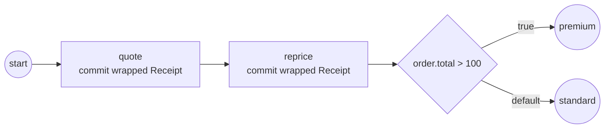

# Native Go structs

When your host application already has its own domain types — an `Order`, a
`Receipt` — you don't have to translate them into a parallel process model.
`adapters.Wrap` returns a **live** `Record` view over your struct: the engine
reads and writes it by path, straight into the original object. Full program:
[`native-structs`](../../../examples/native-structs/).

## What it is

A native-struct adapter *wraps*, it does not *convert*. The wrapped value is a
`data.Value` the engine treats as an ordinary structural record, but every path
access lands on the real Go field. Struct tags reconcile Go naming with process
naming: `gobpm:"total"` exposes `Total` as `total`, and `gobpm:"-"` hides a
field from the process entirely.



## Build it

Tag your host types so the engine knows the process-facing names:

```go
type Order struct {
    ID     string `gobpm:"id"`
    Total  int    `gobpm:"total"`
    Items  []Item `gobpm:"items"`
    Secret string `gobpm:"-"` // never visible to the process
}

type Item struct {
    SKU   string `gobpm:"sku"`
    Price int    `gobpm:"price"`
}
```

Wrap a live instance and hand it to the process as a property. The wrapped
value goes in wherever a `data.Value` is expected:

```go
order := &Order{ID: "A-1", Total: 90,
    Items:  []Item{{SKU: "widget", Price: 50}},
    Secret: "host-only"}

wrapped := adapters.MustWrap(order)

proc, err := process.New("native-structs",
    data.WithProperties(
        data.MustProperty("order",
            data.MustItemDefinition(wrapped, foundation.WithID("order")),
            data.ReadyDataState)))
```

Because the view is live, a host-side write through it lands on the struct:

```go
values.SetPath(context.Background(), wrapped,
    "total", values.NewVariable(150))
// order.Total is now 150 — the write went through the view.
```

The gateway condition reaches into the same struct by path — no engine change,
just the ordinary data seam:

```go
d, err := ds.Find(ctx, "order.total")
if err != nil {
    return nil, err
}
total, _ := d.Value().Get(ctx).(int)
return values.NewVariable(total > 100), nil
```

A task can commit a wrapped host type as its output, and the commit-diff treats
it as an ordinary record:

```go
return data.MustItemDefinition(
    adapters.MustWrap(&Receipt{Sum: sum}),
    foundation.WithID("receipt")), nil
```

## Run it

```bash
cd examples/native-structs && go run .
```

The host write lands on the live struct, the tasks commit wrapped receipts, and
the commit-diff reports a `DataChange` fact per changed path:

```
  SetPath(order.total=150) → the LIVE struct: o.Total == 150
  quote → commit wrapped Receipt{Sum:5}
  reprice → commit wrapped Receipt{Sum:6}
  ▶ Value_Added receipt @quote
  ▶ Value_Updated receipt.sum @reprice
  ▶ order.total > 100 → premium lane
  ✓ completed (Completed)
```

## How it works

- **Wrap, not convert.** `adapters.Wrap(&order)` returns a `Record` view backed
  by the pointer. Reads and writes by path (`values.SetPath`, `ds.Find`) go
  through the view into the real fields — there is no copy to keep in sync.
- **Tags map names.** The `gobpm:"..."` tag is the field's process-facing path
  segment; `gobpm:"-"` removes a field from the process surface (`Secret` above
  is invisible to conditions, mappings, and the commit-diff).
- **Nested types surface as sub-records.** `Items []Item` becomes a live list of
  sub-records, so `order.items.0.price` resolves into the slice element.
- **Reflection runs once per type.** The first `Wrap` of a given type reflects
  its layout and caches a per-type accessor; every later access is a cached
  index lookup, not a fresh reflect call.

> **Note:** `adapters.MustWrap` panics on a type it can't adapt (for example a
> non-struct). Use `adapters.Wrap` and check the error when the type comes from
> outside your control.

## Options & variations

- **A type you can't tag.** If you can't add `gobpm` tags to a third-party type,
  register an adapter for it with `adapters.Register[T]` — the marshaler-analog
  seam — and it wraps like a tagged one.
- **A type that is already a value.** A type that implements `data.Value` itself
  participates as-is; no wrapping needed.
- **Committing wrapped outputs.** Returning a wrapped struct from a task is how
  its per-path changes reach the commit-diff and surface as `DataChange` facts —
  see the `receipt` lines in the run above.

## See also

- Full example: [`native-structs`](../../../examples/native-structs/)
- Related: [Structural data](structural.md) — reading and writing records, lists,
  and maps by path.
- Related: [Data overview](overview.md) — the value model and how data is
  resolved by name.
