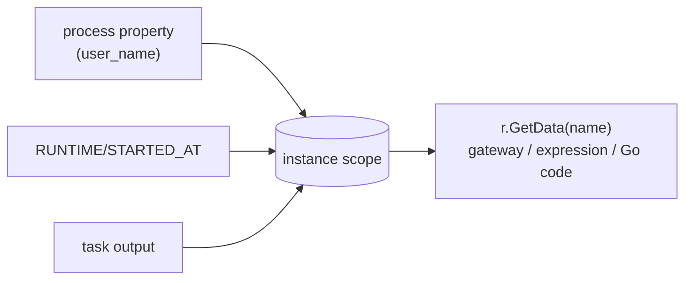

# Working with data — overview

Every process carries data: properties you seed at build time, values your
tasks produce, and engine-provided runtime variables. gobpm exposes all of it
through **one value model** and **one name grammar** — the same whether you
read it from a gateway condition, an expression, or your own Go code inside a
service task. This page is the map; the runnable walk-through is
[`examples/process-data/`](../../../examples/process-data/).

## What it is

A process value is anything implementing `data.Value` (`Get`/`Update`/`Type`/
`Clone`, plus `Lock`/`Unlock`). A **scalar** is the base case; structure is
added by *capabilities* layered on top — at most one per value, nesting to any
depth:

| Capability | Shape | Navigate with |
|---|---|---|
| *(none)* | a scalar | whole-value only |
| `data.Collection` | an ordered list | `[i]` |
| `data.Record` | named fields, ordered | `.field` |
| `data.Map` | a data-keyed dictionary | `["key"]` |

There is no separate schema artifact — shape is discovered by walking the
value. A value lives in the instance's **scope** (a tree of containers); you
reach it **by name**, and the same resolver serves every consumer.



## Build it

Seed a value at build time as a **process property** — an item definition in a
data state, added to the process:

```go
proc, err := process.New("data-demo",
    data.WithProperties(
        data.MustProperty("user_name",
            data.MustItemDefinition(
                values.NewVariable("dr.Dobermann"),
                foundation.WithID("user_name")),
            data.ReadyDataState)))
```

Inside a service task, your Go function receives a read-only `DataReader` and
reaches process data by name — a plain property name, or an engine runtime
variable by its `SOURCE/addr` path:

```go
// the process property, by plain name ...
who, err := r.GetData("user_name")
// ... and an engine runtime variable, by its RUNTIME path.
started, err := r.GetData("RUNTIME/STARTED_AT")

res := fmt.Sprintf("%s, %s!", greeting, who.Value().Get(ctx))
```

A task **produces** a value by declaring an output parameter and returning an
item definition with that id; the output association carries it into a
scope-resident **DataObject**:

```go
outParam := data.MustParameter(name+" result",
    data.MustItemAwareElement(
        data.MustItemDefinition(
            values.NewVariable(""), foundation.WithID(resID)),
        data.UnavailableDataState))

st, _ := activities.NewServiceTask(name, op,
    activities.WithParameters(data.Output, outParam))

resDO, _ := dataobjects.New(name+"-result",
    data.MustItemDefinition(
        values.NewVariable(""), foundation.WithID(resID)), nil)
resDO.AssociateSource(st, []string{resID}, nil) // task output → DataObject
```

## Run it

```bash
cd examples/process-data && go run .
```

Two parallel branches each read the shared `user_name` property, produce a
greeting, and land it in their own per-instance DataObject — read back by name
from the instance handle:

```
  ▶ greet-b produced "Welcome, dr.Dobermann!" (instance started 2026-07-26 …)
  ▶ greet-a produced "Hello, dr.Dobermann!" (instance started 2026-07-26 …)
  ✓ greet-a-result = "Hello, dr.Dobermann!"
  ✓ greet-b-result = "Welcome, dr.Dobermann!"
✓ data-demo completed: the property fed both branches through their frames;
  each result reached its per-instance DataObject in scope, read back by name
```

## How it works

**Reading by path.** One resolver serves gateway conditions, expressions,
output mappings, and in-process Go code, with the same grammar:

```go
d, err := ds.Find(ctx, "order.items[0].price")
```

- `.field` descends into a record, `[i]` into a list, `["key"]` into a map — a
  bare number is a list index, a quoted string a map key (`[0]` vs `["0"]`);
- the head (`order`) resolves like any plain name — a property, a task output;
- `SOURCE/addr` (the `/` provider split, e.g. `RUNTIME/STARTED_AT`) runs
  **first**: `/` selects a provider, then `.`/`[]` walk engine-managed values;
- a path into a scalar, a missing field, or an out-of-range index is a
  classified error naming the walked prefix — never a silent nil.

**Writing and assembling.** `values.SetPath(ctx, root, "items[0].price", v)`
sets a value at a path; on a dynamic target, missing intermediates auto-vivify
(`.field` → a record, `["key"]` → a map, `[i]` → a list; an index appends only
at `len` — no holes). `Collection.SetAt(ctx, i, v)` is the atomic indexed
write. Output-mapping rules whose `Var`s share a head assemble **one** nested
value rather than several flat variables.

**Per-instance isolation.** Each instance clones the registered snapshot, so
properties and DataObjects are the instance's own copy — concurrent instances
never share data state. In the example the two branches run in parallel yet
write into distinct objects.

> **Note:** `data.CreateDefaultStates()` must run once before building any
> data-carrying element — it registers the standard data states (`Ready`,
> `Unavailable`, …). Skip it and construction fails.

## The three tiers

The value you seed can come from any of three tiers; they mix freely (a
wrapped struct nests inside a `values.Record`, and vice-versa):

| Tier | Construct | When |
|---|---|---|
| **dynamic** | `values.NewVariable(v)`, `values.NewArray(…)`, `values.MustRecord(…)` | engine-assembled data, any depth, zero setup |
| **native structs** | `adapters.MustWrap(&hostStruct)` | your own Go types participate **live** — wrap, not convert |
| **codegen** *(future)* | a `go:generate` adapter on the same seam | reflection-free per-type upgrade, by need |

| You have | Use |
|---|---|
| engine-assembled / ad-hoc data | dynamic `values.*` |
| your own Go types as process data | `adapters.Wrap` |
| a third-party type you can't modify | `adapters.Register` |

## Options & variations

- **Runtime variables** — read engine-managed values by their `SOURCE/addr`
  path (`RUNTIME/STARTED_AT`); no message wiring needed.
- **DataObject vs Data Store** — a DataObject is per-instance and scope-resident;
  a Data Store is engine-global and outlives every instance. The task wiring is
  identical (both use `DataAssociation`s).
- **Reading from outside** — the same value is reachable from the instance
  handle via `h.Data().GetData(name)`, not just from inside an operation.

## See also

- Full example: [`examples/process-data/`](../../../examples/process-data/)
- Next: [Structural data](structural.md) — records, lists, and maps by path
- Related: [Native Go structs](native-structs.md) · [Data Objects](data-objects.md) · [Data Store](data-store.md)
