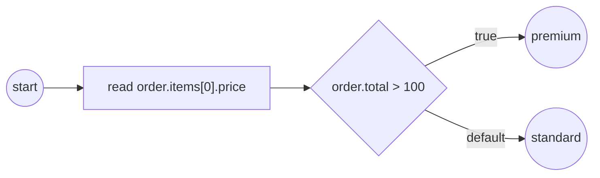

# Reading & writing by path

Process data is not limited to scalars. A property can be a **record**
(`{id, total, items}`), a **list** (`items[0]`), or a **map** (`rates["EUR"]`),
and you reach into any of them with one path grammar: `.field` descends into a
record, `[i]` indexes a list, `["key"]` addresses a map. The *same* paths that
**read** a value also **write** one, so a task's output mapping can *assemble* a
nested value out of a flat worker body. This page is the developer reference for
the value kinds, the path grammar, and the read/write seams that back both.

## Taxonomy

A value's kind is its **optional structural capability** — discovered by type
assertion, exactly as with the base `data.Value`. A scalar implements none of
the three and is a path leaf; a structural value implements **at most one**.

| Kind | Capability interface | Keys are | Path step | Built with |
|---|---|---|---|---|
| Record | `data.Record` | *schema* (field names) | `.field` | `values.MustRecord` / `NewRecord` |
| List | `data.Collection` | positional index | `[i]` | `values.NewArray[T]` |
| Map | `data.Map` | *data* (run-time strings) | `["key"]` | `values.MustMap[T]` / `NewMap[T]` |
| Scalar | — (leaf) | — | — | `values.NewVariable[T]` |

Package: `github.com/dr-dobermann/gobpm/pkg/model/data` (interfaces + path
functions) and `github.com/dr-dobermann/gobpm/pkg/model/data/values` (the
dynamic implementations). See [The value model](value-model.md) for the tiers.



## The capability interfaces

Each structural kind extends `data.Value` with a small read/write surface. You
implement one of these only to add a **custom** value type; for host structs and
maps, [`adapters.Wrap`](native-structs.md) already provides them.

`data.Record` — a string-keyed, insertion-ordered, heterogeneous field set:

```go
type Record interface {
    Value
    Keys() []string                                        // fields in insertion order
    Field(ctx context.Context, name string) (Value, error) // read a field (ObjectNotFound if absent)
    SetField(ctx context.Context, name string, v Value) error
}
```

`data.Map` — a homogeneous dictionary under *data* keys (deletion is
first-class; enumeration is sorted for determinism):

```go
type Map interface {
    Value
    Keys() []string                                    // ascending (sorted) order
    Entry(ctx context.Context, key string) (any, error)
    SetEntry(ctx context.Context, key string, value any) error // upsert (empty key is an error)
    DeleteEntry(ctx context.Context, key string) error
}
```

`data.Collection` extends `Value` with positional access; the members that
matter for path work are `GetAt(ctx, index)` and `SetAt(ctx, index, value)` —
the cursor-free index read/write. `SetAt` replaces at `[0, len)`, appends at
`index == len`, and errors past that.

> A structural value is discovered, never declared: the walker type-asserts a
> `Value` to `Record` / `Collection` / `Map` at each step. A `Value` that
> asserts to none is a leaf, and the path stops there.

## Building a structural value

Nesting composes freely — a record of a scalar, a scalar, and a **list of
records** — from `examples/structural-data/`:

```go
func orderRecord(total int) data.Value {
    item := func(sku string, price int) data.Value {
        return values.MustRecord(
            values.F("sku", values.NewVariable(sku)),
            values.F("price", values.NewVariable(price)))
    }

    return values.MustRecord(
        values.F("id", values.NewVariable("A-1")),
        values.F("total", values.NewVariable(total)),
        values.F("items", values.NewArray[data.Value](
            item("widget", 50), item("gadget", 100))),
    )
}
```

| Constructor | Builds | Failure mode |
|---|---|---|
| `values.MustRecord(fields…)` / `NewRecord` | dynamic record; `values.F(name, v)` is a field literal | `Must*` panics on a malformed literal; `New*` returns an error |
| `values.NewArray[T](vals…)` | positionally-indexed list | — |
| `values.MustMap[T](map)` / `NewMap[T]` | data-keyed dictionary | `Must*` panics; `New*` returns an error |
| `values.NewVariable[T](v)` | a scalar leaf | — |

> `MustRecord` / `MustMap` panic on a malformed literal, matching the `Must*`
> convention for static process construction. Use them where a failure is a
> programmer error, not run-time input; use `New*` for run-time data.

## Reading by path — the `Source.Find` seam

There is no special structural read API. A path is resolved by the **one**
`data.Source.Find` seam that plain names and `SOURCE/addr` providers already
use:

```go
type Source interface {
    Find(ctx context.Context, name string) (Data, error)
}
```

Two different consumers reach into the same `order` record by path. In-process
service code reads a nested path through the narrow `DataReader`:

```go
d, err := r.GetData("order.items[0].price")
// ...
fmt.Printf("  ▶ order.items[0].price = %v\n", d.Value().Get(ctx))
```

A gateway condition reads a path off the resolver and branches on it:

```go
func(ctx context.Context, ds data.Source) (data.Value, error) {
    v, err := ds.Find(ctx, "order.total")
    if err != nil {
        return nil, err
    }
    total, _ := v.Value().Get(ctx).(int)
    return values.NewVariable(total > 100), nil
}
```

Resolution runs in two stages. The `/` **provider split** runs first
(`RUNTIME/STARTED_AT` and friends pick a provider); then the `.` / `[]` /
`["key"]` steps **navigate** the value that the name resolved to. So
`order.items[0].price` is: find `order`, descend into field `items`, index
element `0`, descend into field `price`.

| Step form | Descends into | By |
|---|---|---|
| `.field` | a record (`Record.Field`) | *schema* key |
| `[i]` | a list (`Collection.GetAt`) | positional index |
| `["key"]` | a map (`Map.Entry`) | *data* key — `[0]` indexes a list, `["0"]` is the map key `"0"` |

The path plumbing under `Source.Find` is public in `pkg/model/data`:
`SplitPath` splits a name head from its steps, `ResolvePath` resolves a
possibly-structural name (splitting the head, then walking the steps), and
`NewPathData` wraps a walked leaf as a read-only `Data`. Most code never calls
these directly — `Find` does.

## Run it

Running `examples/structural-data/` (`cd examples/structural-data && go run .`),
after the startup banner (the `order.total = 150` line comes from `main.go`):

```
order.total = 150
  ▶ order.items[0].price = 50
  ▶ order.total > 100 → premium lane
✓ structural-data completed (Completed)
```

## Writing by path — assembling nested output

The write path is the mirror image. `values.SetPath` sets a value at a
structural path **relative to a root**, creating any missing intermediate
records/lists on a permissive dynamic target:

```go
func SetPath(
    ctx context.Context, root data.Value, path string, v data.Value,
) error
```

It walks to the parent of the last step (a following `.field` auto-vivifies a
`values.Record`, a following `[i]` a `values.Array`), then sets the last step
via `Record.SetField` or `Collection.SetAt`. An empty path is an error — a
whole-value write is `Value.Update`. `SetPath` lives in `values`, not `data`,
because auto-vivify constructs concrete `values.Record` / `values.Array` and
`data` cannot import `values`.

The output mapping of a worker task rides this seam. In
`examples/structural-output-mapping/` a worker returns a **flat** body —
`{total, price0, price1}`, no nesting — and three output-mapping rules that
share the head `order` **assemble** one nested record instead of three flat
variables:

```go
activities.WithOutputMapping(
    tasks.OutputRule{Path: bodyPath("body.total"), Var: "order.total"},
    tasks.OutputRule{Path: bodyPath("body.price0"), Var: "order.items[0].price"},
    tasks.OutputRule{Path: bodyPath("body.price1"), Var: "order.items[1].price"}),
```

A `tasks.OutputRule` binds a body-path expression (`Path`) to a target `Var`; a
`Var` that is a structural path (`order.items[1].price`) shapes one nested output
value. The `items` list is **auto-vivified** — a `Var` path that names an element
the target does not have yet grows the container on write. A downstream task then
reads `order.items[1].price` back through the same `DataReader`, proving the flat
body became one navigable nested value.

## Maps

A **map** is the third value kind beside record and list
(`examples/maps/`). A map's keys are *data* where a record's keys are its
*schema*; maps are homogeneous and enumerate in **sorted key order**
(deterministic over Go's randomized map iteration). Two tiers navigate
identically:

```go
// Dynamic: engine-assembled, grow with SetEntry, read a ["key"] path.
fx := values.MustMap(map[string]float64{"USD": 1.0, "EUR": 1.08})
_ = fx.SetEntry(ctx, "GBP", 1.27)

// Native: the host's OWN map, wrapped live — SetEntry writes straight through.
limits := map[string]int{"day": 100}
w, _ := adapters.Wrap(&limits)
_ = w.(data.Map).SetEntry(ctx, "week", 500) // limits now has "week": 500
```

## Reflecting a shape & the commit-diff

`pkg/model/data` also exposes the read-side helpers a tool or an observer uses
to inspect structure, without hand-walking the capabilities:

| Function | Returns |
|---|---|
| `Walk(ctx, v, visit)` | visits every node depth-first with its full path (root path `""`) |
| `SchemaAt(ctx, v, path)` | the `[]FieldInfo` shape at one level (a record's fields, a list slot `"[]"`, or a scalar leaf) |
| `DiffValues(root, old, new)` | one `data.Change{Path, Type}` per changed path — the commit-diff |
| `PathsOverlap(a, b)` | whether two paths address overlapping data (a change at one affects the other) |

`DiffValues` is what surfaces per-entry `DataChange` facts at an activity
boundary: committing a changed map yields a `Change` carrying a `["key"]` path
(`rates["EUR"]` updated, `rates["JPY"]` added, `rates["GBP"]` deleted) — the diff
walks the structure element by element, and a nil old/new collapses a whole
subtree to one `Change` at its root.

## See also

- Examples: `examples/structural-data/` (read) · `examples/structural-output-mapping/` (assemble) · `examples/maps/` (the map kind)
- Related guides: [Working with data — overview](index.md) · [Native Go structs](native-structs.md) · [Data Objects](data-objects.md)
- Design: [ADR-011 — process data flow](../../design/ADR-011-process-data-flow.md)
- Full API: `go doc github.com/dr-dobermann/gobpm/pkg/model/data` · `go doc github.com/dr-dobermann/gobpm/pkg/model/data/values`
