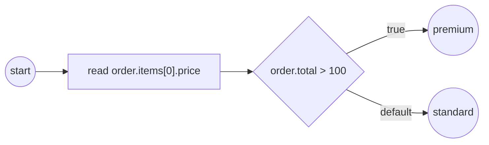

# Structural data

Process data is not limited to scalars. A property can be a **record**
(`{id, total, items}`), a **list** (`items[0]`), or a **map** (`rates["EUR"]`) —
and you reach into any of them with one path grammar: `.field` descends into a
record, `[i]` indexes a list, `["key"]` addresses a map. The same paths that
*read* a value also *write* one, so a task's output mapping can **assemble** a
nested value out of a flat worker body. Primary example:
[`examples/structural-data/`](../../../examples/structural-data/).

## What it is

A structural value is a value whose parts are themselves values. Build it once
with `values.MustRecord` / `values.NewArray` / `values.MustMap`, hand it to a
process as a property, and every consumer — service code, a gateway condition,
an output-mapping rule — navigates it by the **same** path expression. There is
no special structural API: a path is resolved by the one `Source.Find` seam that
plain names and `SOURCE/addr` providers already use.



## Build it

The `order` property is a record of a scalar, a scalar, and a **list of
records** — nesting composes freely:

```go
func orderRecord(total int) data.Value {
    item := func(sku string, price int) data.Value {
        return values.MustRecord(
            values.F("sku", values.NewVariable(sku)),
            values.F("price", values.NewVariable(price)))
    }

    return values.MustRecord(
        values.F("id", values.NewVariable("A-1")),
        values.F("total", values.NewVariable(total)),
        values.F("items", values.NewArray[data.Value](
            item("widget", 50), item("gadget", 100))),
    )
}
```

Wire it as an ordinary property, then two consumers reach into it. In-process
service code reads a nested path through the narrow `DataReader`:

```go
d, err := r.GetData("order.items[0].price")
// ...
fmt.Printf("  ▶ order.items[0].price = %v\n", d.Value().Get(ctx))
```

A gateway condition reads a path off the resolver and branches on it:

```go
func(ctx context.Context, ds data.Source) (data.Value, error) {
    v, err := ds.Find(ctx, "order.total")
    if err != nil {
        return nil, err
    }
    total, _ := v.Value().Get(ctx).(int)
    return values.NewVariable(total > 100), nil
}
```

## Run it

```bash
cd examples/structural-data && go run .
```

After the startup banner (the `order.total = 150` line comes from `main.go`):

```
order.total = 150
  ▶ order.items[0].price = 50
  ▶ order.total > 100 → premium lane
✓ structural-data completed (Completed)
```

## How it works

Path resolution runs in two stages. The `/` **provider split** runs first
(`RUNTIME/STARTED_AT` and friends pick a provider); then `.` / `[]` / `["key"]`
**navigate** the engine-managed value that name resolved to. So
`order.items[0].price` is: find `order`, descend into field `items`, index
element `0`, descend into field `price` — all through the same `Source.Find`
every reader uses.

- **`.field`** descends into a record by its *schema* key.
- **`[i]`** indexes a list positionally.
- **`["key"]`** addresses a map by a *data* key — `[0]` still indexes a list,
  `["0"]` addresses the map key `"0"`.

The write path is the mirror image. In
[`examples/structural-output-mapping/`](../../../examples/structural-output-mapping/)
a worker returns a **flat** body — `{total, price0, price1}`, no nesting — and
three output-mapping rules that share the head `order` **assemble** one nested
record instead of three flat variables:

```go
activities.WithOutputMapping(
    tasks.OutputRule{Path: bodyPath("body.total"), Var: "order.total"},
    tasks.OutputRule{Path: bodyPath("body.price0"), Var: "order.items[0].price"},
    tasks.OutputRule{Path: bodyPath("body.price1"), Var: "order.items[1].price"}),
```

The `items` list is **auto-vivified** — a `Var` path that names an element the
target does not have yet grows the container on write. A downstream task then
reads `order.items[1].price` back through the same `DataReader`, proving the flat
body became one navigable nested value.

## Options & variations

**Maps** are a third value kind beside record and list
([`examples/maps/`](../../../examples/maps/)). A map's keys are *data* (arbitrary
run-time strings) where a record's keys are its *schema*; maps are homogeneous
and enumerate in **sorted key order** (deterministic over Go's randomized map
iteration). Two tiers navigate identically:

```go
// Dynamic: engine-assembled, grow with SetEntry, read a ["key"] path.
fx := values.MustMap(map[string]float64{"USD": 1.0, "EUR": 1.08})
_ = fx.SetEntry(ctx, "GBP", 1.27)

// Native: the host's OWN map, wrapped live — SetEntry writes straight through.
limits := map[string]int{"day": 100}
w, _ := adapters.Wrap(&limits)
_ = w.(data.Map).SetEntry(ctx, "week", 500) // limits now has "week": 500
```

Committing a changed map at an activity boundary surfaces a per-entry
`DataChange` fact carrying a `["key"]` path (`rates["EUR"]` updated,
`rates["JPY"]` added, `rates["GBP"]` deleted) — the commit-diff walks the
structure element by element.

> **Note:** `values.MustRecord` / `values.MustMap` panic on a malformed literal,
> matching the `Must*` convention for build-time construction. Use them where a
> failure is a programmer error, not run-time input.

## See also

- Full example: [`examples/structural-data/`](../../../examples/structural-data/)
- Output-mapping: [`examples/structural-output-mapping/`](../../../examples/structural-output-mapping/) · Maps: [`examples/maps/`](../../../examples/maps/)
- Related: [Data overview](overview.md) · [Native Go structs](native-structs.md)
