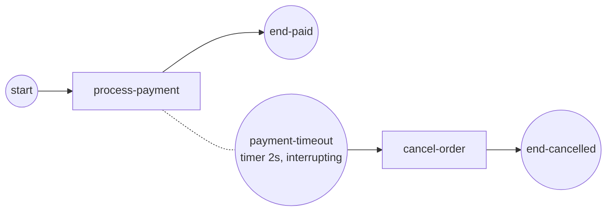

# Boundary events

A **boundary event** is an event catcher attached to the edge of an activity. It
arms when the activity starts and watches for its trigger — a timer, a message,
an error, an escalation — while the activity runs. When it fires it routes a
token onto its own **exception flow**, either *interrupting* the activity
(cancelling it) or running *alongside* it (non-interrupting). This is how you put
a timeout on a long step, catch a thrown error, or react to an escalation without
touching the activity's own code. Full program:
[`examples/boundary-events/`](../../../examples/boundary-events/).

## What it is

The example puts a 2-second interrupting **timer boundary** on a `process-payment`
ServiceTask that takes ~4 seconds. The timer fires first: the engine cancels the
payment track, discards its result, and sends a token down the boundary's flow to
`cancel-order`. The normal "paid" flow is never taken.



The dotted attachment marks the boundary sitting *on* the activity; the solid
arrow out of it is the exception flow taken when it fires.

## Build it

A boundary event needs the **host activity** it attaches to, an **event
definition** (the trigger), and a boolean for whether it **interrupts**. Build
the host first, then the boundary:

```go
be, err := events.NewBoundaryEvent(id, host, def, true) // interrupting
```

Here the trigger is a timer that fires `d` after the host is entered:

```go
def, err := events.NewTimerEventDefinition(when, nil, nil)
be, err := events.NewBoundaryEvent(id, host, def, true) // interrupting
```

Add the boundary to the process like any other element, then link its exception
flow to the handler. The host's own outgoing flow is the *normal* path:

```go
for _, e := range []flow.Element{
    start, payment, cancelOrder, endPaid, endCancelled, boundary,
} {
    proc.Add(e)
}

// normal path                     // exception path
{start, payment},                  {boundary, cancelOrder},
{payment, endPaid},                {cancelOrder, endCancelled},
```

The host activity carries context-honouring work so the interruption can take
effect promptly — it `select`s on `ctx.Done()` and returns early when cancelled:

```go
select {
case <-time.After(4 * time.Second):
    return nil, nil                    // finished normally
case <-ctx.Done():
    fmt.Println("  ✗ process-payment: interrupted before it finished")
    return nil, ctx.Err()              // boundary fired: bail out
}
```

## Run it

```bash
cd examples/boundary-events && go run .
```

After the engine's startup banner, the 2s timer beats the 4s payment and the
instance routes to cancellation:

```
  → process-payment: charging the card (takes ~4s)...
  ✗ process-payment: interrupted before it finished
  → cancel-order: payment timed out, releasing the reservation

✓ boundary-events completed (Completed): the 2s timer boundary fired before the
4s payment finished — it interrupted the activity and routed to cancel-order
```

## How it works

- The boundary **arms when the token arrives on its host** and disarms when the
  activity completes normally. The timer is registered at that moment, so its
  clock starts from activity entry.
- On fire, an **interrupting** boundary cancels the host track. The activity's
  op sees `ctx.Done()`, returns early, and its result is thrown away by the
  interruption checkpoint — so `end-paid` is never reached.
- A token is emitted on the boundary's outgoing (**exception**) flow, driving the
  handler branch (`cancel-order → end-cancelled`).
- The host must **honour its context** for interruption to be prompt. A step that
  ignores `ctx` runs to completion before the cancellation is observed.

> **Note:** Give the host a real outgoing (normal) flow *and* the boundary a
> separate exception flow. They are two distinct paths out of the same activity;
> exactly one is taken per run.

## Options & variations

- **Non-interrupting** — pass `false` as the last argument to
  `NewBoundaryEvent`. The activity keeps running and the boundary fires a
  *parallel* token down its exception flow (e.g. send a reminder while the task
  is still open). It may fire more than once.
- **Other triggers** — swap the event definition. A message, signal,
  conditional, error, or escalation definition works in the same shape; only
  triggers allowed on a boundary are accepted.
- **Error boundary** — an Error boundary is *always* interrupting (BPMN
  §10.5.6); `NewBoundaryEvent` rejects a non-interrupting one. See
  [Error](error.md).
- **Validation** — `NewBoundaryEvent` requires a non-nil host and definition and
  a trigger valid on a boundary; a bad argument returns an error rather than
  failing later.

## See also

- Full example: [`examples/boundary-events/`](../../../examples/boundary-events/)
- Related: [Timer](timer.md) · [Error](error.md) · [Event sub-processes](event-subprocess.md)
