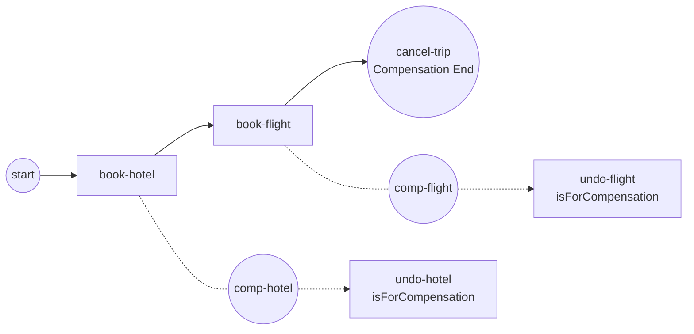

# Compensation events

**Compensation** undoes work that already **completed successfully** — the saga
pattern in BPMN form. You reach for it when a later step fails and there is no
transaction to roll back: each finished activity carries an *undo* handler, and
throwing compensation runs those handlers in reverse to walk the scope back.
Full program:
[`examples/compensation-events/`](../../../examples/compensation-events/).

## What it is

A trip-booking saga: `book-hotel` then `book-flight` both succeed, then a
**Compensation End Event** (`cancel-trip`) undoes the whole scope. Each booking
carries a **Compensation boundary** wired to its `isForCompensation` undo
handler. When a booking completes it enters the engine's **completion ledger**
with a data snapshot; the throw then replays those handlers in **reverse
completion order** — `undo-flight` before `undo-hotel`.



## Build it

An **undo handler** is an ordinary Service Task marked
`activities.WithCompensation()` — that flag lifts it out of the normal flow, so
it never runs on the happy path, only when compensation is thrown:

```go
st, _ := activities.NewServiceTask(name, op,
    activities.WithoutParams(), activities.WithCompensation())
```

A **Compensation boundary** ties a completed activity to its handler.
`NewCompensationBoundaryEvent` takes the host activity, a definition, and the
handler; it validates that the handler is `isForCompensation`:

```go
ced, _ := events.NewCompensationEventDefinition(nil, true)
be, _ := events.NewCompensationBoundaryEvent(name, host, ced, handler)
```

The **throw** is an End Event carrying a compensation trigger. A `nil` activity
on the definition means "compensate the enclosing scope, scope-wide":

```go
ced, _ := events.NewCompensationEventDefinition(nil, true)
cancelTrip, _ := events.NewEndEvent("cancel-trip",
    events.WithCompensationTrigger(ced))
```

Only the normal-flow nodes are linked with sequence flows; the undo handlers are
reached through their boundaries, never wired into the happy path:

```go
for _, l := range [][2]flow.Element{
    {start, hotel},
    {hotel, flight},
    {flight, cancelTrip},
} {
    flow.Link(l[0].(flow.SequenceSource), l[1].(flow.SequenceTarget))
}
```

## Run it

```bash
cd examples/compensation-events && go run .
```

Both bookings complete, then the undo handlers run **flight first, hotel
second**, and the instance completes:

```
  ✓ hotel booked
  ✓ flight booked
  ↩ flight booking canceled
  ↩ hotel booking canceled
InstanceState Completed instance_id=…

✓ compensation-events completed (Completed): both bookings entered the
  completion ledger; the Compensation End Event undid them in reverse order
  and waited for both handlers
```

## How it works

- **Only completed work compensates.** Each activity that finishes enters the
  engine's **completion ledger**. A step that never completed — a failed
  booking — is not in the ledger, so nothing is undone for it. This is the
  spec's *presumed-abort*: no completion, no compensation.
- **Reverse completion order.** The throw replays ledger entries newest-first,
  so the last thing done is the first thing undone: `undo-flight` runs before
  `undo-hotel`.
- **Handlers read a snapshot.** Each handler sees the data its activity
  completed with — a snapshot captured at completion, not the live scope at undo
  time. A handler's own writes still go to the live scope.
- **`waitForCompletion`.** The throw (`waitForCompletion = true`) blocks until
  every handler finishes before the token moves on — the instance completes only
  after both undos return.
- **An empty throw is logged, never a fault.** If nothing is in scope to
  compensate, the throw resolves to nothing, logs it, and continues — it is
  never silently dropped and never an error.

## Options & variations

- **Scope-wide vs targeted throw.** A `nil` activity on the throw definition
  compensates the whole enclosing scope. Pass a specific `flow.ActivityNode`
  instead to compensate just that one activity.
- **Intermediate throw.** The example throws from an End Event, but a
  Compensation intermediate throw event compensates mid-flow and lets the run
  continue afterwards.
- **Transaction Sub-Process.** A transaction's Cancel path compensates its
  completed activities automatically as part of the abort — the same ledger and
  reverse-order machinery, driven by a Cancel rather than a manual throw. See
  [Transaction Sub-Process](../subprocesses/transaction.md).

> **Note:** The handler must be marked `activities.WithCompensation()`.
> `NewCompensationBoundaryEvent` rejects a handler that isn't — the boundary is
> the only way the handler is reached, so an unmarked task would sit unreachable.

## See also

- Full example: [`examples/compensation-events/`](../../../examples/compensation-events/)
- Related: [Error](error.md) · [Boundary events](boundary.md) · [Transaction Sub-Process](../subprocesses/transaction.md)
