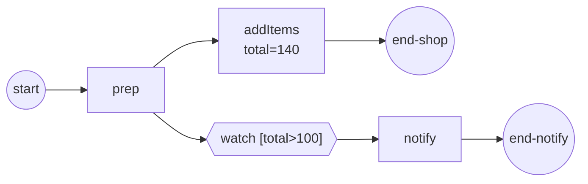

# Conditional events

A conditional event waits on **your process's own data** rather than an
external signal. It carries a boolean condition; the engine re-evaluates that
condition whenever committed data changes and fires on the **false→true edge**.
Reach for it when a branch should pause until the state of the instance makes
some rule true — an order total crossing a threshold, a cart filling, a flag
being set — without polling. Full program:
[`examples/conditional-events/`](../../../examples/conditional-events/).

## What it is

An intermediate conditional catch parks its branch. A sibling task later commits
a value; the engine re-checks the armed condition against the new data and, the
moment it turns true, releases the parked branch.



Here `total` starts at 20, so `watch` parks. When `addItems` commits
`total=140`, the condition flips and `notify` runs.

## Build it

The condition is any boolean `data.FormalExpression`. Build it with `goexpr`,
read the data you care about by name, and return a bool. `WithDependencies`
declares which paths the function reads:

```go
return goexpr.New(nil,
    data.MustItemDefinition(values.NewVariable(false)),
    func(ctx context.Context, ds data.Source) (data.Value, error) {
        d, err := ds.Find(ctx, "total")
        if err != nil {
            return nil, err
        }
        v, _ := d.Value().Get(ctx).(int)
        return values.NewVariable(v > n), nil
    },
    goexpr.WithDependencies("total"))
```

Hand the condition to an intermediate catch event:

```go
watch, err := events.NewIntermediateCatchEvent("watch-total",
    events.MustConditionalEventDefinition(cond))
```

The condition reads a process property that a sibling task will change. The task
returns its updated value from its operation; committing that value at the
activity boundary is what the engine notices:

```go
op, err := gooper.New(taskName,
    func(_ context.Context, _ service.DataReader,
        _ *data.ItemDefinition) (*data.ItemDefinition, error) {
        fmt.Printf("  %s → commit %s=%d\n", taskName, dataName, value)
        return data.MustItemDefinition(
            values.NewVariable(value),
            foundation.WithID(dataName)), nil
    })
```

## Run it

```bash
cd examples/conditional-events && go run .
```

The watch node registers its subscription, `addItems` commits `total=140`, the
edge fires, and the notify path runs:

```
  prep → commit cart=1
  addItems → commit total=140
  ▶ watch-total: Registered
  ▶ watch-total: Fired
  notify → the total crossed 100, shipping upgraded
  ✓ completed (Completed)
```

## How it works

The trigger source is the **commit-diff**. When a node's activity boundary
commits, the engine produces the set of changed paths and re-evaluates every
armed conditional against it — plus once at arm time, so an already-true
condition fires immediately. Mid-activity writes never fire a conditional; only
committed changes do.

`WithDependencies` filters which commits matter, without ever changing
correctness:

- **no `WithDependencies`** → the condition may read anything, so it
  re-evaluates on **every** non-empty commit. Always correct, just unfiltered.
- **`WithDependencies(paths...)`** → re-evaluates only when the commit's changed
  paths overlap a declared one. Overlap is prefix-based on segment boundaries: a
  change at `order` affects a dependency on `order.total`, and vice versa.
- an explicitly **empty** declaration is rejected at construction — "depends on
  nothing" would mean never re-evaluate.

> **Note:** A missing declaration costs performance, never correctness. A wrong
> declaration is your bug — declare exactly what the function reads, or declare
> nothing and let every commit re-check it.

The lifecycle is observable. The example subscribes an observer and prints the
watch node's `EventFlow` facts — `Registered` when the catch arms, `Fired` on
the false→true edge:

```go
func (p *condEventPrinter) OnFact(f observability.Fact) {
    if f.Kind != observability.KindEventFlow || f.NodeName != "watch-total" {
        return
    }
    fmt.Printf("  ▶ watch-total: %s\n", f.Phase)
}
```

## Options & variations

A conditional trigger works in several positions, not just the intermediate
catch shown here:

| Position | Behavior |
|---|---|
| Intermediate catch | The token parks until the condition turns true — including as an **event-based-gateway arm**, where the first arm to fire wins the deferred choice. |
| Boundary, interrupting | Fires while the guarded activity runs: cancels it and routes the exception flow. |
| Boundary, non-interrupting | Fires without cancelling; **re-fires** only after the condition goes false and true again (a fresh edge). |
| Start event (top-level) | **Not supported.** A top-level conditional start may not reference process data; `Process.Validate` rejects it at registration. A conditional start arrives with event sub-processes, where the condition legally reads the enclosing instance. |

## See also

- Full example: [`examples/conditional-events/`](../../../examples/conditional-events/)
- Related: [Event-based gateway](../gateways/event-based.md) · [Timer events](timer.md) · [Working with data](../data.md)
