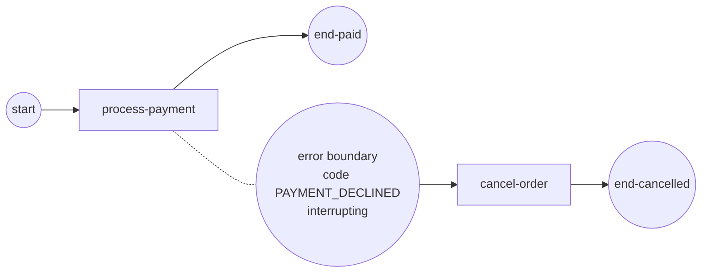

# Error events

A **BPMN error** is a modeled, named failure an activity raises to hand control
to a handler instead of faulting the whole instance. You throw it from your Go
code as a typed error carrying a **code**; an **error boundary** attached to the
activity — armed with a matching code — catches it and routes a token onto its
exception flow. This is the structured way to model "payment declined", "stock
unavailable", or any expected-but-exceptional outcome.

The backing example ([`examples/boundary-events/`](../../../examples/boundary-events/))
demonstrates the boundary + exception-flow mechanism with a **timer** boundary
(a timeout). An error boundary works the same way, differing only in the trigger
you attach: an `ErrorEventDefinition` matched by code, and a `BpmnError` your op
raises. This page shows both the runnable timer variant and the error wiring.

## What it is

An interrupting boundary event sits on an activity while it runs. When it fires,
the engine **cancels the guarded activity**, discards its result, and routes a
token onto the boundary's outgoing (exception) flow. For an error boundary the
trigger is a raised `BpmnError` whose `Code` equals the boundary's `errorCode`.



> **Note:** An error boundary is **always interrupting** (BPMN §10.5.6). gobpm
> rejects `NewBoundaryEvent(..., cancelActivity=false)` for an error trigger.

## Build it

The trigger is an `Error` object (name + `errorCode`) wrapped in an
`ErrorEventDefinition`, then attached to the host activity with
`NewBoundaryEvent(..., true)` — interrupting:

```go
e, err := bpmncommon.NewError("err_"+code, code, nil) // name, errorCode, structure
eed, err := events.NewErrorEventDefinition(e)
boundary, err := events.NewBoundaryEvent("payment-error", payment, eed, true)
```

Your activity **raises** the error by returning a `BpmnError` with the same
code. Any other (untyped) error faults the instance; only a `BpmnError` whose
code matches a boundary routes to it:

```go
op, _ := gooper.New("process-payment",
    func(ctx context.Context, _ service.DataReader,
        _ *data.ItemDefinition) (*data.ItemDefinition, error) {
        // ... attempt the charge ...
        return events.NewBpmnError("PAYMENT_DECLINED", errCardRejected)
    })
```

Wire the boundary's exception flow to the handler, exactly as the example wires
its timer boundary to `cancel-order`:

```go
for _, l := range [][2]flow.Element{
    {start, payment},
    {payment, endPaid},
    {boundary, cancelOrder},      // the boundary's exception flow
    {cancelOrder, endCancelled},
} {
    flow.Link(l[0].(flow.SequenceSource), l[1].(flow.SequenceTarget))
}
```

## Run it

The example runs the **timer** variant of the same boundary mechanism — a 2s
interrupting boundary on a ~4s payment task:

```bash
cd examples/boundary-events && go run .
```

After the engine's startup banner, the boundary fires, cancels the activity, and
the token flows to the handler:

```
  → process-payment: charging the card (takes ~4s)...
  ✗ process-payment: interrupted before it finished
  → cancel-order: payment timed out, releasing the reservation

✓ boundary-events completed (Completed): the 2s timer boundary fired before the
4s payment finished — it interrupted the activity and routed to cancel-order
```

## How it works

- The boundary is **registered when a token arrives on the host** activity, and
  armed for as long as the activity runs.
- On fire, an **interrupting** boundary cancels the guarded activity's track. A
  context-honouring op sees `ctx.Done()` and returns early; the **interruption
  checkpoint** (SRD-029 §3.7) discards whatever it returned, so the normal flow
  (`end-paid`) is never taken.
- The engine then routes a token onto the boundary's outgoing sequence flow —
  the exception path — to the handler (`cancel-order` → `end-cancelled`).
- For an error boundary specifically, the "fire" is your `BpmnError`: the engine
  compares its `Code` to each error boundary's `errorCode`. A match routes to
  that boundary; **no match faults the instance** (SRD-029 FR-9).

`BpmnError` also carries an optional underlying `cause` and implements
`Unwrap()`, so it plays with `errors.Is`/`errors.As`:

```go
be, _ := events.NewBpmnError("PAYMENT_DECLINED", errCardRejected)
// be.Error() -> "bpmn error [PAYMENT_DECLINED]: card rejected"
```

## Options & variations

- **Untyped error = fault.** Return a plain `error` (not a `BpmnError`) and the
  instance faults instead of routing — use this for genuinely unexpected bugs.
- **Empty code is rejected.** `NewBpmnError("", cause)` and `NewError` with a
  blank name/code fail at construction — a BPMN error is identified by its code.
- **Optional payload.** `NewError(name, code, structure)` accepts a non-nil
  `*data.ItemDefinition` to attach a typed payload to the error; pass `nil` for
  a bare coded error.
- **Non-interrupting boundaries.** Timer, message, signal, conditional, and
  escalation boundaries may be non-interrupting (spawn a parallel token, leave
  the activity running). Error and cancel are **always** interrupting.

## See also

- Full example: [`examples/boundary-events/`](../../../examples/boundary-events/)
- Related: [Boundary events](boundary.md) · [Escalation](escalation.md) · [Service Task](../tasks/service-task.md)
