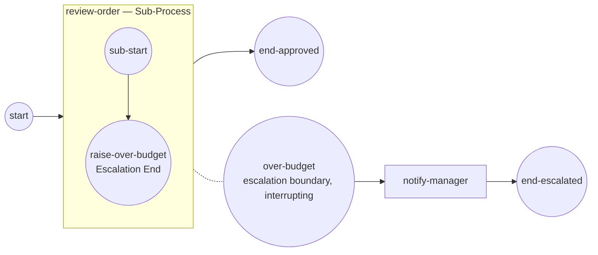

# Escalation events

An **escalation** is a non-critical signal a scope hands *up* to an enclosing
handler — "this needs attention" — without faulting the instance. You throw it
by **code** from an Escalation End or Intermediate Throw event; a matching
**Escalation boundary** (or event-sub-process Escalation start) on an enclosing
activity catches it. Unlike a BPMN error, the throwing token keeps flowing and
the instance stays healthy. This page is the developer reference — the
`Escalation` payload, its event-definition, the trigger option, the interfaces
they satisfy, and the runtime propagation you must know.

## Taxonomy

| | |
|---|---|
| BPMN category | Event → Escalation (propagation strategy, non-critical) |
| Package | `github.com/dr-dobermann/gobpm/pkg/model/events` |
| Payload type | `events.Escalation` (embeds `foundation.BaseElement`) |
| Definition type | `events.EscalationEventDefinition` (implements `flow.EventDefinition`) |
| Trigger | `flow.TriggerEscalation` — allowed on Intermediate Throw, End, Boundary, and event-sub-process Start |
| The work | throw by code (End / Intermediate Throw) · catch by code (Boundary / event-sub Start) |

Where it sits in the event family: [Events taxonomy](index.md).

## Constructor

The payload carries the escalation **code** (the match key) and an optional
typed item:

```go
func NewEscalation(
    name, code string,
    item *data.ItemDefinition,
    baseOpts ...options.Option,
) (*Escalation, error)
```

| Parameter | Meaning |
|---|---|
| `name` | the escalation's diagram name. |
| `code` | the **match key** — throw and catch are paired by this string, not by object identity. Empty code on a catcher = catch-all. |
| `item` | an optional typed payload (`*data.ItemDefinition`); pass a zero-value item if unused. |
| `baseOpts` | base-element options (id, documentation). |

Wrap the payload in an event-definition — this is what a throw or catch event
actually carries:

```go
func NewEscalationEventDefinition(
    escalation *Escalation,
    baseOpts ...options.Option,
) (*EscalationEventDefinition, error)
```

Both return an error (never panic) on invalid input; the `Must*` twins
(`MustEscalation`, `MustEscalationEventDefinition`) panic instead, for
package-level definitions.

## Options

Escalation isn't configured by an option family — you **attach its
event-definition as a trigger** to the event that throws or catches it:

| To… | Use | On |
|---|---|---|
| throw at a path end | `events.WithEscalationTrigger(eed)` | `NewEndEvent(name, …)` |
| throw and continue | *(no option)* pass `eed` as the definition | `NewIntermediateThrowEvent(name, eed, …)` |
| catch on an activity | *(no option)* pass `eed` as the definition | `NewBoundaryEvent(name, host, eed, cancelActivity)` |
| catch in an event sub-process | `events.WithEscalationTrigger(eed)` | the sub-process's start event |

`WithEscalationTrigger` is an `events.EventOption` — the same shape as
`WithErrorTrigger`, `WithSignalTrigger`, and the rest of the trigger family:

```go
func WithEscalationTrigger(eed *EscalationEventDefinition) EventOption
```

The boundary's `cancelActivity` flag chooses **interrupting** (`true`) vs
**non-interrupting** (`false`) — unlike an Error boundary (which
`NewBoundaryEvent` forces interrupting), an Escalation boundary is legally
non-interrupting.

> Escalation matches by **code**, not object identity. Reuse one
> `EscalationEventDefinition`, or two definitions sharing the same code string,
> across throw and catch; a mismatched code simply won't be caught.

For the complete, always-current signatures run
`go doc github.com/dr-dobermann/gobpm/pkg/model/events`.

## The EventDefinition contract

`EscalationEventDefinition` implements `flow.EventDefinition`, so the engine
treats it like any other trigger. The members you touch are few — the engine
drives the rest:

| Member | Role |
|---|---|
| `Type() flow.EventTrigger` | reports `flow.TriggerEscalation` — how the model gates where the trigger is legal. |
| `Escalation() *Escalation` | the payload the definition carries. |
| `CloneEventDefinition(evtData []data.Data) (flow.EventDefinition, error)` | per-instance clone at snapshot time. |
| `GetItemsList() []*data.ItemDefinition` | the typed item(s) the payload declares. |
| `CheckItemDefinition(iDefID string) bool` | whether a given item id belongs to this definition. |

## Build it

One code, carried by an `EscalationEventDefinition`, feeds both the throw and
the catch. From [`examples/escalation-events/`](../../../examples/escalation-events/):

```go
const escalationCode = "OVER_BUDGET"

esc, _ := events.NewEscalation("over-budget", escalationCode,
    data.MustItemDefinition(values.NewVariable(0)))
def, _ := events.NewEscalationEventDefinition(esc)
```

Inside the `review-order` sub-process, an **End Event** with an escalation
trigger raises it and ends its token:

```go
throw, _ := events.NewEndEvent("raise-over-budget",
    events.WithEscalationTrigger(def))
```

On the sub-process, an **interrupting Escalation boundary** (`true`) catches the
code and routes to the handler task:

```go
boundary, _ := events.NewBoundaryEvent("over-budget", body, def, true)
notify, _ := notifyManager()   // a ServiceTask on the exception flow

flow.Link(start, body)
flow.Link(body, approved)      // the normal, non-escalated path
flow.Link(boundary, notify)    // the escalation path
flow.Link(notify, escalated)
```



## Run it

```bash
cd examples/escalation-events && go run .
```

The sub-process raises the escalation, the interrupting boundary cancels the
scope, the handler runs, and the instance completes on the escalated path
(startup banner skipped):

```
Scope Opened    node_name=review-order scope_path=/escalation-events/sp-…
Scope Canceled  node_name=review-order scope_path=/escalation-events/sp-…
  → notify-manager: order escalated (OVER_BUDGET), routing to a human approver
InstanceState Completed instance_id=…

✓ escalation-events completed (Completed): review-order raised a non-critical
  OVER_BUDGET escalation; the interrupting boundary caught it by code and routed
  to notify-manager (end-escalated)
```

## Methods & runtime behavior

Read-side helpers on the payload and definition — you rarely call these, the
engine does:

| Member | Role |
|---|---|
| `Escalation.Code()` / `Name()` / `Item()` | read the match key, name, typed payload. |
| `EscalationEventDefinition.Escalation()` | the payload the definition carries. |
| `EscalationEventDefinition.Type()` | `flow.TriggerEscalation`. |
| `EscalationEventDefinition.CloneEventDefinition(evtData)` | per-instance clone at snapshot time. |

Behavior a developer must know:

- **Non-critical throw.** An Escalation End ends its path and an Escalation
  Intermediate Throw **returns its outgoing flows** and continues — the throw is
  *not* a fault, no error propagates, the instance stays healthy (ADR-006 §2.6).
- **Climbs the scope chain.** From the throwing scope the engine walks outward,
  innermost scope first, checking each open scope for an armed event-sub
  Escalation handler then an Escalation boundary on the composite host. The
  **first match by code consumes** the escalation (empty code = catch-all).
- **Interrupting vs non-interrupting.** An **interrupting** boundary
  (`NewBoundaryEvent(..., true)`) **cancels** the enclosing scope — you see
  `Scope Canceled review-order` — and routes the token down its outgoing flow;
  a **non-interrupting** boundary (`false`) **forks** a parallel handler and
  lets the scope run on. Use non-interrupting when the escalation is
  informational.
- **Unresolved = logged, never faulted.** An escalation that reaches the root
  with no reachable catcher is **logged** (name + code + throwing node) — never
  silently dropped, never an instance fault (the non-critical contract,
  ADR-006 §2.2/§2.6).
- **Escalation vs Error.** Reach for an escalation when the condition is
  business-level and the instance should stay healthy; reach for a BPMN
  **error** when the step has genuinely faulted (a fault suspends execution and,
  unresolved, aborts the instance). See [Error](error.md).

## See also

- Examples: [`examples/escalation-events/`](../../../examples/escalation-events/)
- Related guides: [Error](error.md) · [Boundary events](boundary.md) · [Event sub-processes](event-subprocess.md) · [Embedded Sub-Process](../subprocesses/embedded.md)
- Design: [ADR-006 — events and subscriptions](../../design/ADR-006-events-and-subscriptions.md) · [ADR-018 — boundary events & activity interruption](../../design/ADR-018-boundary-events-and-activity-interruption.md)
- Full API: `go doc github.com/dr-dobermann/gobpm/pkg/model/events`
