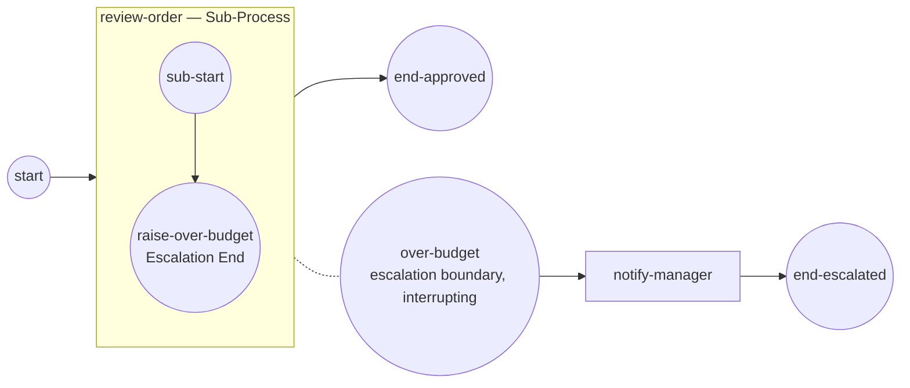

# Escalation events

An **escalation** is a non-critical signal a sub-process hands up to an
enclosing handler — "this needs attention" — without faulting the instance.
You reach for it when a step hits a business condition (over budget, needs a
human) that a higher scope should react to, while the rest of the run stays
healthy. Full program:
[`examples/escalation-events/`](../../../examples/escalation-events/).

## What it is

An **Escalation End Event** *throws* a coded escalation and ends its token; an
**Escalation boundary event** on an enclosing activity *catches* it by the same
code. Matching is by code, so throw and catch share one value. Unlike an Error
End Event, this does **not** fault the instance — the escalation climbs the
scope chain to the innermost matching catcher.



## Build it

One `EscalationEventDefinition`, carrying a code, feeds both the throw and the
catch. Because matching is by code, the throw and the boundary use the same
value:

```go
const escalationCode = "OVER_BUDGET"

esc, _ := events.NewEscalation("over-budget", escalationCode,
    data.MustItemDefinition(values.NewVariable(0)))
def, _ := events.NewEscalationEventDefinition(esc)
```

Inside the sub-process, an **End Event** with an escalation trigger raises it and
ends the token:

```go
throw, _ := events.NewEndEvent("raise-over-budget",
    events.WithEscalationTrigger(def))
```

On the sub-process, an **interrupting Escalation boundary** (`true`) catches the
code and routes to the handler task:

```go
boundary, _ := events.NewBoundaryEvent("over-budget", body, def, true)
notify, _ := notifyManager()   // a ServiceTask on the exception flow

flow.Link(start, body)
flow.Link(body, approved)      // the normal, non-escalated path
flow.Link(boundary, notify)    // the escalation path
flow.Link(notify, escalated)
```

## Run it

```bash
cd examples/escalation-events && go run .
```

The sub-process raises the escalation, the interrupting boundary cancels it, the
handler runs, and the instance completes on the escalated path:

```
Scope Opened    node_name=review-order scope_path=/escalation-events/sp-…
Scope Canceled  node_name=review-order scope_path=/escalation-events/sp-…
  → notify-manager: order escalated (OVER_BUDGET), routing to a human approver
InstanceState Completed instance_id=…

✓ escalation-events completed (Completed): review-order raised a non-critical
  OVER_BUDGET escalation; the interrupting boundary caught it by code and routed
  to notify-manager (end-escalated)
```

## How it works

- The **Escalation End Event** throws by code and ends its token. It is *not* a
  fault: no error propagates, the instance stays healthy.
- The escalation **climbs the scope chain** to the innermost boundary (or event
  sub-process start) whose code matches. Here the interrupting boundary on
  `review-order` matches `OVER_BUDGET`.
- An **interrupting** boundary (`NewBoundaryEvent(..., true)`) **cancels** the
  sub-process — you see `Scope Canceled review-order` — and routes the token
  down its outgoing flow to `notify-manager`, so the run ends at
  `end-escalated`, never reaching `end-approved`.
- An **unresolved** escalation — no reachable catcher — is **logged**, never
  silently dropped and never a fault.

> **Note:** Escalation matches by **code**, not by object identity. Reuse one
> `EscalationEventDefinition` (or two definitions sharing the same code string)
> across throw and catch; a mismatched code simply won't be caught.

## Options & variations

- **Non-interrupting** — pass `false` as the boundary's last argument. The
  boundary forks a **parallel** handler and lets the sub-process run on instead
  of cancelling it. Use this when the escalation is informational.
- **Event sub-process handler** — instead of a boundary, an in-scope event
  sub-process started by an Escalation start event can catch the code; it too
  can be interrupting or non-interrupting.
- **Escalation vs Error** — reach for an escalation when the condition is
  business-level and the instance should stay healthy; reach for a BPMN **error**
  when the step has genuinely faulted. See [Error](error.md).

## See also

- Full example: [`examples/escalation-events/`](../../../examples/escalation-events/)
- Related: [Error](error.md) · [Boundary events](boundary.md) · [Embedded Sub-Process](../subprocesses/embedded.md)
