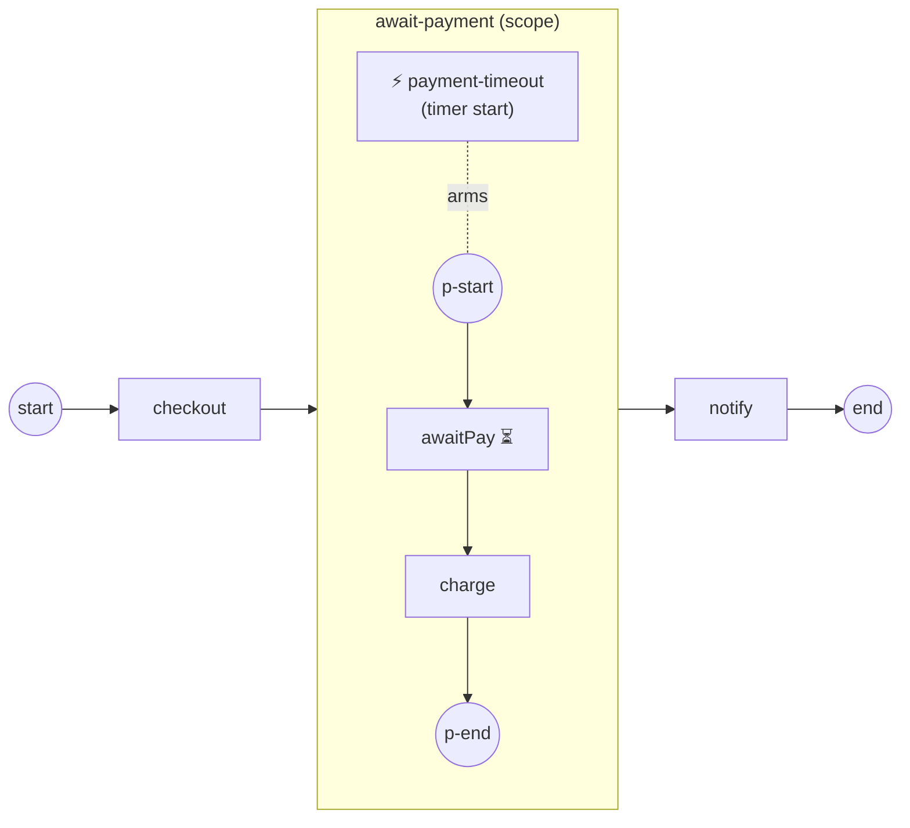

# Event sub-processes

An **Event Sub-Process** is a handler that lives *inside* a scope and fires when
an event catches — the boundary-event pattern lifted from a single activity's
window to the whole enclosing scope's window. Reach for it when work anywhere in
a scope needs a shared reaction: a timeout, a cancellation message, a caught
error. Full program:
[`examples/event-subprocess/`](../../../examples/event-subprocess/).

## What it is

A `SubProcess` marked `triggeredByEvent` that you place inside another scope (a
process or an embedded sub-process). It is **not** entered by a token: it is
**armed** while its enclosing scope is open, and fires when its triggered
**start event** catches. An *interrupting* handler (the default) cancels the
scope's in-flight work, runs its own flow, and — reaching its End without
re-throwing — lets the parent resume on its **normal** outgoing flow.

In the example, an `await-payment` scope blocks on a payment message that never
arrives. A Timer-triggered handler is armed alongside it; when the timer fires
it cancels the blocked wait, runs `releaseHold`, and absorbs the event, so the
parent continues to `notify`.



## Build it

The handler is an ordinary `SubProcess` with two things: the
`WithTriggeredByEvent()` marker, and a start event carrying a **trigger** (here
a timer). Wire its flow like any sub-process:

```go
timeout, _ := activities.NewSubProcess("payment-timeout",
    activities.WithTriggeredByEvent())

tStart, _ := events.NewStartEvent("timeout-fired",
    events.WithTimerTrigger(timeoutTimer()))
release, _ := step("releaseHold")
tEnd, _ := events.NewEndEvent("timeout-end")
// add tStart, release, tEnd to `timeout` and link start → release → end
```

Then add the handler to the scope it guards — the same `Add` you use for any
element. Here it goes inside the `await-payment` sub-process, alongside that
scope's own nodes:

```go
await, _ := activities.NewSubProcess("await-payment")
// await's own flow: p-start → awaitPay → charge → p-end
wire(await,
    []flow.Element{pStart, pay, charge, pEnd, timeout}, // timeout is the handler
    [2]flow.Element{pStart, pay},
    [2]flow.Element{pay, charge},
    [2]flow.Element{charge, pEnd})
```

The `awaitPay` node is a `ReceiveTask` waiting on a message that never comes, so
the timer wins the race:

```go
func awaitPayment(name string) (*activities.ReceiveTask, error) {
    return activities.NewReceiveTask(name,
        bpmncommon.MustMessage("payment",
            data.MustItemDefinition(values.NewVariable(1))))
}
```

## Run it

```bash
cd examples/event-subprocess && go run .
```

The observer narrates the scope and handler lifecycle (operator log lines
elided):

```
  checkout
  ▶ scope await-payment: Opened
  ⚡ handler payment-timeout: Armed
  ⚡ handler payment-timeout: Fired
  ▶ scope payment-timeout: Opened
  ⚡ handler payment-timeout: Disarmed
  releaseHold
  ▶ scope payment-timeout: Completed
  ▶ scope await-payment: Completed
  notify
  ✓ completed (Completed)
```

The wait never charged: the timer interrupted it, `releaseHold` ran, and the
parent resumed on its normal flow to `notify`.

## How it works

The handler is **armed** when its enclosing scope opens and **disarmed** when it
fires (interrupting) or when the scope closes. An interrupting fire:

- **cancels** the scope's in-flight work (`awaitPay`), while the scope's data
  plane stays open — so the handler runs in the parent's data context;
- **runs its own flow** in a fresh child scope seeded from the triggered start
  (`payment-timeout: Opened` → `releaseHold` → `Completed`);
- **absorbs** the event by reaching its End without re-throwing, so the parent
  resumes on its **normal** outgoing flow — not a boundary path.

You watch all of this through an observer. A handler fact arrives as a
`KindBoundary` fact carrying a scope path — that scope path is how the engine
tells a handler apart from a plain boundary event:

```go
func (p *scopePrinter) OnFact(f observability.Fact) {
    switch f.Kind {
    case observability.KindScope:
        fmt.Printf("  ▶ scope %s: %s\n", f.NodeName, f.Phase)
    case observability.KindBoundary:
        if _, isHandler := f.Details[observability.AttrScopePath]; isHandler {
            fmt.Printf("  ⚡ handler %s: %s\n", f.NodeName, f.Phase)
        }
    }
}
```

> **Note:** An Event Sub-Process is armed, not linked. No sequence flow enters
> it — placing it in a scope with `WithTriggeredByEvent()` and a triggered start
> is all the wiring it needs.

## Options & variations

- **Interrupting (default).** Cancels the scope's work, fires once, then
  disarms. This is the BPMN default (§13.5.4) and what the example shows.
- **Non-interrupting.** `activities.WithNonInterrupting()` makes the handler
  **fork** instead: each fire spawns a concurrent handler instance in its own
  child scope **without** cancelling the scope, and it can re-fire unlimited
  times. The scope completes once its own work *and* every handler instance
  drain.
- **Other triggers.** The start event can carry a Message, Signal, Error, or
  Conditional trigger instead of a Timer — swap `WithTimerTrigger(...)` for the
  matching `WithXxxTrigger(...)`. An Error-triggered handler catches on the
  scope chain and is interrupting-only.

## See also

- Full example: [`examples/event-subprocess/`](../../../examples/event-subprocess/)
- Related: [Timer](timer.md) · [Service Task](../tasks/service-task.md) · [Observability](../concepts/observability.md)
