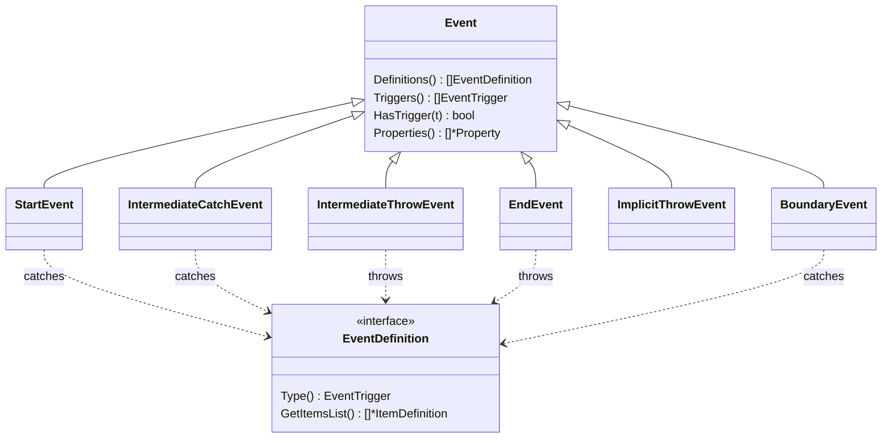

# Events

Events are the reactive elements of a process: they say *where an instance
begins*, *where it waits or reacts mid-flow*, *where it throws a signal to the
rest of the model*, and *where a branch ends*. gobpm splits every event into
two orthogonal choices — its **class** (its position in the flow: Start,
Intermediate, End, or Boundary) and its **trigger** (what it reacts to or
emits: Message, Timer, Signal, Error, …). The class is a *node type* you
construct; the trigger is an *EventDefinition* you attach as an option. This
page is the map of that family — the class tree, every member with its role and
link, and the attributes and options every event shares.

All members live in `github.com/dr-dobermann/gobpm/pkg/model/events`.

## The two axes



A catch event (Start, Intermediate-catch, Boundary) *waits for* its definition
to arrive; a throw event (Intermediate-throw, End, Implicit-throw) *emits* it.
The same definition type — say `MessageEventDefinition` — serves both sides;
whether it is caught or thrown is decided by the node it is attached to.

## Event classes — the node you construct

Start with what most processes use — a plain start and end — then reach for the
mid-flow and boundary forms:

| Class | Type | Role |
|---|---|---|
| Start | `StartEvent` | instantiation point; no incoming flow. Bare, or triggered (Message/Timer/Signal/Conditional). |
| End | `EndEvent` | branch completion; no outgoing flow. Bare, or triggered (Error/Escalation/Terminate/…). |
| Intermediate catch | `IntermediateCatchEvent` | mid-flow wait: parks until its trigger arrives, binds payload, then continues. |
| Intermediate throw | `IntermediateThrowEvent` | mid-flow emit: throws its trigger (e.g. publishes a message) and continues. |
| Boundary | `BoundaryEvent` | armed on an activity; interrupts it or spawns a parallel token when its trigger fires. |
| Implicit throw | `ImplicitThrowEvent` | engine-emitted throw not reached by a token (e.g. a Multi-Instance behavior event); you rarely build one directly. |

Every class embeds the shared `Event` base and implements `flow.Node`, so it is
added to a process and wired with `flow.Link` like any other node.

| Class | Constructor |
|---|---|
| `StartEvent` | `NewStartEvent(name string, opts ...options.Option)` |
| `EndEvent` | `NewEndEvent(name string, opts ...options.Option)` |
| `IntermediateCatchEvent` | `NewIntermediateCatchEvent(name string, def flow.EventDefinition, opts ...options.Option)` |
| `IntermediateThrowEvent` | `NewIntermediateThrowEvent(name string, def flow.EventDefinition, opts ...options.Option)` |
| `BoundaryEvent` | `NewBoundaryEvent(name string, host flow.ActivityNode, def flow.EventDefinition, ...)` · `NewCompensationBoundaryEvent(...)` |
| `ImplicitThrowEvent` | `NewImplicitThrowEvent(name string, def flow.EventDefinition, opts ...options.Option)` |

Start and End take their triggers as **options** (a single event may carry
several — `WithMessageTrigger`, `WithTerminateTrigger`, …). The Intermediate and
Boundary forms take **one** `flow.EventDefinition` positionally, because a
mid-flow or boundary event carries exactly one trigger.

## Triggers — the EventDefinition you attach

A trigger is a value implementing `flow.EventDefinition`; its `Type()` returns
the `flow.EventTrigger` it represents. Each has its own guide:

| Trigger | Definition type | Role — page |
|---|---|---|
| Message | `MessageEventDefinition` | send/receive a correlated message across instances — [Message](message.md) |
| Timer | `TimerEventDefinition` | wait for a date, cycle, or duration — [Timer](timer.md) |
| Signal | `SignalEventDefinition` | broadcast to every listening catcher — [Signal](signal.md) |
| Error | `ErrorEventDefinition` | throw / catch a named BPMN error — [Error](error.md) |
| Escalation | `EscalationEventDefinition` | non-fatal escalation up the scope chain — [Escalation](escalation.md) |
| Conditional | `ConditionalEventDefinition` | fire on a data condition's false→true edge — [Conditional](conditional.md) |
| Link | `LinkEventDefinition` | off-page connector: pair a throw source to a catch target — [Link](link.md) |
| Terminate | `TerminateEventDefinition` | end the whole instance/scope at once — [Terminate](terminate.md) |
| Compensation | `CompensationEventDefinition` | trigger a compensation handler — [Compensation](compensation.md) |
| Cancel | `CancelEventDefinition` | cancel a transaction sub-process — [Transaction](../subprocesses/transaction.md) |

Two triggers carry a **first-class subject object** you build once and reuse
across the definitions that reference it:

| Object | Constructor | Used by |
|---|---|---|
| `Signal` | `NewSignal(name string, str *data.ItemDefinition, ...)` | `SignalEventDefinition` |
| `Escalation` | `NewEscalation(name, code string, item *data.ItemDefinition, ...)` | `EscalationEventDefinition` |

> The BPMN "Multiple" and "Parallel-Multiple" triggers are not first-class
> constants in gobpm — they are *derived*: an event with several definitions is
> multiple, and `WithParallel()` marks a start event parallel-multiple. Likewise
> there is no "None" trigger — an event with an empty `Definitions()` list is the
> bare (none) event.

### Attaching a trigger

Start/End take trigger options; Intermediate/Boundary take one definition. Both
build the definition first:

```go
// A message start event — the definition is attached as an option.
med, _ := events.NewMessageEventDefinition(msg, op)
start, _ := events.NewStartEvent("order-received",
    events.WithMessageTrigger(med))

// A timer intermediate-catch — the single definition is positional.
ted, _ := events.NewTimerEventDefinition(nil, nil, delay)
wait, _ := events.NewIntermediateCatchEvent("pause", ted)
```

The full option/definition set — including `MustXxxEventDefinition` panicking
variants for setup code — is in each trigger's page and in the package docs.

## Shared attributes & options

Every event embeds the `Event` base, so these are common to all classes:

| Member | What it gives you |
|---|---|
| `Definitions() []flow.EventDefinition` | the triggers attached to the event. |
| `Triggers() []flow.EventTrigger` | those triggers' types, for introspection. |
| `HasTrigger(t flow.EventTrigger) bool` | whether a given trigger is present. |
| `Properties() []*data.Property` | the event's data properties. |
| `EventClass() flow.EventClass` | the class (`Start`/`Intermediate`/`End`/`Boundary`). |

Options fall into three groups by *what they apply to*:

| Option | Applies to | Effect |
|---|---|---|
| `WithMessageTrigger` · `WithSignalTrigger` · `WithTimerTrigger` · `WithConditionalTrigger` · `WithErrorTrigger` · `WithEscalationTrigger` · `WithCancelTrigger` · `WithCompensationTrigger` | Start / End | attach a trigger definition (type `EventOption`). Each config add-or-rejects the trigger for that event class. |
| `WithTerminateTrigger` | End | attach a terminate definition (type `options.Option`). |
| `WithParallel` | Start | mark a start event parallel-multiple (`isParallelMultiple`). |
| `WithCorrelationKey` | Start (message) | declare the `CorrelationKey` an instantiating message start correlates on; nil rejected. |
| `WithInterrupting` / `WithNonInterrupting` | Event sub-process Start | interrupting (default, §13.5.4) vs concurrent handler. |
| `foundation.WithID` / `foundation.WithDoc` | any event | stable id / documentation, like every model element. |

The `flow.EventClass` and `flow.EventTrigger` constant sets classify events:

- Classes: `StartEventClass`, `IntermediateEventClass`, `EndEventClass`,
  `BoundaryEventClass`.
- Triggers: `TriggerMessage`, `TriggerSignal`, `TriggerTimer`,
  `TriggerConditional`, `TriggerError`, `TriggerEscalation`, `TriggerCancel`,
  `TriggerCompensation`, `TriggerTerminate`, `TriggerLink`.

Not every trigger is legal on every class (a Timer cannot end a branch; a
Terminate cannot start one). Each event class's config validates the triggers
you attach and rejects an illegal combination at construction time, so an
invalid pairing is a constructor error, not a runtime surprise.

## Pick a page

Start with the class you are placing, then the trigger it carries:

- [Start & End](start-and-end.md) — instantiation and completion; the bare pair and its triggers.
- [Boundary events](boundary.md) — arm a catch on an activity; interrupting or not.
- [Event sub-processes](event-subprocess.md) — in-scope handlers, interrupting or not.
- Triggers: [Message](message.md) · [Timer](timer.md) · [Signal](signal.md) · [Error](error.md) · [Escalation](escalation.md) · [Conditional](conditional.md) · [Link](link.md) · [Terminate](terminate.md) · [Compensation](compensation.md)

## See also

- Runtime: [How events are processed](../concepts/event-processing.md) — the EventHub, waiters, correlation, delivery.
- Data: [Event data and the process contract](../data/event-data.md) — an event's data outputs/inputs, wiring them to Data Objects, Data Stores and the process's own contract.
- Design: [ADR-006 — events and subscriptions](../../design/ADR-006-events-and-subscriptions.md) · [ADR-014 — message handling](../../design/ADR-014-message-handling.md) · [ADR-015 — event-triggered instantiation](../../design/ADR-015-event-triggered-instantiation.md) · [ADR-018 — boundary events](../../design/ADR-018-boundary-events-and-activity-interruption.md)
- Full API: `go doc github.com/dr-dobermann/gobpm/pkg/model/events`
