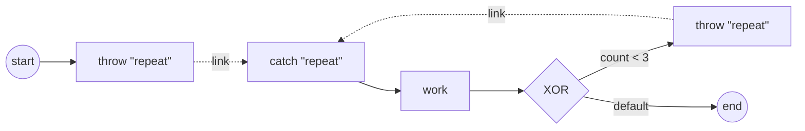

# Link events

A **Link** is an intra-process GOTO: a source **intermediate throw** hands its
token straight to a same-name target **intermediate catch** in the same
process, with no drawn sequence flow between them. Reach for it to keep a long
or crossing sequence-flow line off the diagram, or to build an on-page loop.
It is **not** a wait node — no broadcast, no correlation, no subscription. The
pairing is resolved once, by name, at snapshot build; the throw simply
redirects the token to the target catch's outgoing flows.

## Taxonomy

| | |
|---|---|
| BPMN category | Event → Intermediate throw / catch → **Link** (§10.5.1) |
| Package | `github.com/dr-dobermann/gobpm/pkg/model/events` |
| Definition type | `events.LinkEventDefinition` |
| Carried by | `events.IntermediateThrowEvent` (source) · `events.IntermediateCatchEvent` (target) |
| Trigger | `flow.TriggerLink` (`Type()` returns `flow.EventTrigger` = `"Link"`) |
| Implements | throw and catch both satisfy `flow.LinkEventNode` (`LinkName`, `IsLinkSource`); the throw also `flow.LinkSource` (`SetLinkTarget`) |
| The work | pair a throw to a catch by **name**, within one process level |

Where it sits in the event family: [Events taxonomy](index.md).

## Constructor

A Link is a `LinkEventDefinition` handed to an intermediate throw (source) or an
intermediate catch (target). The definition carries only the pairing name — the
metamodel's source/target refs are not modeled; gobpm pairs by name at the
container:

```go
func NewLinkEventDefinition(
    name string,
    baseOpts ...options.Option,
) (*LinkEventDefinition, error)
```

| Parameter | Meaning |
|---|---|
| `name` | the pairing key — every throw meant for a catch shares the catch's name. Must be non-empty. |
| `baseOpts` | zero or more `options.Option` for the underlying base element (id, docs). |

An empty `name` is a classified error — never a panic. `MustLinkEventDefinition(name, …)`
is the panic-on-error twin, for tests and static process construction.

You then wrap the definition in an intermediate event:

```go
func NewIntermediateThrowEvent(name string, def flow.EventDefinition,
    baseOpts ...options.Option) (*IntermediateThrowEvent, error)
func NewIntermediateCatchEvent(name string, def flow.EventDefinition,
    baseOpts ...options.Option) (*IntermediateCatchEvent, error)
```

A nil `def`, or a trigger not allowed for that intermediate position, is
rejected — again never a panic.

## Options

A Link definition takes no Link-specific options — the name is the whole
contract, so most uses call the two-arg constructors directly. `baseOpts` are
the ordinary base-element options shared by every model element:

| Base option | Effect |
|---|---|
| `foundation.WithId(id)` | set an explicit element id instead of a generated one. |
| `foundation.WithDoc(text, fmt)` | attach documentation to the definition. |

> The **link name** is what pairs source to target; the element **IDs** are
> independent. Give every throw meant for the same catch the same link name.

For the complete, always-current signatures run
`go doc github.com/dr-dobermann/gobpm/pkg/model/events`.

## The LinkEventNode contract

You rarely implement this yourself — the intermediate throw and catch already
do — but the graph wiring pairs a source to its target through it:

```go
type LinkEventNode interface {
    Node
    LinkName() string   // the pairing name, or "" when the node carries no Link def
    IsLinkSource() bool // true for the throw source, false for the catch target
}

type LinkSource interface {
    LinkEventNode
    SetLinkTarget(target Node) // records the resolved target catch
}
```

`IntermediateThrowEvent` satisfies `LinkSource`: `IsLinkSource()` returns `true`,
and the wiring calls `SetLinkTarget` with the resolved catch so the throw's
`Exec` can redirect the token. `IntermediateCatchEvent` satisfies
`LinkEventNode` with `IsLinkSource()` returning `false` — it is the target, a
pure flow label. Both return the shared name from `LinkName()`.

## Build it

A source is an intermediate throw carrying a Link definition; a target is an
intermediate catch carrying a Link definition of the **same name**. From
`examples/link-events/handlers.go`:

```go
func linkThrow(id, name string) (*events.IntermediateThrowEvent, error) {
    def, err := events.NewLinkEventDefinition(name)
    if err != nil {
        return nil, fmt.Errorf("create link def %q: %w", name, err)
    }
    return events.NewIntermediateThrowEvent(id, def)
}

func linkCatch(id, name string) (*events.IntermediateCatchEvent, error) {
    def, err := events.NewLinkEventDefinition(name)
    if err != nil {
        return nil, fmt.Errorf("create link def %q: %w", name, err)
    }
    return events.NewIntermediateCatchEvent(id, def)
}
```

The example builds an on-page loop — two throws (an initial jump and a back-edge)
share the name `"repeat"` and pair to one catch (**many sources → one target**).
Wire the loop body with ordinary sequence flows; the throws and the catch are
**not** drawn to each other:

```go
throwInit, _ := linkThrow("throw-init", "repeat")
throwBack, _ := linkThrow("throw-back", "repeat")
catchLoop, _ := linkCatch("catch-loop", "repeat")

// start → throw"repeat" ; catch"repeat" → work → xor (the loop body)
for _, l := range [][2]flow.Element{
    {start, throwInit}, {catchLoop, work}, {work, xor},
} {
    flow.Link(l[0].(flow.SequenceSource), l[1].(flow.SequenceTarget))
}

// xor -[count<3]-> throw"repeat" (back-edge) ; xor -default-> end
flow.Link(xor, throwBack, flow.WithCondition(cond))
df, _ := flow.Link(xor, end)
xor.UpdateDefaultFlow(df)
```



## Run it

```bash
cd examples/link-events && go run .
```

```
  link-events (an on-page loop by static name-pairing):
    start → throw"repeat"            (initial jump into the loop)
    catch"repeat" → work → XOR{ count<3 → throw"repeat" | done → end }

  ▶ iteration 1 (reached via the Link redirect)
  ▶ iteration 2 (reached via the Link redirect)
  ▶ iteration 3 (reached via the Link redirect)
  ✓ completed (Completed) after 3 iterations via the Link
```

The work task advances a counter; the gateway condition `count < 3` decides
whether to throw back into the loop or fall through the default flow to `end`.

## Methods & runtime behavior

The engine drives the pair through these — you rarely call them directly:

| Method | Role |
|---|---|
| `LinkName()` (throw/catch) | the pairing name the wiring matches on. |
| `IsLinkSource()` (throw/catch) | `true` on the throw, `false` on the catch. |
| `SetLinkTarget(node)` (throw) | records the resolved target catch during wiring. |
| `Exec(ctx, re)` (throw) | redirect the token to the target catch's outgoing flows. |
| `Type()` (definition) | returns `flow.EventTrigger` `"Link"` (the `flow.TriggerLink` constant). |
| `Name()` (definition) | returns the pairing key. |

Behavior worth knowing:

- **Static pairing, resolved once.** The throw→catch link is matched by name at
  snapshot build and validated at registration — `events.ValidateLinkPairing`,
  run from `Process.Validate`/`SubProcess.Validate`, requires exactly one target
  and at least one source per name (errors joined in sorted name order). There is
  no runtime routing decision; the redirect is fixed for every instance.
- **Redirect, not wait.** On reaching a Link throw the engine moves the token to
  the paired catch's **outgoing** flows. No goroutine parks, nothing is published
  on the EventHub, nothing else can observe or intercept it — unlike Message or
  Signal, a Link never touches the hub.
- **The catch is a pure flow label.** It has no incoming sequence flow, is never
  independently executed, and is never seeded as a process entry point. It only
  gives the redirect a place to land; its downstream flow is what runs next.
- **Re-entrancy.** Because many throws pair to one catch, the same catch heads the
  loop body on every pass — the idiom the example uses for its on-page loop.

> A Link stays **within one process level**. It does not cross into a
> sub-process or a called process — validation runs per container, so a nested
> sub-process is one opaque node here. For crossing levels use a real flow into
> the child, a [Message](message.md), or a [Signal](signal.md).

## See also

- Examples: `examples/link-events/`
- Related guides: [Message](message.md) · [Signal](signal.md) · [Exclusive gateway](../gateways/exclusive.md) · [Standard Loop](../iteration/standard-loop.md)
- Design: [ADR-006 — events and subscriptions](../../design/ADR-006-events-and-subscriptions.md) (§2.8, SRD-057)
- Full API: `go doc github.com/dr-dobermann/gobpm/pkg/model/events`
