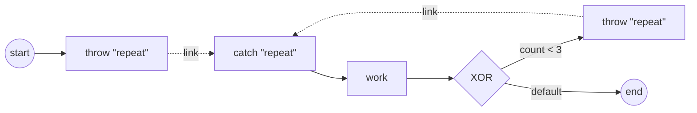

# Link events

A **Link** is an intra-process GOTO: a source **throw** hands the token straight
to a same-name target **catch** in the same process, with no drawn sequence
flow between them. Reach for it to avoid long looping lines on a diagram, or to
join two parts of a process that would otherwise cross the page. Full program:
[`examples/link-events/`](../../../examples/link-events/).

## What it is

A Link is a **static, name-paired connector**. You give the throw and the catch
the same link name; at snapshot build the pairing is resolved and the token
redirects from throw to catch. It is **not** a wait node — no broadcast, no
correlation, no subscription. The throw simply moves the token to the target
catch's outgoing flow.

Many throws can point at **one** catch (many sources → one target). A common use
is an on-page loop: an initial jump into the loop and a back-edge, both throwing
the same link name, land on one catch that heads the loop body.



## Build it

A source is an **intermediate throw** carrying a Link event definition; a target
is an **intermediate catch** carrying a Link definition of the same name:

```go
func linkThrow(id, name string) (*events.IntermediateThrowEvent, error) {
    def, err := events.NewLinkEventDefinition(name)
    if err != nil {
        return nil, fmt.Errorf("create link def %q: %w", name, err)
    }
    return events.NewIntermediateThrowEvent(id, def)
}

func linkCatch(id, name string) (*events.IntermediateCatchEvent, error) {
    def, err := events.NewLinkEventDefinition(name)
    if err != nil {
        return nil, fmt.Errorf("create link def %q: %w", name, err)
    }
    return events.NewIntermediateCatchEvent(id, def)
}
```

The two throws (initial jump + back-edge) share the name `"repeat"` and pair to
one catch. Wire the loop body with ordinary sequence flows — the throws and the
catch are **not** drawn to each other:

```go
throwInit, _ := linkThrow("throw-init", "repeat")
throwBack, _ := linkThrow("throw-back", "repeat")
catchLoop, _ := linkCatch("catch-loop", "repeat")

// start → throw"repeat" ; catch"repeat" → work → xor (the loop body)
for _, l := range [][2]flow.Element{
    {start, throwInit}, {catchLoop, work}, {work, xor},
} {
    flow.Link(l[0].(flow.SequenceSource), l[1].(flow.SequenceTarget))
}

// xor -[count<3]-> throw"repeat" (back-edge) ; xor -default-> end
flow.Link(xor, throwBack, flow.WithCondition(cond))
df, _ := flow.Link(xor, end)
xor.UpdateDefaultFlow(df)
```

The work task advances a counter; the gateway condition `count < 3` decides
whether to throw back into the loop or fall through the default flow to `end`.

## Run it

```bash
cd examples/link-events && go run .
```

```
  link-events (an on-page loop by static name-pairing):
    start → throw"repeat"            (initial jump into the loop)
    catch"repeat" → work → XOR{ count<3 → throw"repeat" | done → end }

  ▶ iteration 1 (reached via the Link redirect)
  ▶ iteration 2 (reached via the Link redirect)
  ▶ iteration 3 (reached via the Link redirect)
  ✓ completed (Completed) after 3 iterations via the Link
```

## How it works

- **Static pairing, resolved once.** The throw→catch link is matched by name at
  snapshot build and validated at registration: exactly one target and at least
  one source per name. There is no runtime routing decision — the redirect is
  fixed for every instance.
- **Redirect, not wait.** When the token reaches a Link throw the engine moves
  it to the paired catch's **outgoing** flow. No goroutine parks, no event is
  published on the hub, nothing else can observe or intercept it.
- **The catch is a pure flow label.** It has no incoming sequence flow and is
  never independently executed, nor seeded as a process entry point. It only
  gives the redirect a place to land — its downstream flow is what runs next.
- **Re-entrancy.** Because two throws pair to one catch, the same catch heads the
  loop body on every pass. In the example the initial throw and the back-edge
  both land on `catch-loop`, so `work` runs each iteration until `count < 3`
  fails and the default flow exits.

> **Note:** A Link stays **within one process level**. It does not cross into a
> sub-process or a called process — for those, use a real flow into the child, a
> Message, or a Signal.

## Options & variations

- **One source, one target.** The simplest Link is a single throw and a single
  catch — an off-page connector that keeps a long or crossing sequence-flow line
  off the diagram. The many-sources case in the example is the loop idiom.
- **Naming.** The **link name** (here `"repeat"`) is what pairs source to target;
  the element **IDs** (`throw-init`, `throw-back`, `catch-loop`) are independent.
  Give every throw meant for the same catch the same link name.
- **Exit condition.** The loop above exits via an exclusive gateway's default
  flow. Any gateway or condition that eventually stops throwing the link name
  will end the loop.

## See also

- Full example: [`examples/link-events/`](../../../examples/link-events/)
- Related: [Exclusive gateway (XOR)](../gateways/exclusive.md) · [Iteration](../iteration.md) · [Start & End](start-and-end.md)
