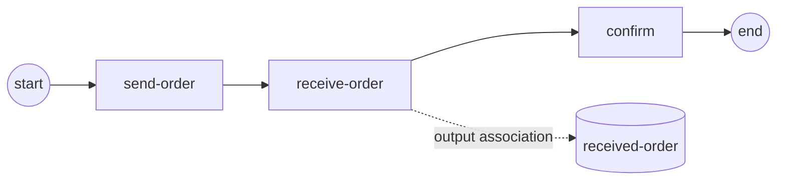

# Message events

A **message** is a named, payload-carrying signal that travels through the
engine's MessageBroker from one point in a process to another — potentially
across two different instances. You reach for messages when one activity must
**publish** data and another must **wait** for it and bind that data into its
own scope. gobpm exposes the same message contract in two shapes: the
task-shaped **SendTask/ReceiveTask** and the event-shaped
**IntermediateThrowEvent/IntermediateCatchEvent**. Primary example:
[`examples/message-send-receive/`](../../../examples/message-send-receive/).

## What it is

A send point binds a process property, wraps it in a named `Message`, and
publishes it to the broker. A receive point subscribes a **MessageWaiter** to
that same message name; on arrival it binds the payload into its scope, where an
output association can land it in a DataObject.



Both endpoints reference a `Message` with the **same name** (`order placed`) —
that name is the routing key. The send side reads the property named in its
message item (`order_out`); the receive side binds the arriving payload into
the item its message names (`order_in`).

## Build it

A `Message` pairs a name with an item definition. The **SendTask** binds the
`order_out` property and publishes it:

```go
send, err := activities.NewSendTask("send-order",
    bpmncommon.MustMessage("order placed",
        data.MustItemDefinition(values.NewVariable(""),
            foundation.WithID("order_out"))),
    activities.WithoutParams())
```

The **ReceiveTask** waits for the same `order placed` message and binds its
payload into `order_in`. An output parameter carries the bound item outward:

```go
outParam := data.MustParameter("received order",
    data.MustItemAwareElement(
        data.MustItemDefinition(values.NewVariable(""),
            foundation.WithID("order_in")),
        data.UnavailableDataState))

receive, err := activities.NewReceiveTask("receive-order",
    bpmncommon.MustMessage("order placed",
        data.MustItemDefinition(values.NewVariable(""),
            foundation.WithID("order_in"))),
    activities.WithParameters(data.Output, outParam))
```

An **output association** lands the bound `order_in` into a DataObject the
driver can read back:

```go
receivedDO, err := dataobjects.New("received-order",
    data.MustItemDefinition(values.NewVariable(""),
        foundation.WithID("order_in")),
    nil)

err = receivedDO.AssociateSource(receive, []string{"order_in"}, nil)
```

Wire the nodes on one track (`start → send → receive → confirm → end`) so the
send completes before the receive subscribes — the in-memory broker buffers the
published message until then.

## Run it

```bash
cd examples/message-send-receive && go run .
```

Past the startup banner, the message travels the broker and the DataObject
verifies:

```
  ✓ send-order published "ORD-2026-001"
  ✓ receive-order bound it into received-order = "ORD-2026-001"
✓ message-demo completed: the message travelled the broker from the SendTask to the ReceiveTask
```

The event-shaped peer (`message-intermediate-events`) does the same round-trip
with intermediate throw/catch events instead of send/receive tasks:

```
  ✓ throw-order published "ORD-2026-002"
  ✓ catch-order bound it; confirm read order_in = "ORD-2026-002"
✓ message-events-demo completed: the message travelled the broker from the throw event to the catch event
```

## How it works

- **Name is the route.** Both endpoints name the same `Message` (`order
  placed`); the broker matches subscribers by that name. The item IDs on each
  side (`order_out`, `order_in`) name the *local* data the payload is read from
  and bound into — they need not match each other.
- **The receive side parks.** A ReceiveTask (and an IntermediateCatchEvent)
  subscribes a **MessageWaiter** and holds its track until the message arrives;
  on arrival the payload is bound into the local item.
- **Buffered delivery.** The in-memory broker buffers a published message, so a
  send that fires *before* the matching receive subscribes still delivers — the
  ordering on a single track (send then receive) relies on this.
- **Binding, not copying by hand.** The receive side binds the payload for you;
  an output association (or an output parameter) then moves the bound item into
  a DataObject or downstream scope.

## Options & variations

- **Event shape instead of task shape.** Use an `IntermediateThrowEvent` /
  `IntermediateCatchEvent` with a `MessageEventDefinition` when the send/receive
  is an event on the flow rather than a work step:

  ```go
  throw, err := events.NewIntermediateThrowEvent("throw-order",
      events.MustMessageEventDefinition(
          bpmncommon.MustMessage("order placed",
              data.MustItemDefinition(values.NewVariable(""),
                  foundation.WithID("order_out"))),
          nil))
  ```

  The catch peer is `events.NewIntermediateCatchEvent(...)` with the same
  message name; it binds into `order_in`. See
  [`examples/message-intermediate-events/`](../../../examples/message-intermediate-events/).
- **Across instances.** The broker is engine-global, so a send in one instance
  and a receive in another exchange the message the same way. When more than one
  instance could receive, use **correlation** to route the message to the right
  one.
- **Reading the bound payload.** Downstream code reads the bound item by ID —
  in the event example, `confirm` calls `r.GetDataByID("order_in")`.

## See also

- Full example: [`examples/message-send-receive/`](../../../examples/message-send-receive/)
- Event-shaped peer: [`examples/message-intermediate-events/`](../../../examples/message-intermediate-events/)
- Related: [Signal](signal.md) · [Timer](timer.md) · [Correlation & conversations](../operating/correlation.md)
