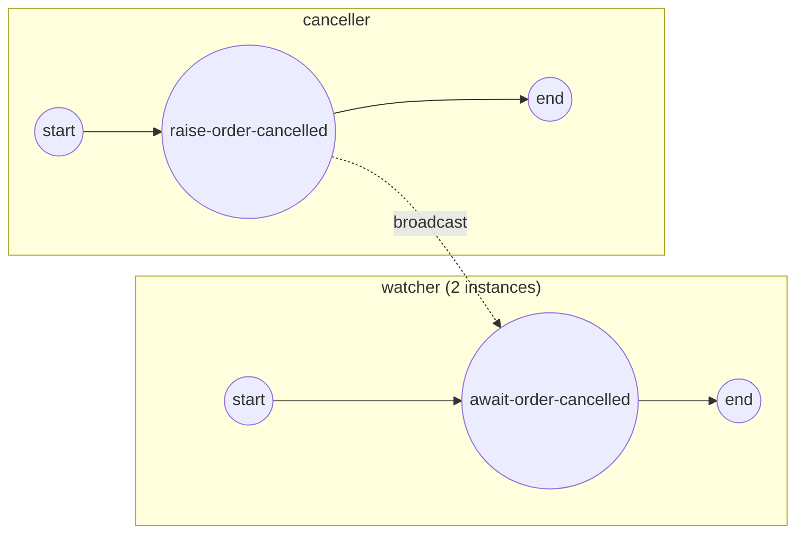

# Signal events

A **signal** is a fire-and-forget broadcast: one throw reaches *every* catcher
in range at once. Unlike a message, a signal has **no correlation** and no
single addressee — thrower and catchers meet only by the signal **name**. Reach
for a signal when one event must fan out to many independent listeners:
"order cancelled", "system shutting down", "batch ready". Full program:
[`examples/signal-broadcast/`](../../../examples/signal-broadcast/).

## What it is

Any number of catchers can wait on a signal name; a single throw wakes them all.
Because there is no correlation key, the throw does not target one instance — it
broadcasts to whoever is listening, even across independent process instances.



## Build it

Catcher and thrower each build their **own** signal event definition — they are
distinct nodes that meet by **name**, not by sharing an object:

```go
func signalDef(name string) (*events.SignalEventDefinition, error) {
    sig, err := events.NewSignal(name, nil)
    if err != nil {
        return nil, fmt.Errorf("create signal: %w", err)
    }
    return events.NewSignalEventDefinition(sig)
}
```

The catcher parks on an **Intermediate Catch Event** until the signal arrives:

```go
def, _ := signalDef(signal)
catch, _ := events.NewIntermediateCatchEvent("await-"+signal, def)
```

The thrower broadcasts via an **Intermediate Throw Event**:

```go
def, _ := signalDef(signal)
throw, _ := events.NewIntermediateThrowEvent("raise-"+signal, def)
```

Each node is wired into a plain `start → node → end` process and registered with
the engine. Two watcher instances start and park; one canceller throws once:

```go
h1, _ := engine.StartLatest(catcher.ID()) // parks on the catch
h2, _ := engine.StartLatest(catcher.ID()) // parks on the catch
// ...
engine.StartLatest(thrower.ID())          // one broadcast wakes both
```

## Run it

```bash
cd examples/signal-broadcast && go run .
```

After the engine's startup banner, one throw wakes both waiting instances:

```
  ▶ two watcher instances are waiting on "order-cancelled"
  ▶ one canceller threw the signal once
  ✓ watcher 1 completed (Completed) — caught the broadcast
  ✓ watcher 2 completed (Completed) — caught the broadcast
✓ one throw → every waiting instance caught it (broadcast)
```

## How it works

- **Match by name, not by object.** Thrower and catcher build separate
  `SignalEventDefinition`s. The engine routes a throw to every catcher whose
  signal *name* matches — there is no correlation key to compute or align.
- **Broadcast, not point-to-point.** A single throw is delivered to *all*
  reachable catchers. If both watchers are parked, both resume from one throw;
  a message, by contrast, is consumed by exactly one receiver.
- **Catchers must be waiting.** A signal is transient — it wakes catchers that
  are parked *at throw time*. An instance that reaches its catch after the throw
  will keep waiting; there is no replay or buffering.
- **Payload is optional.** `events.NewSignal(name, nil)` carries no payload;
  pass a non-nil item to attach one.

## Options & variations

**Start a process on a signal.** A Start Event can carry a signal trigger. It
has no incoming flow — a broadcast of the signal *creates* an instance, with no
`StartProcess` call. Register the process, then propagate the signal:

```go
def, _ := signalDef(signalName)
start, _ := events.NewStartEvent("start", events.WithSignalTrigger(def))
// ...
engine.PropagateEvent(ctx, def) // one broadcast instantiates every listener
```

Every registered process that starts on that name gets its own instance. Because
signal-born instances have no `StartProcess` handle, discover them via
`engine.Instances(...)` and `engine.Instance(id)` to await completion. See
[`examples/signal-start/`](../../../examples/signal-start/):

```
  ▶ broadcasting "order-received" once (no StartProcess call)...
  order-received → handling fulfillment
  order-received → recording audit
✓ one broadcast signal created and completed both instances
```

> **Note:** A signal broadcasts to *all* listeners with no correlation. When you
> need to route an event to one specific instance — by a key such as an order
> id — use a [Message](message.md) instead.

## See also

- Full example: [`examples/signal-broadcast/`](../../../examples/signal-broadcast/)
- Signal start: [`examples/signal-start/`](../../../examples/signal-start/)
- Related: [Message](message.md) · [Start & End](start-and-end.md) · [Events & the hub](../concepts/events-and-hub.md)
