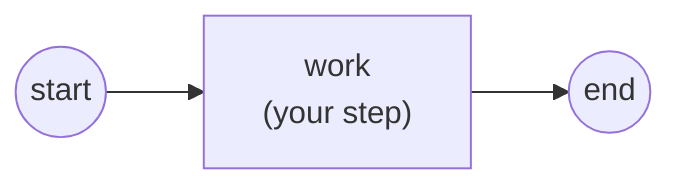

# Start & End events

Every process needs a way in and a way out. A **start event** marks where an
instance begins; an **end event** marks where a branch of it finishes. In their
plainest form — a bare start and a bare end — they carry no trigger and simply
bracket the flow. This page builds that plain pair, then shows the two most
common variations: an end that ends the *whole* instance at once, and the
triggers you can attach. Primary example:
[`examples/basic-process/`](../../../examples/basic-process/).

## What it is

A start event has no incoming sequence flow; the engine emits a token from it
when the instance starts. An end event has no outgoing flow; when a token
arrives, that branch is done. A process completes normally once *all* of its
tokens have reached end events.



## Build it

Both are one-line constructors — a name, and (optionally) trigger options. The
plain pair takes no options at all:

```go
start, err := events.NewStartEvent("start")
// ...
end, err := events.NewEndEvent("end")
```

Add them to the process like any other flow node, then wire the flow through:

```go
for _, e := range []flow.Element{start, task, end} {
    proc.Add(e)
}
flow.Link(start, task)
flow.Link(task, end)
```

That is the whole contract: the start feeds the first node, the last node feeds
the end.

## Run it

```bash
cd examples/basic-process && go run .
```

After the engine's startup banner and config dump, the instance starts at the
start event, runs the task, and settles at the end event as `Completed`:

```
2026/07/26 20:19:43 INFO InstanceState Created instance_id=6586177629480081713
2026/07/26 20:19:43 INFO InstanceState Active instance_id=6586177629480081713
  ▶ hello, dr.Dobermann (instance started at 2026-07-26 20:19:43.30 …)
2026/07/26 20:19:43 INFO InstanceState Completed instance_id=6586177629480081713
✓ basic-process completed (Completed): start → service task (read property + RUNTIME var) → end
```

## How it works

The engine drives the whole lifecycle around these two events:

```go
engine.RegisterProcess(proc)           // definition → launch template
engine.Run(ctx)                        // engine goroutine comes up
h, _ := engine.StartLatest(proc.ID())  // instance emits a token from the start
state, _ := h.WaitCompletion(ctx)      // returns when tokens reach the ends
```

- **Start** is the instantiation point. `StartLatest` launches an instance of the
  newest registered version and places a token on the start event's outgoing
  flow; execution proceeds from there.
- **End** is a completion point, not the instance's death. Each token that
  reaches an end event ends *its own* branch. The instance settles once *every*
  live token has reached an end event — that terminal state is what
  `WaitCompletion` returns (`Completed` for the normal case).
- A process may hold **several** end events (one per branch); reaching one end
  does not disturb the others. To tear the whole instance down from a single
  branch, you need a *terminate* trigger — see below.

> **Note:** A plain end event ends only the branch that reached it. If other
> branches are still running, the instance keeps going until they too reach an
> end.

## Options & variations

**Terminate end event — end the whole instance at once.** Attach a terminate
trigger to an end event and reaching it tears down the entire instance,
cancelling any in-flight branches (the running operations' contexts are
cancelled). The instance settles in `Terminated`, not `Completed`:

```go
termEd, _ := events.NewTerminateEventDefinition()
terminate, _ := events.NewEndEvent("terminate-order",
    events.WithTerminateTrigger(termEd))
```

See the full walkthrough in [`examples/terminate-end-event/`](../../../examples/terminate-end-event/),
where one branch flags fraud and terminates the instance mid-payment:

```
  ⚠ fraud-check: fraudulent order detected — terminating the process
  → process-payment: charging the card (takes ~3s)...
  ✗ process-payment: interrupted before it finished
```

**Other triggers.** A bare start/end carries no trigger, but both accept
trigger options to react to (start) or emit (end) an event. Start events take
`WithMessageTrigger`, `WithSignalTrigger`, `WithTimerTrigger`,
`WithConditionalTrigger`; end events take `WithErrorTrigger`,
`WithEscalationTrigger`, `WithMessageTrigger`, `WithSignalTrigger`,
`WithCancelTrigger`, `WithCompensationTrigger`. Each trigger has its own guide —
see below.

**Identity & docs.** Both constructors also accept `foundation.WithID(...)` for
a stable id and `foundation.WithDoc(...)` for documentation, like every model
element.

## See also

- Full example: [`examples/basic-process/`](../../../examples/basic-process/) · [`examples/terminate-end-event/`](../../../examples/terminate-end-event/)
- Next: [Your first process](../getting-started/first-process.md) · [Terminate](terminate.md)
- Triggers: [Message](message.md) · [Signal](signal.md) · [Timer](timer.md)
