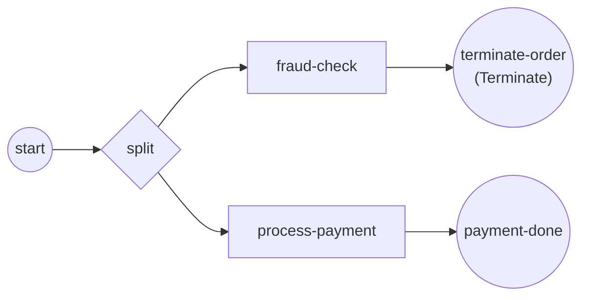

# Terminate end event

A normal end event just consumes its own token. A **terminate end event** ends
the whole enclosing scope the moment a single token reaches it: every other
in-flight branch is cancelled and the instance settles in `Terminated` instead
of `Completed`. Reach for it when one branch discovers there is no point
continuing — a fraud hit, a hard business rule, an unrecoverable input. Full
program: [`examples/terminate-end-event/`](../../../examples/terminate-end-event/).

## What it is

An ordinary end event carries an extra **terminate trigger**. The engine treats
it specially: instead of retiring one token and waiting for the rest, it tears
down the entire scope at once. Here two branches run in parallel; the fraud
branch reaches the terminate end event and takes the payment branch down with
it, mid-charge.



## Build it

A terminate end event is a plain end event plus a terminate trigger. Build the
trigger with `NewTerminateEventDefinition`, then attach it with
`WithTerminateTrigger`:

```go
termEd, err := events.NewTerminateEventDefinition()
// ...
terminate, err := events.NewEndEvent("terminate-order",
    events.WithTerminateTrigger(termEd))
```

The rest of the process is ordinary. A diverging parallel gateway splits into
the two branches; the fraud branch ends at the terminate event, the payment
branch at a normal end event:

```go
split, _ := gateways.NewParallelGateway(gateways.WithDirection(gateways.Diverging))
fraudCheck, _ := serviceTask("fraud-check", fraudCheckOp)
payment, _ := serviceTask("process-payment", paymentOp)
paymentDone, _ := events.NewEndEvent("payment-done")

flow.Link(start, split)
flow.Link(split, fraudCheck)
flow.Link(fraudCheck, terminate)
flow.Link(split, payment)
flow.Link(payment, paymentDone)
```

The payment operation is long-running and **honors its context** — that is what
lets the engine cancel it when the terminate fires:

```go
select {
case <-time.After(3 * time.Second):
    fmt.Println("  ✓ process-payment: charged")
    return nil, nil
case <-ctx.Done():
    fmt.Println("  ✗ process-payment: interrupted before it finished")
    return nil, ctx.Err()
}
```

## Run it

```bash
cd examples/terminate-end-event && go run .
```

The payment branch starts charging; the fraud branch fires the terminate; the
payment is cancelled before it can finish, and the instance settles in
`Terminated`:

```
  → process-payment: charging the card (takes ~3s)...
  ⚠ fraud-check: fraudulent order detected — terminating the process
  ✗ process-payment: interrupted before it finished

✓ terminate-end-event finished (Terminated): the fraud branch hit a Terminate End Event and ended the whole instance before the payment completed
```

> **Note:** the two branches run concurrently, so `fraud-check` and
> `process-payment` may print in either order. What is deterministic is the
> outcome: the payment is interrupted and the instance ends `Terminated`.

## How it works

- One token reaching the terminate end event is enough. The engine flips the
  instance to `Terminating`, cancels the context of every other active track,
  then settles the instance in `Terminated`.
- **Terminated is not Completed.** A normal instance that finishes all branches
  ends `Completed`; a terminate collapses it to `Terminated`. Read the terminal
  state from the handle to tell them apart:

  ```go
  state, _ := h.WaitCompletion(ctx)
  // state == Terminated after a terminate end event
  ```
- Cancellation is **cooperative**. The engine cancels each track's
  `context.Context`; a long-running operation must select on `ctx.Done()` to
  actually stop. An operation that ignores its context runs to completion — its
  side effects still land — even though the instance is already terminating.

## Options & variations

- **Scope reach.** A terminate ends the scope it lives in. At the top level of a
  process that is the whole instance; inside an embedded sub-process it ends that
  sub-process's scope, and the outer process continues from the sub-process's
  outgoing flow.
- **No trigger needed to construct it.** `WithTerminateTrigger` is the only thing
  that turns an end event into a terminate; drop it and you get a plain end event
  that just consumes its own token.
- **Pair it with a decision.** Terminate is usually downstream of a gateway or a
  guard — the "abandon everything" arm of an exclusive/parallel split, not the
  happy path.

## See also

- Full example: [`examples/terminate-end-event/`](../../../examples/terminate-end-event/)
- Related: [Start & End](start-and-end.md) · [Parallel (AND)](../gateways/parallel.md) · [Exclusive (XOR)](../gateways/exclusive.md)
