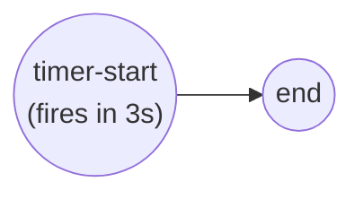

# Timer events

A **timer event** ties process flow to the clock. You reach for it when a step
should fire at a specific instant, after a delay, or on a repeating cycle —
without writing your own scheduling loop. The simplest form is a **timer start
event**: the engine instantiates the process when the timer fires. Full program:
[`examples/simple-timer/`](../../../examples/simple-timer/).

## What it is

A start event carrying a **timer event definition**. The definition holds *when*
to fire; the engine arms it at registration and launches an instance when the
clock reaches that point. Here a start event fires 3 seconds after registration
and flows straight to end.



## Build it

First compute *when*. A timer's `when` is a `FormalExpression` that yields a
`time.Time`; wrap it with `goexpr.Must`:

```go
timeExpr := goexpr.Must(
    nil,
    data.MustItemDefinition(values.NewVariable(time.Now().Add(3*time.Second))),
    func(ctx context.Context, ds data.Source) (data.Value, error) {
        return values.NewVariable(time.Now().Add(3 * time.Second)), nil
    },
    foundation.WithID("timer-3s"),
)
```

Feed that expression into a **timer event definition** as its `timeDate`, then
attach the definition to a start event via `WithTimerTrigger`:

```go
timerDef, err := events.NewTimerEventDefinition(timeExpr, nil, nil)

timerStart, err := events.NewStartEvent("timer-start",
    events.WithTimerTrigger(timerDef))
```

Wire it to an end event and add both to the process — an ordinary two-node flow:

```go
endEvent, _ := events.NewEndEvent("end")

proc.Add(timerStart)
proc.Add(endEvent)
flow.Link(timerStart, endEvent)
```

## Run it

```bash
cd examples/simple-timer && go run .
```

After the engine's startup banner, the process is registered and the timer is
armed; the instance auto-starts when it fires:

```
Timer process started. Will trigger in 3 seconds...
Timer should have fired by now!
```

> **Note:** A timer **start** event needs no explicit `StartLatest` call — the
> engine instantiates the process itself when the timer fires. You only
> `RegisterProcess` and `Run` the engine, then wait.

## How it works

The three parameters of `NewTimerEventDefinition(tDate, tCycle, tDuration, …)`
map to the three BPMN timer flavours, and they are **mutually exclusive**:

- **`timeDate`** — a specific instant (result type `Time`). Fires once, at that
  moment. This is what both examples use.
- **`timeCycle`** — a recurring count (result type `int`), paired with a
  duration for the interval between repetitions.
- **`timeDuration`** — a delay (result type `Duration`) from the moment the
  timer is armed.

The constructor rejects an inconsistent combination: you pass **either**
`timeDate` alone **or** `timeCycle` *and* `timeDuration` together — never a mix,
and never all-nil. It also type-checks each expression's result, so a `timeDate`
expression that doesn't yield a `time.Time` fails fast at build time.

Because the `when` is an expression evaluated by the engine (not a captured
constant), each armed instance recomputes it — the sample's closure returns
`time.Now().Add(3 * time.Second)` freshly on evaluation.

## Options & variations

- **Timer + real work.** Point the timer start at a task instead of straight to
  end. [`examples/timer-event/`](../../../examples/timer-event/) fires a 5-second
  timer into a `ServiceTask`, then ends — the same definition, a longer flow:

  ```go
  timerEvent, _ := events.NewStartEvent("timer-start",
      events.WithTimerTrigger(timerDef))
  serviceTask, _ := activities.NewServiceTask("handle-timeout", op,
      activities.WithoutParams())
  flow.Link(timerEvent, serviceTask)
  flow.Link(serviceTask, endEvent)
  ```

- **Duration instead of instant.** Pass the expression as the third argument
  (`NewTimerEventDefinition(nil, nil, durationExpr)`) with a result type of
  `Duration` for a "fire N after arming" delay.
- **Recurring.** Supply `timeCycle` (an `int` count) together with
  `timeDuration` (the interval) for a repeating timer.

## See also

- Full example: [`examples/simple-timer/`](../../../examples/simple-timer/) · [`examples/timer-event/`](../../../examples/timer-event/)
- Related: [Start & End](start-and-end.md) · [Events & the hub](../concepts/events-and-hub.md) · [Expressions](../data/expressions.md)
