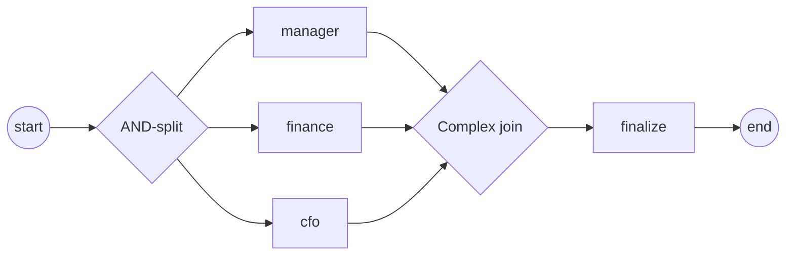

# Complex gateway

A **complex gateway** is a data-aware synchronizing join: it fires once an
**activation rule** is satisfied — typically "N of M incoming branches have
arrived" — instead of waiting for *every* branch (parallel join) or the
*conditionally-true* subset (OR-join). Reach for it when partial completion is
enough: two of three approvals, a quorum, a discriminator. Full program:
[`examples/complex-gateway/`](../../../examples/complex-gateway/).

## What it is

Three approvers run in parallel; a converging complex gateway joins them on the
rule "two approvals for a small order, all three for a large one". The first
branches to satisfy the threshold fire the join once; any approval that arrives
afterwards is consumed as a **trailing token** — it does not re-fire the join.



## Build it

The activation rule is a disjunction of **triples**. Each `Triple` says: fire
when `count` incoming flows have arrived and its optional guard holds. Here two
triples — guarded on the `amount` property — pick the threshold by data:

```go
small, _ := gateways.NewTriple(2,
    gateways.WithGuard(amountCond(func(a int) bool { return a < 1000 })))
big, _ := gateways.NewTriple(3,
    gateways.WithGuard(amountCond(func(a int) bool { return a >= 1000 })))

cg, _ := gateways.NewComplexGateway(
    gateways.WithActivation(small, big),
    gateways.WithDirection(gateways.Converging))
```

The guard is an ordinary process-data expression — it reads the `amount`
property and returns a bool:

```go
func amountCond(pred func(a int) bool) data.FormalExpression {
    return goexpr.Must(
        nil,
        data.MustItemDefinition(values.NewVariable(false)),
        func(ctx context.Context, ds data.Source) (data.Value, error) {
            v, err := ds.Find(ctx, "amount")
            if err != nil {
                return nil, err
            }
            a, _ := v.Value().Get(ctx).(int)
            return values.NewVariable(pred(a)), nil
        })
}
```

The AND-split (`gateways.NewParallelGateway()`) forks all three approver tasks;
each links into the complex join. Wiring is `start → split → each approver →
join → finalize → end` (see `process.go`).

## Run it

```bash
cd examples/complex-gateway && go run .
```

After the engine's startup banner, all three approvers run, but the join fires
on the 2nd arrival (the demo uses `amount = 500`):

```
order amount = 500 (needs 2 approvals)
  ▶ finance approved
  ▶ cfo approved
  ▶ manager approved
  ✓ order finalized
✓ complex-gateway completed (Completed): the join fired on the 2nd approval; the 3rd was consumed as a trailing token
```

> **Note:** All three approvers still run — the split is a plain parallel fork.
> The threshold only governs when the *join* fires downstream; it does not
> cancel the branches that lose the race. Their tokens arrive as trailing
> tokens and are consumed.

## How it works

- **Converging vs diverging.** `WithDirection(gateways.Converging)` makes the
  gateway a join. Diverging, a complex gateway behaves as the inclusive split —
  it forks the conditionally-true outgoing subset.
- **Activation rule.** The rule is a disjunction of `Triple`s; the join fires as
  soon as *any* triple is satisfied. A triple needs `count` arrivals, and — if
  given — its guard must hold and any `WithRequired` flows must be among the
  arrived. Evaluation happens on each arrival against the current arrival state.
- **Fires once.** The gateway owns its per-instance arrival state under its own
  mutex and flips to `fired` on the first satisfied triple. Later arrivals are
  counted (the count is monotonic) but do not re-fire.
- **Token death aborts.** Unlike the OR-join, if an incoming token dies the
  complex join aborts rather than firing — because a partial-arrival count can
  never be "completed" by a death.

## Options & variations

- **Bare threshold.** For a guard-less "N of M" join, skip the triples and use
  `WithActivationThreshold(n)` — a single unconditional triple. It is mutually
  exclusive with `WithActivation`.
- **Gate-identity activation.** `NewTriple(count, gateways.WithRequired(ids...))`
  demands that specific incoming flows be among the arrived — a discriminator
  that waits for *particular* branches, not just any `count` of them.
- **Multiple disjuncts.** Pass several triples to `WithActivation`; the first to
  match wins. `NewTriple` rejects `count < 1` and `count` below the number of
  required flows — a triple that can never fire is caught at build time.

## See also

- Full example: [`examples/complex-gateway/`](../../../examples/complex-gateway/)
- Related: [Parallel (AND)](parallel.md) · [Inclusive (OR)](inclusive.md) · [Exclusive (XOR)](exclusive.md)
