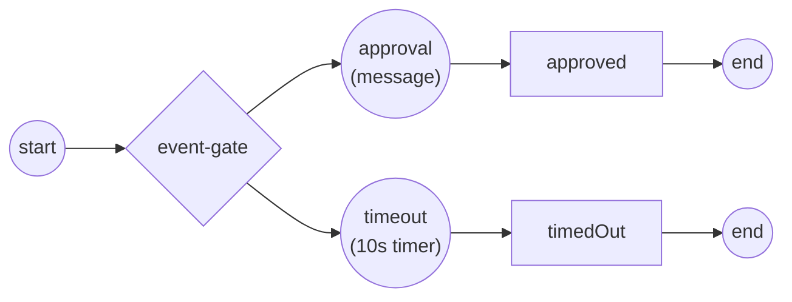

# Event-based gateway

Where an [exclusive gateway](exclusive.md) picks an arm by evaluating *data*,
an **event-based** gateway defers the choice to the outside world: it arms
several catch events at once and routes the token down whichever **fires
first**, dropping the rest. Reach for it when the next step depends on which
event arrives — an approval message versus a timeout, for example. Full
program: [`examples/event-based-gateway/`](../../../examples/event-based-gateway/).

## What it is

The gateway sits between a source and two or more **intermediate catch
events** (a message, a timer, a signal, a conditional). When the token reaches
the gate it subscribes to *every* arm and parks. The first arm to fire wins:
its token continues, and the other subscriptions are cancelled.



In the example the approval message and a 10-second timeout race. The demo
publishes the approval, so that arm wins; the timer is the self-terminating
fallback — the run completes even if no message ever arrives.

## Build it

Construct the gateway with `WithDirection(Diverging)`, then wire each arm as an
intermediate catch event downstream of it:

```go
gate, err := gateways.NewEventBasedGateway(
    gateways.WithDirection(gateways.Diverging))

approvalArm, _ := messageCatch("approval", approvalMessage)   // message catch
timeoutArm, _ := timerCatch("timeout", 10*time.Second)        // timer catch
```

Each arm is an ordinary `IntermediateCatchEvent` — nothing special marks it as
a gateway arm; the sequence flows from the gate do that:

```go
flow.Link(start, gate)
flow.Link(gate, approvalArm)   // arm 1
flow.Link(gate, timeoutArm)    // arm 2
flow.Link(approvalArm, approved)
flow.Link(timeoutArm, timedOut)
```

The message arm is a plain message catch; the timer arm fires after its
duration from *now*:

```go
def, _ := events.NewMessageEventDefinition(
    bpmncommon.MustMessage(msgName, data.MustItemDefinition(
        values.NewVariable(""), foundation.WithID(id+"_in"))), nil)
ice, _ := events.NewIntermediateCatchEvent(id, def)
```

## Run it

```bash
cd examples/event-based-gateway && go run .
```

After the engine's startup banner:

```
deferred choice: waiting for an approval message OR a 10s timeout...
  ✓ approval arrived first → order approved
✓ event-based-gateway completed (Completed): the gate fired the arm whose event arrived first; the other was dropped
```

The driver starts the instance, waits a moment for the gate to park on both
arms, then publishes the approval message:

```go
h, _ := engine.StartLatest(proc.ID())
time.Sleep(300 * time.Millisecond) // let the gate park on both arms
broker.Publish(ctx, messaging.Envelope{Name: approvalMessage, Payload: "OK"})
state, _ := h.WaitCompletion(ctx)
```

## How it works

- **Subscribe-all, then park.** On arrival the gate registers a waiter for
  every downstream catch and blocks. It does *not* pick an arm eagerly — the
  choice belongs to the events.
- **First fire wins.** When one arm's event is delivered, its token proceeds
  and the gate cancels the other subscriptions, so the losing arms never run.
- **The timer is a safety net.** A timer arm guarantees the instance makes
  progress even if no message arrives — bound its duration to your SLA.

> **Note:** every arm must be an intermediate *catch* event directly downstream
> of the gate. A service task or a second gateway on an arm is not a valid
> target for the deferred choice.

## Options & variations

The gateway can also **start** a process — the instantiating form, with no
incoming flow and no start event. The first correlated message to arrive
creates the instance:

```go
gate, _ := gateways.NewEventBasedGateway(
    gateways.WithInstantiate(),
    gateways.WithEventGatewayType(gateways.ParallelEvents),
    gateways.WithCorrelationKey(key))
```

- **`WithInstantiate()`** — the gate has no start event; the first arm's event
  creates the instance.
- **`WithEventGatewayType(...)`** — `ExclusiveEvents` (the default; first event
  wins, others dropped) or `ParallelEvents` (the instance completes only once
  *every* arm has fired).
- **`WithCorrelationKey(key)`** — routes later messages to the instance the
  first message created, keyed off a value in the payload.

The [`event-based-parallel-start`](../../../examples/event-based-parallel-start/)
example builds exactly this: an order-fulfillment process born by the first of
two correlated messages (order placed, payment received) that finishes once
both have arrived.

## See also

- Full example: [`examples/event-based-gateway/`](../../../examples/event-based-gateway/)
- Instantiating variant: [`examples/event-based-parallel-start/`](../../../examples/event-based-parallel-start/)
- Related: [Exclusive (XOR)](exclusive.md) · [Message](../events/message.md) · [Timer](../events/timer.md)
