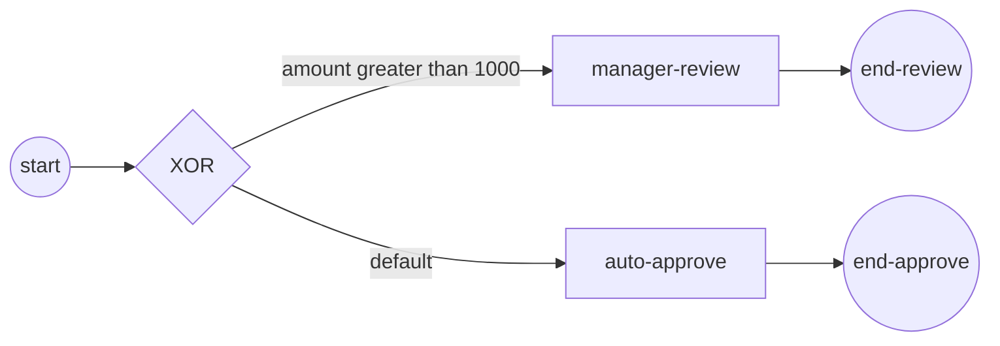

# Exclusive gateway (XOR)

An **exclusive gateway** sends a token down exactly **one** outgoing flow. It
evaluates each branch's condition and takes the **first true** one; if none is
true it takes the **default flow**. Reach for it when a single data value
decides which of several mutually exclusive paths a process should follow. Full
program: [`examples/gateway-routing/`](../../../examples/gateway-routing/).

## What it is

One split node with several outgoing flows. Every non-default flow carries a
**condition** (a boolean expression over process data); one flow is marked the
**default**. At runtime the gateway checks the conditions in order and routes
the token to the first flow whose condition is true — the default flow is taken
only when every condition is false.



The example routes an order by its `amount`: over 1000 goes to manager review,
otherwise it auto-approves. The demo runs with `amount = 2500`, so it takes the
manager-review branch.

## Build it

Give the process a property for the condition to read, then create the gateway
and the two branch tasks:

```go
proc, err := process.New("order-routing",
    data.WithProperties(
        data.MustProperty("amount",
            data.MustItemDefinition(
                values.NewVariable(amount),
                foundation.WithID("amount")),
            data.ReadyDataState)))

xor, err := gateways.NewExclusiveGateway()
```

Wire the branches. A conditional flow carries `flow.WithCondition`; the
fall-through flow carries no condition and is registered as the **default** with
`UpdateDefaultFlow`:

```go
if _, err := flow.Link(xor, review,
    flow.WithCondition(amountGt1000())); err != nil {
    return nil, fmt.Errorf("link xor->review: %w", err)
}

df, err := flow.Link(xor, approve)
if err != nil {
    return nil, fmt.Errorf("link xor->approve: %w", err)
}

if err := xor.UpdateDefaultFlow(df); err != nil {
    return nil, fmt.Errorf("set default flow: %w", err)
}
```

The condition is a `data.FormalExpression` that reads a named value from the
data source and returns a boolean:

```go
func amountGt1000() data.FormalExpression {
    return goexpr.Must(
        nil,
        data.MustItemDefinition(values.NewVariable(false)),
        func(ctx context.Context, ds data.Source) (data.Value, error) {
            v, err := ds.Find(ctx, "amount")
            if err != nil {
                return nil, err
            }

            amount, _ := v.Value().Get(ctx).(int)

            return values.NewVariable(amount > 1000), nil
        })
}
```

## Run it

```bash
cd examples/gateway-routing && go run .
```

After the engine's startup banner, the gateway picks the branch and the
instance completes:

```
order amount = 2500
  ▶ amount > 1000 → routed to manager review
✓ gateway-routing completed (Completed): the exclusive gateway chose the branch by data
```

## How it works

- The gateway evaluates its conditional flows and takes the **first true**
  one — exactly one token leaves the gateway, never more.
- Each condition is evaluated against the instance's data plane; `ds.Find(ctx,
  "amount")` resolves the process property **by name**, the same way a task
  reads data.
- If no condition is true, the **default flow** is taken. The default flow
  itself has no condition — it is the explicit fall-through you register with
  `UpdateDefaultFlow`.
- Order matters when two conditions could both be true: the first true flow in
  evaluation order wins, and the rest are skipped.

> **Note:** Always register a default flow. Without one, an input that matches
> no condition leaves the token with nowhere to go — the default is the
> guaranteed exit that keeps the gateway total over its inputs.

## Options & variations

- **Change the routing value.** The demo hard-codes `amount = 2500` in
  `main.go`; set it at or below 1000 and the token falls through to the
  auto-approve (default) branch instead.
- **More branches.** Add further `flow.Link(xor, …, flow.WithCondition(…))`
  flows; each gets its own condition and they are evaluated in order, first-true
  wins, default last.
- **Expression style.** The condition here is a Go functor via `goexpr`. For a
  string expression evaluated by the engine, see
  [Expressions](../data/expressions.md).

## See also

- Full example: [`examples/gateway-routing/`](../../../examples/gateway-routing/)
- Related: [Parallel (AND)](parallel.md) · [Inclusive (OR)](inclusive.md) · [Expressions](../data/expressions.md)
