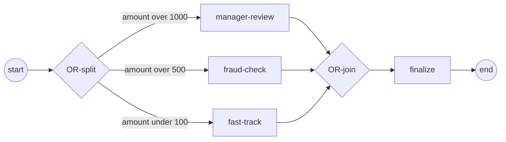

# Inclusive gateway (OR)

An **inclusive (OR) gateway** forks *every* branch whose condition is true — not
exactly one (that's the exclusive XOR) and not all unconditionally (that's the
parallel AND). Diverging, it activates the *true subset* of its outgoing flows.
Converging, it is the **OR-join**: it waits for exactly that subset — no more,
no less — then continues once. Reach for it when several conditions can hold at
the same time and you must re-synchronize only the branches that actually ran.
This page is the developer reference — the type, its constructor, the direction
option, the join contract it implements, and its runtime behavior.

## Taxonomy

| | |
|---|---|
| BPMN category | Gateway → **Inclusive (OR) gateway** (§13.3.3) |
| Package | `github.com/dr-dobermann/gobpm/pkg/model/gateways` |
| Type | `gateways.InclusiveGateway` |
| Embeds | `gateways.Gateway` (which embeds `flow.BaseNode`) — direction, default flow, flow-slot checks |
| Implements | `flow.Node`; `exec.NodeExecutor` (`Exec`); when converging, `exec.ReachabilityJoin` (`Arrive`, `Recheck`, `IsTrailing`) |
| The work | route a token by the *true subset* of outgoing conditions (split) or reachability-merge the active branches (join) |

Where it sits in the gateway family: [Gateways taxonomy](index.md).

## Constructor

```go
func NewInclusiveGateway(opts ...options.Option) (*InclusiveGateway, error)
```

| Parameter | Meaning |
|---|---|
| `opts` | zero or more options — see below. The one that matters is `WithDirection`, which decides split vs join. |

It returns an error — never panics — on an invalid option (e.g. an unknown
gateway direction). A gateway with no direction option is `Unspecified`; give
the split `Diverging` and the join `Converging` explicitly.

## Options

Most inclusive gateways need only one option — the direction:

| Option | When you reach for it |
|---|---|
| `WithDirection(Diverging)` | the OR-**split** — forks every branch whose condition is true. |
| `WithDirection(Converging)` | the OR-**join** — merges exactly the branches the split lit up. |

`NewInclusiveGateway` accepts these option families (from `go doc`):

| Option | Effect |
|---|---|
| `gateways.WithDirection(dir GDirection)` | set the gateway direction — `Diverging`, `Converging`, or `Unspecified` (`GDirection` values). |
| `foundation.WithID(id string)` | set an explicit element id (otherwise derived). |
| `foundation.WithDoc(...)` | attach documentation. |
| `options.WithName(name string)` | set the diagram name. |

> Conditions live on the **outgoing sequence flows**, not on the gateway.
> Attach each split branch's guard with `flow.WithCondition` when you `flow.Link`
> it — see [Sequence flows](../foundation/flows.md) and
> [Expressions](../data/expressions.md). The default flow (taken when no
> condition is true) is registered with the gateway's `UpdateDefaultFlow`, the
> same pattern as the [Exclusive gateway](exclusive.md).

For the complete, always-current signatures run
`go doc github.com/dr-dobermann/gobpm/pkg/model/gateways`.

## The ReachabilityJoin contract

A converging `InclusiveGateway` is an `exec.ReachabilityJoin` — a
`SynchronizingJoin` whose completion is **non-local**: it fires only when no
live token can still reach an un-marked incoming flow. The engine drives it;
you never call these yourself:

```go
type ReachabilityJoin interface {
    SynchronizingJoin // Arrive(incomingFlowID, arrivingTrackID) (complete bool, merged []string)
    Recheck(fc FlowChecker) (complete bool, survivor string, merged []string)
    IsTrailing(arrivingTrackID string) bool
}
```

| Member | Role |
|---|---|
| `Arrive(flowID, trackID)` | record a token arriving on `flowID`; report count-only completion (every incoming flow marked) and the merged track ids. |
| `Recheck(fc)` | re-prune now-unreachable incoming flows via the loop's `exec.FlowChecker` and fire without a new arrival — this is what lets an OR-join stop waiting on a branch that was never taken. |
| `IsTrailing(trackID)` | report a late arrival that reached the join after a reachability fire, so the loop consumes rather than parks it. |

The join owns its per-instance arrival state under its own mutex (ADR-005
§2.4 / ADR-009); the instance loop supplies reachability and re-checks the join
when a token parks at it and on every token death.

## Build it

Create the two gateways with opposite directions — one `Diverging` split, one
`Converging` join — then wire the diamond:

```go
split, err := gateways.NewInclusiveGateway(
    gateways.WithDirection(gateways.Diverging))

join, err := gateways.NewInclusiveGateway(
    gateways.WithDirection(gateways.Converging))
```

Each split branch is a sequence flow carrying a condition; branches into the
join carry none. `flow.WithCondition` attaches the guard, and a condition is a
`data.FormalExpression` over process data (here it reads the `amount` property):

```go
links := []struct {
    from, to flow.Element
    cond     data.FormalExpression
}{
    {b.start, split, nil},
    {split, b.mgr, amountAbove(1000)},
    {split, b.fraud, amountAbove(500)},
    {split, b.fast, amountBelow(100)},
    {b.mgr, join, nil},
    {b.fraud, join, nil},
    {b.fast, join, nil},
    {join, b.finalize, nil},
    {b.finalize, b.end, nil},
}

for _, l := range links {
    opts := []options.Option{}
    if l.cond != nil {
        opts = append(opts, flow.WithCondition(l.cond))
    }
    src := l.from.(flow.SequenceSource)
    trg := l.to.(flow.SequenceTarget)
    if _, err := flow.Link(src, trg, opts...); err != nil {
        return fmt.Errorf("link: %w", err)
    }
}
```



## Run it

```bash
cd examples/inclusive-join && go run .
```

With `amount = 1500`, both `> 1000` and `> 500` are true, so `manager-review`
and `fraud-check` fork; `fast-track` (`< 100`) is never taken, and the join does
not wait on it. After the engine banner, the two active branches run
concurrently (print order varies) and the join fires once:

```
order amount = 1500
  ▶ amount > 500 → fraud check
  ▶ amount > 1000 → manager review
  ✓ branches merged → order finalized
✓ inclusive-join completed (Completed): the OR-join merged the active branches and fired once
```

## Methods & runtime behavior

The engine drives the gateway through these — you rarely call them directly:

| Method | Role |
|---|---|
| `Exec(ctx, re) ([]*flow.SequenceFlow, error)` | diverging: return the true-subset of outgoing flows; converging: route the survivor's post-merge continuation. |
| `Arrive` / `Recheck` / `IsTrailing` | the OR-join synchronization contract (above). |
| `Direction()` / `DefaultFlow()` / `UpdateDefaultFlow(f)` | inspect the direction, read/register the default flow (via the embedded `Gateway`). |
| `Node()` / `NodeType()` / `Clone()` | flow-node introspection and per-instance cloning. |

Behavior worth knowing:

- **Split — the true subset.** The diverging gateway evaluates every outgoing
  condition and activates exactly those that are true. A single-true run behaves
  like XOR, an all-true run like AND; the OR gateway spans that whole range.
- **Join — reachability, not a fixed count.** Completion is *count-only* on
  `Arrive` (every incoming flow already marked) **or** *reachability-based* on
  `Recheck` — the join fires as soon as no live token can still reach an
  un-marked incoming flow. That is why a never-taken branch (`fast-track` here)
  does not stall it: the engine finds it unreachable and the join stops awaiting
  it, rather than blocking forever.
- **Fire once.** However many branches merge, the join promotes one survivor
  track and continues a single token downstream to `finalize`.
- **Pair the types.** The join derives which branches to await from the split's
  decision; pairing an OR-join with a different split type breaks that
  accounting. Keep the split/join both inclusive with matching direction.

## See also

- Examples: `examples/inclusive-join/`
- Related guides: [Exclusive (XOR)](exclusive.md) · [Parallel (AND)](parallel.md) · [Complex](complex.md) · [Sequence flows](../foundation/flows.md) · [Expressions](../data/expressions.md)
- Design: [ADR-005 — Gateways and joins](../../design/ADR-005-gateways-and-joins.md) (§2.9 split, §2.10 OR-join)
- Full API: `go doc github.com/dr-dobermann/gobpm/pkg/model/gateways`
</content>
</invoke>
