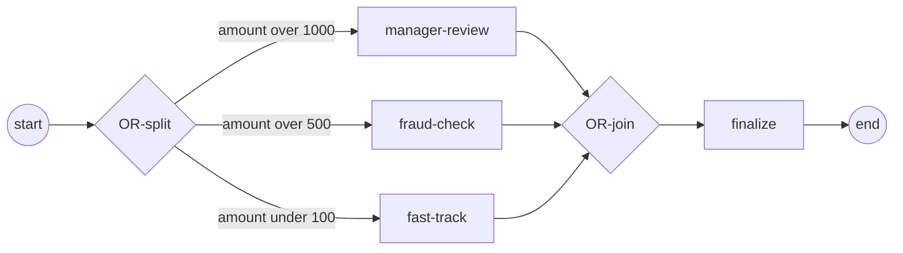

# Inclusive gateway (OR)

An **inclusive (OR) gateway** forks *every* branch whose condition is true — not
exactly one (that's the exclusive XOR) and not all of them unconditionally
(that's the parallel AND). The converging OR-join then waits for exactly that
subset of branches before continuing once. Reach for it when several conditions
can independently hold at the same time. Full program:
[`examples/inclusive-join/`](../../../examples/inclusive-join/).

## What it is

Two inclusive gateways bracket a set of conditional branches: a **diverging**
split and a **converging** join. At the split, each outgoing sequence flow
carries a condition; every branch that evaluates true is activated. The join
knows how many branches the split lit up and merges exactly those, firing once
downstream.



With `amount = 1500`, both `> 1000` and `> 500` are true, so `manager-review`
and `fraud-check` fork; `fast-track` (`< 100`) is never taken, and the join does
not wait on it.

## Build it

Create the two gateways with opposite directions — one `Diverging`, one
`Converging`:

```go
split, err := gateways.NewInclusiveGateway(
    gateways.WithDirection(gateways.Diverging))

join, err := gateways.NewInclusiveGateway(
    gateways.WithDirection(gateways.Converging))
```

Each split branch is a sequence flow with a condition; branches into the join
carry none. `flow.WithCondition` attaches the guard:

```go
links := []struct {
    from, to flow.Element
    cond     data.FormalExpression
}{
    {b.start, split, nil},
    {split, b.mgr, amountAbove(1000)},
    {split, b.fraud, amountAbove(500)},
    {split, b.fast, amountBelow(100)},
    {b.mgr, join, nil},
    {b.fraud, join, nil},
    {b.fast, join, nil},
    {join, b.finalize, nil},
    {b.finalize, b.end, nil},
}

for _, l := range links {
    opts := []options.Option{}
    if l.cond != nil {
        opts = append(opts, flow.WithCondition(l.cond))
    }
    src := l.from.(flow.SequenceSource)
    trg := l.to.(flow.SequenceTarget)
    if _, err := flow.Link(src, trg, opts...); err != nil {
        return fmt.Errorf("link: %w", err)
    }
}
```

A condition is a `data.FormalExpression` over process data. Here it reads the
`amount` property and returns a bool:

```go
func amountCond(pred func(a int) bool) data.FormalExpression {
    return goexpr.Must(
        nil,
        data.MustItemDefinition(values.NewVariable(false)),
        func(ctx context.Context, ds data.Source) (data.Value, error) {
            v, err := ds.Find(ctx, "amount")
            if err != nil {
                return nil, err
            }
            a, _ := v.Value().Get(ctx).(int)
            return values.NewVariable(pred(a)), nil
        })
}
```

## Run it

```bash
cd examples/inclusive-join && go run .
```

After the engine's startup banner, the two true branches run and the join fires
once (branch print order varies — the active branches run concurrently):

```
order amount = 1500
  ▶ amount > 500 → fraud check
  ▶ amount > 1000 → manager review
  ✓ branches merged → order finalized
✓ inclusive-join completed (Completed): the OR-join merged the active branches and fired once
```

## How it works

- **Split** — the diverging gateway evaluates every outgoing condition and
  activates the *true subset*. With `amount = 1500` that is two branches; a
  single-true amount would behave like XOR, an all-true amount like AND.
- **Join** — the converging gateway synchronizes exactly the branches the split
  lit up. It does not wait for the whole diagram, only for the tokens that are
  actually in flight, then continues **once** to `finalize`.
- **Unreachable branches don't stall** — `fast-track` (`< 100`) is never taken.
  The engine determines it is unreachable for this run and the join ignores it,
  rather than blocking forever on a branch that will never arrive.

> **Note:** The split and join must both be inclusive gateways with matching
> direction (`Diverging` / `Converging`). The join derives which branches to
> await from the split's decision — pairing an OR-join with a different split
> type breaks that accounting.

## Options and variations

- **Direction** — `gateways.WithDirection(gateways.Diverging)` for the split,
  `gateways.Converging` for the join. A single inclusive gateway can also mix
  incoming and outgoing flows, but the split/join pair is the clear form.
- **Default flow** — as with the exclusive gateway, a branch can be marked the
  default to take when no condition is true, avoiding a dead-ended token. See
  [Exclusive (XOR)](exclusive.md) for the default-flow pattern.
- **Condition language** — the example uses `goexpr` (native Go predicates). Any
  `data.FormalExpression` works; see [Expressions](../data/expressions.md).

## See also

- Full example: [`examples/inclusive-join/`](../../../examples/inclusive-join/)
- Related: [Exclusive (XOR)](exclusive.md) · [Parallel (AND)](parallel.md) · [Expressions](../data/expressions.md)
