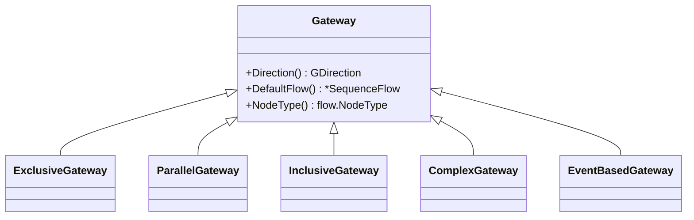

# Gateways

A **gateway** controls how sequence flows converge and diverge in a process. It
does no work and has zero effect on cost/time — it only routes tokens: merging
them on input (a **join**), splitting them on output (a **split**), or both. The
gateway *kind* picks the routing rule; the *direction* (converging / diverging /
mixed) is a well-formedness constraint on how many flows may attach. gobpm
implements the full BPMN gateway set from `pkg/model/gateways`.

This page is the family map — the class tree, every member with its role and
page, and the shared attributes and construction pattern all five gateways
share. Each kind has its own reference page for its options and runtime
behavior.

## The family



Every concrete gateway embeds the base `gateways.Gateway`, inheriting its
direction, default-flow, and node behavior; each adds its own `Exec` (the
routing rule) and `Clone`.

## Choosing one

Most processes need only the first three:

| You want to… | Use | Page |
|---|---|---|
| Take one path by condition (first-true, with a default) | Exclusive (XOR) | [exclusive.md](exclusive.md) |
| Fork all paths, then synchronize them | Parallel (AND) | [parallel.md](parallel.md) |
| Fork every true path, then join whichever ran | Inclusive (OR) | [inclusive.md](inclusive.md) |

The remaining two cover advanced synchronization and deferred choice:

| You want to… | Use | Page |
|---|---|---|
| Fire a join on an activation rule (N-of-M, required flows, a guard) | Complex | [complex.md](complex.md) |
| Wait, and let the first event that fires decide the path | Event-based | [event-based.md](event-based.md) |

## The members

| Type | Split semantics | Join semantics | Constructor |
|---|---|---|---|
| `ExclusiveGateway` | route to the first outgoing flow whose condition is true; else the default | pass-through (first arrival flows on) | `NewExclusiveGateway(opts…)` |
| `ParallelGateway` | fork every outgoing flow unconditionally | synchronize — fire once every incoming flow has arrived | `NewParallelGateway(opts…)` |
| `InclusiveGateway` | fork every outgoing flow whose condition is true | OR-join — fire once no live token can still reach an un-arrived incoming flow | `NewInclusiveGateway(opts…)` |
| `ComplexGateway` | the inclusive split (conditionally-true subset) | activation-driven — fire / park / abort against a rule (a disjunction of `Triple`s, or a bare N-of-M threshold) | `NewComplexGateway(opts…)` |
| `EventBasedGateway` | deferred choice — subscribe to every arm's event; the first to fire wins its arm | (diverging only) | `NewEventBasedGateway(opts…)` |

> The bare `gateways.New(opts…)` builds an untyped `Gateway` — the shared base,
> not a routing kind. Reach for a concrete constructor above for real flow
> control.

## Shared attributes

Every gateway carries the base `Gateway` state and methods:

| Member | Role |
|---|---|
| `Direction() GDirection` | the gateway's declared direction (see below). |
| `DefaultFlow() *flow.SequenceFlow` | the fall-through flow when no condition matches (Exclusive/Inclusive/Complex). |
| `UpdateDefaultFlow(f)` / `MustUpdateDefaultFlow(f)` | set the default flow (checked / panicking). |
| `NodeType() flow.NodeType` | the node kind, for the flow graph. |
| `Node()` | the gateway as a `flow.Node`. |
| `AcceptIncomingFlow` / `SupportOutgoingFlow` / `TestFlows` | flow-attachment validation. |

### Direction (`GDirection`)

`GDirection` is a well-formedness constraint on the flows a gateway may carry,
set with the `WithDirection` option (default `Unspecified`):

| Constant | Meaning |
|---|---|
| `Unspecified` | may have multiple incoming **and** outgoing flows. |
| `Converging` | must have multiple incoming, must **not** have multiple outgoing (a pure join). |
| `Diverging` | must have multiple outgoing, must **not** have multiple incoming (a pure split). |
| `Mixed` | must have both multiple incoming and outgoing. |

> A gateway with no incoming sequence flow is **not** supported by gobpm — the
> BPMN "instantiate on divergence" rule is deliberately not implemented. Every
> gateway must have at least one incoming flow.

## Construction pattern

All five constructors follow the same shape — variadic `options.Option`,
returning `(*T, error)`, never a panic:

```go
func NewParallelGateway(opts ...options.Option) (*ParallelGateway, error)
```

Every gateway accepts the base and gateway options:

| Option | Effect |
|---|---|
| `foundation.WithID(id)` | set the element id (else derived from the name). |
| `foundation.WithDoc(...)` | attach documentation. |
| `options.WithName(name)` | set the diagram name. |
| `gateways.WithDirection(dir)` | declare the direction (above). |

Two kinds add their own typed option families, covered on their pages:

| Kind | Extra option family | Options |
|---|---|---|
| Complex | `ComplexOption` | `WithActivationThreshold(n)`, `WithActivation(triples…)` (each a `Triple` built with `NewTriple`, `WithGuard`, `WithRequired`) — exactly one required. |
| Event-based | `EventBasedOption` | `WithInstantiate()`, `WithEventGatewayType(t)` (`ExclusiveEvents` / `ParallelEvents`), `WithCorrelationKey(key)`. |

## See also

- Members: [Exclusive](exclusive.md) · [Parallel](parallel.md) · [Inclusive](inclusive.md) · [Complex](complex.md) · [Event-based](event-based.md)
- Related guides: [Sequence flows & associations](../foundation/flows.md) · [Expressions](../data/expressions.md)
- Design: [ADR-005 — Gateways and joins](../../design/ADR-005-gateways-and-joins.md)
- Full API: `go doc github.com/dr-dobermann/gobpm/pkg/model/gateways`
</content>
</invoke>
