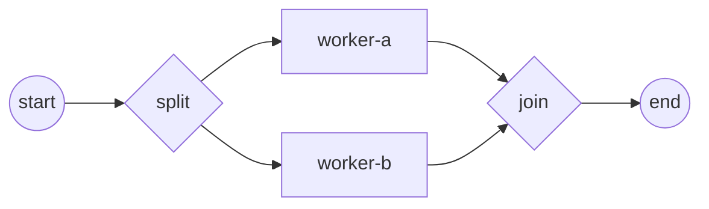

# Parallel gateway (AND)

A **parallel gateway** does two jobs. Diverging, it forks a single token into
**every** outgoing flow at once — the branches run concurrently. Converging, it
**synchronizes**: it waits until a token has arrived on every incoming flow,
then lets one token continue. Reach for it when several independent steps should
run in parallel and the process must not proceed until all of them finish. Full
program: [`examples/parallel-gateway/`](../../../examples/parallel-gateway/).

## What it is

Two gateways of the same kind bracketing the parallel work: a **split**
(diverging) and a **join** (converging). The split activates all its outgoing
flows unconditionally — no conditions, no default. The join records each
arrival and blocks until every incoming flow has delivered a token, then emits a
single surviving token.



The example forks two service-task branches, `worker-a` and `worker-b`; each
prints when it runs. The join then synchronizes them so exactly one token
reaches the End.

## Build it

The split and join are both `ParallelGateway`s — you distinguish them by
**direction**. Nothing else configures them:

```go
split, err := gateways.NewParallelGateway(
    gateways.WithDirection(gateways.Diverging))

join, err := gateways.NewParallelGateway(
    gateways.WithDirection(gateways.Converging))
```

Add every node to the process, then wire the diamond — the split fans out to
both workers, and both workers converge on the join:

```go
for _, e := range []flow.Element{start, split, workerA, workerB, join, end} {
    if err := proc.Add(e); err != nil {
        return fmt.Errorf("add element: %w", err)
    }
}

// start ─> split ─┬─> worker-a ─┬─> join ─> end
//                 └─> worker-b ─┘
for _, l := range [][2]flow.Element{
    {start, split},
    {split, workerA}, {split, workerB},
    {workerA, join}, {workerB, join},
    {join, end},
} {
    if err := link(l[0], l[1]); err != nil {
        return err
    }
}
```

Each worker is an ordinary `ServiceTask` whose operation is a Go functor. Here
it prints and signals a channel, so the demo can prove both branches actually
ran:

```go
op, err := gooper.New(
    name+"-op",
    func(_ context.Context, _ service.DataReader, _ *data.ItemDefinition) (*data.ItemDefinition, error) {
        fmt.Printf("  ▶ %s executed\n", name)
        done <- name

        return nil, nil
    })

st, err := activities.NewServiceTask(name, op, activities.WithoutParams())
```

## Run it

```bash
cd examples/parallel-gateway && go run .
```

After the engine's startup banner, both branches execute (in either order) and
the instance completes:

```
  ▶ worker-b executed
  ▶ worker-a executed
✓ parallel-demo completed: split forked both branches, join synchronized, one token reached End
```

> **Note:** The two `▶` lines can print in either order — that is the point.
> The branches run on their own goroutines (tracks), so their relative timing is
> not deterministic.

## How it works

- The **diverging** split activates *all* its outgoing flows unconditionally
  (BPMN 2.0 §13.4.1) — one incoming token becomes N branch tokens. There is no
  condition evaluation and no default flow.
- Each branch runs on its own **track** (goroutine); the branches proceed
  concurrently and independently.
- The **converging** join is a *synchronizing* join. It records each arrival
  under its own mutex, and only when a token has arrived on **every** incoming
  flow does it release a single surviving token onward. Arrivals before the last
  one park; they do not each spawn a continuation.
- Because the join owns per-instance arrival state and serializes concurrent
  arrivals with its own lock, two branches finishing at the same moment are
  handled safely — exactly one token leaves the join.

## Options & variations

- **More branches.** Add further `link(split, workerN)` and `link(workerN,
  join)` pairs; the split forks all of them and the join waits for all of them.
  The pattern scales without any per-branch configuration.
- **Mixed / self-standing use.** A parallel gateway can be purely diverging (a
  fork with no matching join) or purely converging. The join only synchronizes
  the incoming flows it actually has.
- **Split vs. choose.** A parallel split takes *every* branch. To take exactly
  one branch by data, use the [Exclusive gateway](exclusive.md); to take *every
  true* branch and synchronize the ones taken, use the
  [Inclusive gateway](inclusive.md).

## See also

- Full example: [`examples/parallel-gateway/`](../../../examples/parallel-gateway/)
- Related: [Exclusive (XOR)](exclusive.md) · [Inclusive (OR)](inclusive.md) · [Complex](complex.md)
