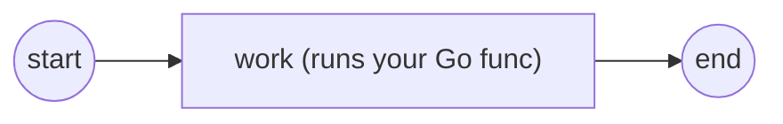

# Your first process

The smallest useful gobpm process is **start → service task → end**, where the
service task runs a plain Go function of yours. This tutorial builds that
process, runs it for real, and walks through what the engine did. The complete,
runnable program is [`examples/basic-process/`](../../../examples/basic-process/).



Three flow nodes wired by two sequence flows. The **service task** carries the
work — an ordinary Go function that reads process data and does something with
it.

## Build the process

A process is a container of model elements. Build one with `process.New`, then
add nodes and link them. Give the process a **property** (`user_name`) so the
task has something to read:

```go
proc, err := process.New("basic-process",
    data.WithProperties(
        data.MustProperty("user_name",
            data.MustItemDefinition(
                values.NewVariable("dr.Dobermann"),
                foundation.WithID("user_name")),
            data.ReadyDataState)))

start, _ := events.NewStartEvent("start")
task, _ := activities.NewServiceTask("work", op, activities.WithoutParams())
end, _ := events.NewEndEvent("end")

for _, e := range []flow.Element{start, task, end} {
    _ = proc.Add(e)
}
_, _ = flow.Link(start, task)
_, _ = flow.Link(task, end)
```

`process.New(name, procOpts...)` accepts a small set of options —
`data.WithProperties`, `activities.WithRoles`, `foundation.WithID`,
`foundation.WithDoc`. `proc.Add` registers each node; `flow.Link(from, to)`
draws a sequence flow between two nodes.

> The example checks and wraps every returned error — see the real `process.go`.
> The `_` discards here are only to keep the walkthrough short.

## Write the work

The task's `op` is your code, wrapped as a `service.Operation` with `gooper`.
The function receives a read-only `service.DataReader` and reaches process data
**by name** — `WithoutParams()` on the task means it declares no typed I/O and
resolves data directly:

```go
op, _ := gooper.New("greet",
    func(ctx context.Context, r service.DataReader,
        _ *data.ItemDefinition) (*data.ItemDefinition, error) {
        user, _ := r.GetData("user_name")             // the process property
        started, _ := r.GetData("RUNTIME/STARTED_AT") // an engine runtime var
        fmt.Printf("  ▶ hello, %v (instance started at %v)\n",
            user.Value().Get(ctx), started.Value().Get(ctx))
        return nil, nil
    })
```

`"user_name"` resolves the **property** declared on the process;
`"RUNTIME/STARTED_AT"` is an engine-provided **runtime variable** (the
`SOURCE/addr` form) — no message wiring needed to read it. Returning
`(nil, nil)` means the operation produced no output item.

## Register, run, start

The engine — the **Thresher** — is created, given the process, and started;
then you launch an instance and wait for it. `data.CreateDefaultStates()` must
run once up front to register the standard data states (`Ready`, `Unavailable`,
…) the data-carrying elements above depend on:

```go
_ = data.CreateDefaultStates()             // one-time: register the data states
engine, _ := thresher.New("basic-process-engine")
reg, _ := engine.RegisterProcess(proc)     // definition → launch template

ctx, cancel := context.WithTimeout(context.Background(), 5*time.Second)
defer cancel()
_ = engine.Run(ctx)                        // engine goroutine comes up

h, _ := engine.StartLatest(proc.ID())      // one running instance
state, _ := h.WaitCompletion(ctx)          // block until it finishes
```

Each call maps to one stage of the lifecycle:

| Call | What it does |
|---|---|
| `thresher.New(id, opts...)` | create an empty engine in `NotStarted`; every extension defaults to its bundled core implementation (a zero-option `New` is fully working). |
| `RegisterProcess(proc)` | validate the definition and snapshot it into an immutable launch template; returns a `*ProcessRegistration`. |
| `Run(ctx)` | bring up the engine's event-processing goroutine. |
| `StartLatest(proc.ID())` | launch an instance of the newest registered version, keyed by the process id; returns an `*InstanceHandle`. |
| `WaitCompletion(ctx)` | block until the instance reaches a terminal state (`Completed`/`Terminated`) or `ctx` is done; return the terminal `InstanceState`. |

> `StartLatest` is the "just run the current one" path. To pin an exact version,
> hold the `reg` from `RegisterProcess` and call `engine.StartProcess(reg)`.

## Run it

```bash
cd examples/basic-process && go run .
```

The engine prints a startup banner and per-state log lines; the meaningful
output — the task running and the instance completing — is:

```
2026/07/27 09:14:04 INFO InstanceState Created instance_id=5244414867016051026
2026/07/27 09:14:04 INFO InstanceState Active instance_id=5244414867016051026
  ▶ hello, dr.Dobermann (instance started at 2026-07-27 09:14:04.414634157 +0500 +05 m=+0.000327023)
2026/07/27 09:14:04 INFO InstanceState Completed instance_id=5244414867016051026
✓ basic-process completed (Completed): start → service task (read property + RUNTIME var) → end
```

The instance walks `Created → Active → Completed`; between `Active` and
`Completed` your `greet` function ran on the service task and read both the
property and the runtime variable.

## What happened

- `RegisterProcess` turned your mutable definition into an immutable **launch
  template**; every instance clones that template, so instances never share
  mutable node state.
- `StartLatest` launched one instance and returned a **handle** — a read-only
  window onto the running instance (`ID`, `State`, `Tokens`, `History`,
  `WaitCompletion`, `Cancel`), never the instance object itself.
- The instance ran its own goroutines (tracks) from the start event, through the
  service task, to the end event. `WaitCompletion` is backed by the instance's
  terminal done-channel — a guaranteed signal, not the lossy observation stream.
- Inside the task, `r.GetData` resolved names against the instance's data scope:
  the `user_name` **property** and the `RUNTIME/STARTED_AT` **runtime variable**.

## See also

- Full example: [`examples/basic-process/`](../../../examples/basic-process/)
- Previous: [Installation](installation.md)
- Next: [Running & observing](running-and-observing.md) · [The engine (Thresher)](../concepts/engine.md)
- Give the task real inputs/outputs next: [Service Task](../tasks/service-task.md)
- Design: [ADR-013 — instance observability](../../design/ADR-013-instance-observability.md) · [ADR-021 — Service Task execution model](../../design/ADR-021-service-task-execution-model.md)
- Full API: `go doc github.com/dr-dobermann/gobpm/pkg/thresher`
