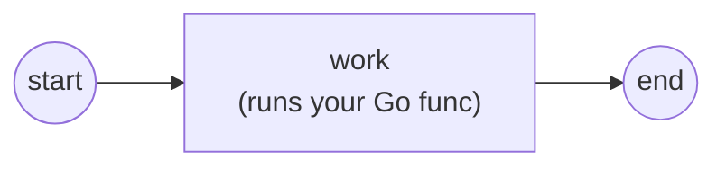

# Your first process

The smallest useful gobpm process is **start → service task → end**, where the
service task runs a plain Go function of yours. This page builds it, runs it,
and explains each moving part. Full program:
[`examples/basic-process/`](../../../examples/basic-process/).

## What it is

Three flow nodes wired by two sequence flows. The **service task** carries your
work — an ordinary Go function (a *functor*) that reads process data and does
something with it.



## Build it

A process is assembled from model elements, then linked. Give the process a
**property** (`user_name`) so the task has something to read:

```go
proc, err := process.New("basic-process",
    data.WithProperties(
        data.MustProperty("user_name",
            data.MustItemDefinition(
                values.NewVariable("dr.Dobermann"),
                foundation.WithID("user_name")),
            data.ReadyDataState)))

start, _ := events.NewStartEvent("start")
task, _ := activities.NewServiceTask("work", op, activities.WithoutParams())
end, _ := events.NewEndEvent("end")

for _, e := range []flow.Element{start, task, end} {
    proc.Add(e)
}
flow.Link(start, task)
flow.Link(task, end)
```

The task's `op` is your code, wrapped as an operation with `gooper`. It receives
a read-only `DataReader` and reaches process data **by name**:

```go
op, _ := gooper.New("greet",
    func(ctx context.Context, r service.DataReader,
        _ *data.ItemDefinition) (*data.ItemDefinition, error) {
        user, _ := r.GetData("user_name")            // the process property
        started, _ := r.GetData("RUNTIME/STARTED_AT") // an engine runtime var
        fmt.Printf("  ▶ hello, %v (instance started at %v)\n",
            user.Value().Get(ctx), started.Value().Get(ctx))
        return nil, nil
    })
```

## Run it

```bash
cd examples/basic-process && go run .
```

After the engine's startup banner, the task runs and the instance completes:

```
  ▶ hello, dr.Dobermann (instance started at 2026-07-26 19:58:54 …)
✓ basic-process completed (Completed): start → service task (read property + RUNTIME var) → end
```

## How it works

The engine — the **Thresher** — is created, given the process, and started;
then you start an instance and wait for it:

```go
data.CreateDefaultStates()                 // one-time: register the data states
engine, _ := thresher.New("basic-process-engine")
engine.RegisterProcess(proc)               // definition → launch template
engine.Run(ctx)                            // engine goroutine comes up
h, _ := engine.StartLatest(proc.ID())      // one running instance
state, _ := h.WaitCompletion(ctx)          // block until it finishes
```

- **`RegisterProcess`** validates the definition and snapshots it into an
  immutable launch template; every instance clones that template.
- **`StartLatest`** launches an instance of the newest registered version and
  returns a **handle**.
- The instance runs its own goroutines (tracks) until the end event; the
  handle's **`WaitCompletion`** returns the terminal state.
- Inside the task, `r.GetData("user_name")` resolves the **property** by name;
  `"RUNTIME/STARTED_AT"` is an engine-provided **runtime variable** (the
  `SOURCE/addr` form) — no message wiring needed to read process data.

> **Note:** `data.CreateDefaultStates()` must run once before building data-carrying
> elements — it registers the standard data states (`Ready`, `Unavailable`, …).

## See also

- Full example: [`examples/basic-process/`](../../../examples/basic-process/)
- Next: [Running & observing](running-and-observing.md) · [The engine (Thresher)](../concepts/engine.md)
- Then give the task real inputs/outputs: [Service Task](../tasks/service-task.md)
