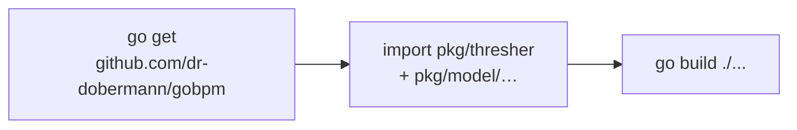

# Installation

**gobpm** is an ordinary Go module. You add it with `go get`, import the
packages you need, and build. There is no server to stand up, no code-generation
step, and no runtime beyond your own program — the engine runs in-process and
links into a single binary. This page walks you from an empty directory to a
compiling dependency, then verifies the install by running the bundled
quick-start for real.



## Requirements

- **Go 1.25 or newer.** The module declares `go 1.25` and pins `toolchain
  go1.25.13`; an older toolchain will refuse to build it.
- **A module-enabled project** (a `go.mod`). Starting fresh:

  ```bash
  mkdir my-process && cd my-process
  go mod init example.com/my-process
  ```

gobpm has a small dependency footprint — `github.com/google/uuid` at runtime,
plus test-only libraries — so it adds little to your build graph.

## Add it

From your module root, pull the current release:

```bash
go get github.com/dr-dobermann/gobpm@latest
```

To pin an explicit tag for reproducible builds instead:

```bash
go get github.com/dr-dobermann/gobpm@v0.9.0
```

> **Warning:** The `v0.2.0-prerelease` … `v0.6.4-prerelease` tags are the
> pre-rewrite codebase and are **retracted** in `go.mod` — the module system
> will not select them. Take a current release (`v0.7.0` or newer); the API on
> those old tags no longer exists.

## Import it

The two packages you reach for first are the engine (`pkg/thresher`) and the
model (`pkg/model/…`). A minimal build target that just links both:

```go
package main

import (
	"github.com/dr-dobermann/gobpm/pkg/model/data"
	"github.com/dr-dobermann/gobpm/pkg/thresher"
)

func main() {
	data.CreateDefaultStates()
	_, _ = thresher.New("my-engine")
}
```

Real processes pull in a few more model packages — these are the ones the
[first process](first-process.md) assembles:

```go
import (
	"github.com/dr-dobermann/gobpm/pkg/model/activities"      // service/user/script tasks
	"github.com/dr-dobermann/gobpm/pkg/model/data"            // properties, item definitions, states
	"github.com/dr-dobermann/gobpm/pkg/model/data/values"     // variables and their values
	"github.com/dr-dobermann/gobpm/pkg/model/events"          // start / end / intermediate events
	"github.com/dr-dobermann/gobpm/pkg/model/flow"            // Link and sequence flows
	"github.com/dr-dobermann/gobpm/pkg/model/foundation"      // WithID and base options
	"github.com/dr-dobermann/gobpm/pkg/model/process"         // the process container
	"github.com/dr-dobermann/gobpm/pkg/model/service"         // the Operation / DataReader contracts
	"github.com/dr-dobermann/gobpm/pkg/model/service/gooper"  // wrap a Go func as an operation
)
```

## Verify the build

Tidy the module and compile everything. If both succeed, gobpm is installed
correctly:

```bash
go mod tidy
go build ./...
```

`go mod tidy` resolves the version and records it in `go.mod`/`go.sum`;
`go build ./...` proves the packages resolve and your toolchain is new enough.

## Run the quick-start

The surest proof is a real run. The repository ships the canonical quick-start
under [`examples/basic-process/`](../../../examples/basic-process/) — a minimal
**start → service task → end** process whose service task runs a plain Go
function. Clone the repo and run it:

```bash
git clone https://github.com/dr-dobermann/gobpm
cd gobpm/examples/basic-process
go run .
```

The engine logs its configuration on startup (repository, logger, clock,
dispatcher, …). Past that banner, the meaningful lines are the lifecycle
transitions, your functor's output, and the completion line:

```
InstanceState Created instance_id=8554803671285277133
InstanceState Active instance_id=8554803671285277133
  ▶ hello, dr.Dobermann (instance started at 2026-07-27 09:14:07 …)
InstanceState Completed instance_id=8554803671285277133
✓ basic-process completed (Completed): start → service task (read property + RUNTIME var) → end
```

## What just happened

The example is a compact tour of the whole call path you will use in real code:

- `data.CreateDefaultStates()` registers the standard data states the model
  needs before any data-carrying element is built.
- `thresher.New("basic-process-engine")` constructs the engine — an in-process
  object, not a service.
- `engine.RegisterProcess(proc)` stores the process definition (you see it in
  the `ProcessLifecycle Registered` log line).
- `engine.Run(ctx)` starts the engine and its event hub.
- `engine.StartLatest(proc.ID())` launches an instance and hands back a handle;
  `handle.WaitCompletion(ctx)` blocks until it reaches `Completed`.

Each of those model constructors and engine calls links straight into your
binary — no external services, no sidecars. That is the "library, not
framework" model: gobpm embeds in your application rather than owning `main`.

> **Note:** The `data.CreateDefaultStates()` call is not optional. It seeds the
> standard states once at startup; call it before you construct any
> data-carrying element, or those constructors will fail. The
> [first process](first-process.md) page shows where it sits in a real build.

## Building against a local checkout

Every program under [`examples/`](../../../examples/) builds against the code in
the same repository, not a published tag. Each carries a `replace` directive
that points the import at the repo root:

```
replace github.com/dr-dobermann/gobpm => ../..
```

Use the same directive when you want to build against a working copy of gobpm
(for instance, while extending it). Otherwise, in a normal project, `go get` a
tag and commit `go.mod`/`go.sum` for a reproducible build.

## See also

- Next: [Your first process](first-process.md) — build and run a process from scratch.
- Then: [Running & observing](running-and-observing.md) — the engine lifecycle and watching an instance.
- The engine: [The engine (Thresher)](../concepts/engine.md) — what `thresher.New` gives you.
- Example: [`examples/basic-process/`](../../../examples/basic-process/)
- Full API: `go doc github.com/dr-dobermann/gobpm/pkg/thresher`
