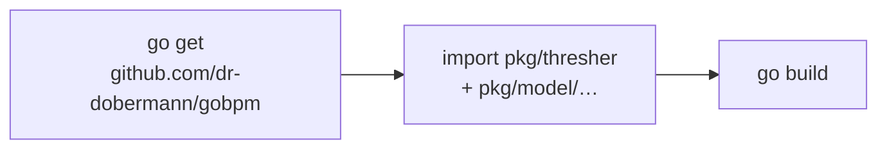

# Installation

**gobpm** is an ordinary Go module — you add it with `go get` and import the
packages you need. There is no server to install, no code generation step, and
no runtime beyond your program: the engine runs in-process. This page gets the
dependency into a project and confirms it compiles.

## What it is

gobpm ships as a single module, `github.com/dr-dobermann/gobpm`. You build a
process from the model packages under `pkg/model/…`, then run it with the engine
in `pkg/thresher`. Nothing else is required.



## Requirements

- **Go 1.25 or newer.** The module declares `go 1.25` and pins
  `toolchain go1.25.12`; older toolchains will refuse to build it.
- A module-enabled project (a `go.mod`). If you are starting fresh:

  ```bash
  mkdir my-process && cd my-process
  go mod init example.com/my-process
  ```

## Add it

From your module root, pull the latest release:

```bash
go get github.com/dr-dobermann/gobpm@latest
```

To pin a specific version instead of the latest tag:

```bash
go get github.com/dr-dobermann/gobpm@v0.9.0
```

> **Warning:** The `v0.2.0-prerelease` … `v0.6.4-prerelease` tags are the
> pre-rewrite codebase and are **retracted** in `go.mod` — the module system
> will not select them. Always take a current release (`v0.7.0` or newer); the
> API on those old tags no longer exists.

## Import it

The two packages you reach for first are the engine and the model. A minimal
build target:

```go
package main

import (
	"github.com/dr-dobermann/gobpm/pkg/model/data"
	"github.com/dr-dobermann/gobpm/pkg/thresher"
)

func main() {
	data.CreateDefaultStates()
	_, _ = thresher.New("my-engine")
}
```

Real processes pull in a few more model packages — these are the ones the
[first process](first-process.md) uses:

```go
import (
	"github.com/dr-dobermann/gobpm/pkg/model/activities"      // service/user/script tasks
	"github.com/dr-dobermann/gobpm/pkg/model/data"            // properties, item definitions, states
	"github.com/dr-dobermann/gobpm/pkg/model/data/values"     // variables and their values
	"github.com/dr-dobermann/gobpm/pkg/model/events"          // start / end / intermediate events
	"github.com/dr-dobermann/gobpm/pkg/model/flow"            // Link and sequence flows
	"github.com/dr-dobermann/gobpm/pkg/model/foundation"      // WithID and base options
	"github.com/dr-dobermann/gobpm/pkg/model/process"         // the process container
	"github.com/dr-dobermann/gobpm/pkg/model/service"         // the Operation / DataReader contracts
	"github.com/dr-dobermann/gobpm/pkg/model/service/gooper"  // wrap a Go func as an operation
)
```

## Verify the build

Tidy the module and compile. If both succeed, gobpm is installed correctly:

```bash
go mod tidy
go build ./...
```

`go mod tidy` resolves the version and records it in `go.mod`/`go.sum`;
`go build ./...` proves the packages resolve and your Go toolchain is new
enough. There is nothing to run yet — that comes on the
[first process](first-process.md) page.

## How it works

gobpm is a **library, not a framework**: it embeds in your application rather
than owning `main`. `go get` fetches the module into your build; the model
packages give you constructors (`process.New`, `events.NewStartEvent`,
`activities.NewServiceTask`, …), and `thresher.New` gives you the engine that
runs what you assemble. All of it links into a single binary — no external
services, no sidecars.

> **Note:** The engine's data layer needs its standard states registered once
> at startup. Call `data.CreateDefaultStates()` before you construct any
> data-carrying element, or those constructors will fail. See
> [first process](first-process.md) for where it fits.

## Options & variations

- **Pin vs. float.** `@latest` tracks the newest tag; `@v0.9.0` (or any explicit
  tag) pins for reproducible builds. Commit `go.mod`/`go.sum` either way.
- **Vendoring.** `go mod vendor` works normally — gobpm has a small dependency
  set (`google/uuid`, plus test-only libraries), so a vendored tree stays light.
- **Local checkout.** To build against a working copy (e.g. the bundled
  examples), a `replace` directive points the import at a path:

  ```
  replace github.com/dr-dobermann/gobpm => ../..
  ```

  Each program under [`examples/`](../../../examples/) uses exactly this so it
  compiles against the code in the same repository.

## See also

- Full example: [`examples/basic-process/`](../../../examples/basic-process/)
- Next: [Your first process](first-process.md) — build and run a real process.
- Then: [The engine (Thresher)](../concepts/engine.md) — what `thresher.New` gives you.
