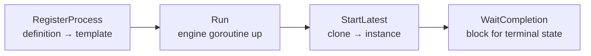

# Running & observing

You have a process built (that was [Your first process](first-process.md)). Now
you *run* it. Five calls take a definition to a finished instance: **register**
it with the engine, **run** the engine, **start** an instance, **wait** for it,
and — when you want to see inside — **observe** the facts it emits. This page
walks the whole lifecycle with real code and the real output it produces.

Primary example: [`examples/basic-process/`](../../../examples/basic-process/).
Observability add-on: [`examples/data-change/`](../../../examples/data-change/).

## The shape of a run

The engine — the **Thresher** — is a long-lived goroutine you register
processes with and start instances from. `RegisterProcess` turns a definition
into an immutable launch template; each `StartLatest` clones that template into
one running instance and hands you a **handle** to wait on.



## Build it

The lifecycle is engine wiring — independent of how the process was assembled.
This is the core of `examples/basic-process/`, verbatim:

```go
if err := data.CreateDefaultStates(); err != nil {   // one-time: register data states
    return fmt.Errorf("init data states: %w", err)
}

engine, err := thresher.New("basic-process-engine")  // construct the engine
if err != nil {
    return fmt.Errorf("create engine: %w", err)
}

if _, err := engine.RegisterProcess(proc); err != nil {  // definition → launch template
    return fmt.Errorf("register process: %w", err)
}

ctx, cancel := context.WithTimeout(context.Background(), 5*time.Second)
defer cancel()

if err := engine.Run(ctx); err != nil {              // engine goroutine comes up
    return fmt.Errorf("run engine: %w", err)
}

h, err := engine.StartLatest(proc.ID())              // one running instance
if err != nil {
    return fmt.Errorf("start process: %w", err)
}

state, err := h.WaitCompletion(ctx)                  // block until it finishes
if err != nil {
    return fmt.Errorf("waiting for completion: %w", err)
}
```

Two things worth noticing before we run it:

- The `context.WithTimeout` bounds the whole run — a stuck instance can't hang
  the program forever; the wait unblocks when the context expires.
- `WaitCompletion` returns the terminal `state` (an `InstanceState`), the value
  you report. Here it's `Completed`:

```go
fmt.Printf("✓ basic-process completed (%s): "+
    "start → service task (read property + RUNTIME var) → end\n", state)
```

> `data.CreateDefaultStates()` must run **once**, before you build any
> data-carrying element — it registers the standard data states (`Ready`,
> `Unavailable`, …). Call it at startup, before you build the process.

## Run it

```bash
cd examples/basic-process && go run .
```

After the startup banner and configuration dump (the `INFO configuration:` block
— skip it), the engine comes up and the instance runs to its terminal state:

```
INFO ProcessLifecycle Registered process_id=983163788697627792 version=1
INFO EngineState Starting
INFO HubState Started
INFO EngineState Started
INFO InstanceState Created instance_id=6461367832864217974
INFO InstanceState Active instance_id=6461367832864217974
  ▶ hello, dr.Dobermann (instance started at 2026-07-27 09:14:29 …)
INFO InstanceState Completed instance_id=6461367832864217974
✓ basic-process completed (Completed): start → service task … → end
```

Every `INFO …` line is the engine's own **operator log** — printed without any
wiring on your part. Read top to bottom it *is* the lifecycle: the process
registered, the engine and its event hub started, one instance went
`Created → Active → Completed`. The `▶ hello` line is your Service Task's own
`fmt.Printf`; the final `✓` line is the `state` you reported.

## What each call does, and why the order matters

| Call | What it does |
|---|---|
| `RegisterProcess(proc)` | validates the definition and snapshots it into an immutable launch template; returns a `*ProcessRegistration` (its version). Once per definition. |
| `Run(ctx)` | brings the engine goroutine and its event hub up. Must precede `StartLatest`. |
| `StartLatest(key)` | launches an instance of the newest registered version; returns an `*InstanceHandle`. The instance runs its own goroutines (tracks) until an end event. |
| `WaitCompletion(ctx)` | blocks on the handle until the instance reaches a terminal state, then returns it. The bounded `ctx` unblocks the wait if it expires. |

You can register before or after `Run` — but you can't start an instance on an
engine that isn't running. The terminal `InstanceState` from `WaitCompletion` is
one of a small, open vocabulary:

| `InstanceState` | Meaning |
|---|---|
| `StateCreated` | instance built, not yet executing. |
| `StateActive` | executing. |
| `StateCompleted` | reached an end event — the success terminal. |
| `StateTerminating` / `StateTerminated` | a terminate-end or cancel is tearing it down / has torn it down. |

The set is **open** — treat unknown values gracefully; new states (`Failing`,
`Paused`, …) join additively as their subsystems land.

> The handle is read-only. Besides `WaitCompletion` it offers `State()`,
> `ID()`, `History()`, `Tokens()`, and `Cancel(ctx)` — a window onto the
> instance, never the instance object itself. See
> [Instance lifecycle](../operating/instance-lifecycle.md).

## Quieten the engine

The banner and configuration dump are convenience output, not required. Suppress
them at construction — the `data-change` example does exactly this:

```go
engine, err := thresher.New("data-change-engine",
    thresher.WithoutBanner(), thresher.WithoutStartupConfig())
```

| Option | Effect |
|---|---|
| `thresher.WithoutBanner()` | drop the ASCII wordmark, tagline, and version lines. |
| `thresher.WithoutStartupConfig()` | drop the `configuration:` dump (each still prints unless both are given). |
| `thresher.WithLogger(l)` | route the operator log to your own `slog.Logger` (default: `slog.Default()`). |

## Watch the facts

The operator log is one view. Underneath it the engine emits structured
**facts** — one `observability.Fact` per lifecycle transition or failure across
the whole engine. Subscribe with `Observe`, before `Run`, so you catch
everything from the first transition:

```go
sub := engine.Observe(&dataChangePrinter{})
defer sub.Cancel()
```

An **observer** is any type with an `OnFact(observability.Fact)` method. A `Fact`
carries identity and phase, never process payload:

```go
type Fact struct {
    At       time.Time
    Details  map[string]string
    Kind     Kind    // what object class: InstanceState, NodeProgress, DataChange, …
    Phase    Phase   // the transition within that Kind
    NodeID   string
    NodeName string
}
```

The observer decides what to surface. Here it keeps only `DataChange` facts —
which are **observer-only** and never reach the operator log (the flood guard),
so an observer is the *only* way to see them:

```go
func (p *dataChangePrinter) OnFact(f observability.Fact) {
    if f.Kind != observability.KindDataChange {
        return
    }

    fmt.Printf("  ▶ %s %s @%s\n",
        f.Phase, f.Details[observability.AttrDataPath], f.NodeName)
}
```

`Kind` is an open catalog — a few you'll meet first:

| `Kind` | Emitted when |
|---|---|
| `KindEngineState` / `KindHubState` | the engine / event hub starts and stops. |
| `KindProcessLifecycle` | a process registers. |
| `KindInstanceState` | an instance changes state (the `InstanceState …` operator lines). |
| `KindNodeProgress` | a track enters/leaves a node. |
| `KindDataChange` | a commit changed data (observer-only). |

`OnFact` runs on a per-observer drain goroutine — never on the engine's
execution path — so it may block without stalling the engine (the engine drops
facts past its buffer instead, countable via `sub.Dropped()`). Because delivery
is asynchronous through that buffer, `sub.Cancel()` **drains** pending facts as
well as unsubscribing — call it before you print a final line so nothing is lost:

```bash
cd examples/data-change && go run .
```

```
  produce → commit receipt={sum:5}
  ▶ Value_Added receipt @produce
  reprice → commit receipt={sum:6}
  ▶ Value_Updated receipt.sum @reprice
  ✓ completed (Completed)
```

Each `▶` line is one `DataChange` fact — a first whole-value commit is one
`Value_Added` at the root, a nested re-commit one `Value_Updated` at the changed
leaf. That is `Phase`, `Details[AttrDataPath]`, and `NodeName` from the struct
above.

> A handle has its own `Observe` too — `h.Observe(o)` watches just that one
> instance's stream, where `engine.Observe(o)` watches the whole engine.

## Start a specific version

`StartLatest` uses the newest registered version. To pin an earlier one, start
it by explicit version with `StartVersion(key, version)`, or from a registration
you kept with `StartProcess(reg)` — see
[Registering & versioning](../operating/registering-and-versioning.md).

## See also

- Examples: [`examples/basic-process/`](../../../examples/basic-process/) · [`examples/data-change/`](../../../examples/data-change/)
- Previous: [Your first process](first-process.md)
- Concepts: [The engine (Thresher)](../concepts/engine.md) · [Observability](../concepts/observability.md)
- In practice: [Instance lifecycle](../operating/instance-lifecycle.md) · [Observability in practice](../operating/observability.md)
- Design: [ADR-013 — instance observability](../../design/ADR-013-instance-observability.md) · [ADR-002 — extension architecture](../../design/ADR-002-extension-architecture.md)
- Full API: `go doc github.com/dr-dobermann/gobpm/pkg/thresher` · `go doc github.com/dr-dobermann/gobpm/pkg/observability`
