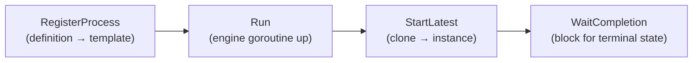

# Running & observing

Once a process is built, five calls take it from a definition to a finished
instance: **register** it, **run** the engine, **start** an instance, **wait**
for it, and — when you want to see inside — **observe** the facts it emits.
Primary example: [`examples/basic-process/`](../../../examples/basic-process/).

## What it is

The engine — the **Thresher** — is a long-lived goroutine you register
processes with and start instances from. A registered process becomes an
immutable launch template; each `StartLatest` clones it into one running
instance and hands you a **handle** to wait on.



## Build it

The lifecycle is engine wiring, independent of how the process was assembled.
Register first, run the engine, then start and wait:

```go
data.CreateDefaultStates()                 // one-time: register the data states

engine, _ := thresher.New("basic-process-engine")
engine.RegisterProcess(proc)               // definition → launch template
engine.Run(ctx)                            // engine goroutine comes up
h, _ := engine.StartLatest(proc.ID())      // one running instance
state, _ := h.WaitCompletion(ctx)          // block until it finishes
```

Bound the run with a context so a stuck instance can't hang forever:

```go
ctx, cancel := context.WithTimeout(context.Background(), 5*time.Second)
defer cancel()
```

The terminal `state` is the value you report — `Completed` on success:

```go
fmt.Printf("✓ basic-process completed (%s): "+
    "start → service task (read property + RUNTIME var) → end\n", state)
```

## Run it

```bash
cd examples/basic-process && go run .
```

After the startup banner and configuration dump, the instance runs and reaches
its terminal state:

```
InstanceState Created instance_id=1584910154363942637
InstanceState Active instance_id=1584910154363942637
  ▶ hello, dr.Dobermann (instance started at 2026-07-26 20:18:48 …)
InstanceState Completed instance_id=1584910154363942637
✓ basic-process completed (Completed): start → service task (read property + RUNTIME var) → end
```

Those `InstanceState` lines are the engine's own **operator log** — the default
window into an instance's lifecycle, printed without any wiring on your part.

## How it works

Each call has a distinct job, and the order matters:

- **`RegisterProcess`** validates the definition and snapshots it into an
  immutable launch template, returning the registered version. Every instance
  clones that template, so registration happens once per definition.
- **`Run`** brings the engine goroutine (and its event hub) up. It must precede
  `StartLatest` — you can register before or after `Run`, but you can't start an
  instance on an engine that isn't running.
- **`StartLatest`** launches an instance of the newest registered version and
  returns a **handle**. The instance runs its own goroutines (tracks) until an
  end event.
- **`WaitCompletion`** blocks on that handle until the instance reaches a
  terminal state (`Completed`, and others for failure/termination), then returns
  it. Passing the bounded `ctx` means the wait unblocks if the context expires.

> **Note:** `data.CreateDefaultStates()` must run once before building
> data-carrying elements — it registers the standard data states (`Ready`,
> `Unavailable`, …). Call it at startup, before `process.New`.

## Options & variations

**Quieten the engine.** The banner and configuration dump are convenience
output, not required. Suppress them at construction:

```go
engine, _ := thresher.New("data-change-engine",
    thresher.WithoutBanner(), thresher.WithoutStartupConfig())
```

**Watch the facts.** Beyond the operator log, the engine emits structured
**facts** you can subscribe to with `Observe`. An observer is any type with an
`OnFact` method; register it before `Run` so it catches everything:

```go
sub := engine.Observe(&dataChangePrinter{})
defer sub.Cancel()
```

The observer decides what to surface — here, only `DataChange` facts, which are
observer-only and never reach the operator log:

```go
func (p *dataChangePrinter) OnFact(f observability.Fact) {
    if f.Kind != observability.KindDataChange {
        return
    }
    fmt.Printf("  ▶ %s %s @%s\n",
        f.Phase, f.Details[observability.AttrDataPath], f.NodeName)
}
```

Facts are delivered asynchronously through a buffered channel, so call
`sub.Cancel()` to drain pending facts before you print the final status — it's
both the drain and the unsubscribe:

```bash
cd examples/data-change && go run .
```

```
  produce → commit receipt={sum:5}
  ▶ Value_Added receipt @produce
  reprice → commit receipt={sum:6}
  ▶ Value_Updated receipt.sum @reprice
  ✓ completed (Completed)
```

**Start a specific version.** `StartLatest` uses the newest registered version;
to pin an earlier one, start it by its explicit version instead (see
[Definition versioning](../operating/versioning.md)).

## See also

- Full example: [`examples/basic-process/`](../../../examples/basic-process/) · Observability: [`examples/data-change/`](../../../examples/data-change/)
- Previous: [Your first process](first-process.md) · Concept: [The engine (Thresher)](../concepts/engine.md)
- Go deeper on facts: [Observability in practice](../operating/observability.md)
