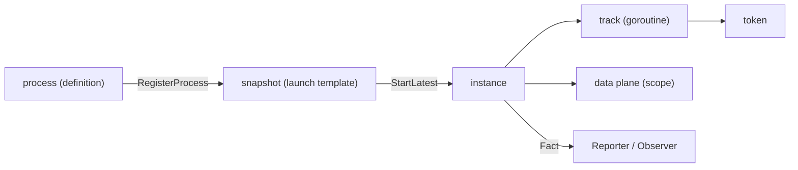

# Glossary

The vocabulary these guides lean on — standard BPMN 2.0 terms plus the names of
gobpm's own runtime machinery (the **Thresher** engine, the **Fact / Reporter /
Observer** observation trio, the **functor**). Each entry is one line: the term,
what it means, and the public symbol or package that carries it. Where a term
has its own page, the link takes you to the worked example.

## How the terms fit together

You build a **process** (a definition), register it with the **engine**, and
start an **instance**. Inside the instance, work advances as **tokens** carried
along **tracks**; each running node reads and writes the **data plane** by name;
every lifecycle transition surfaces as a **Fact**.

## Start here — the terms in almost every page

| Term | One line | Symbol |
|---|---|---|
| Process | the static definition you build once and register | `process.New` (`pkg/model/process`) |
| Instance | one live execution of a process | `Thresher.StartLatest` → `*InstanceHandle` |
| Engine / Thresher | the orchestrator you register with and run | `thresher.New`, `thresher.Thresher` |
| Snapshot | the immutable launch template a process is frozen into at registration | internal (`internal/instance/snapshot`) |
| Handle | your read-only grip on one running instance | `thresher.InstanceHandle` |
| Token / Track | the control marker, and the goroutine that carries it | internal runtime |
| Data plane / Scope | where instance data lives, resolved by name | `internal/scope` |
| Functor / Operation | the Go func a service task runs, and its wrapper | `gooper.OpFunctor`, `service.Operation` |
| Fact | the one observable event the engine emits | `observability.Fact` |

## Core execution

| Term | Definition |
|---|---|
| **Process** | The static definition you build once: flow nodes (events, tasks, gateways) wired by sequence flows. It never runs — it is registered as a launch template. Built with `process.New(name, ...options)` (`pkg/model/process`). |
| **Instance** | One live execution of a process. Each start clones the launch template into an independent run with its own data and state (`internal/instance`). You reach it only through a handle. |
| **Engine / Thresher** | The process orchestrator (`pkg/thresher`), created with `thresher.New(id, opts...)`. You `RegisterProcess` with it, `Run(ctx)` it, then `StartLatest` an instance. It exposes no mutating access to a running instance. |
| **Snapshot / launch template** | The immutable, validated form a process is frozen into at registration. Every instance clones it; the header (id/name, properties, correlation keys) is shared by reference. It is *not* a durable persistence mechanism — see [design ADR-009](../design/index.md). |
| **Handle** | What `StartLatest` / `StartProcess` return and `Thresher.Instance` finds: a `thresher.InstanceHandle`, a read-only window onto one running instance. `WaitCompletion(ctx)` blocks until it finishes; `State()`, `Data()`, `Tokens()`, `History()` observe; `Cancel(ctx)` stops it. |
| **Token** | The moving "here is where control is" marker. It enters at a start event and flows node → node along the sequence flows. Surfaced read-only via `InstanceHandle.Tokens()`. |
| **Track** | The goroutine that carries a token. A diverging parallel gateway spawns a track per branch (branches run concurrently); a converging gateway waits for every inbound track before one token leaves. |
| **Registration** | The result of `RegisterProcess` — a `thresher.ProcessRegistration` naming a specific process version under a key. `StartVersion(key, n)` starts a pinned version; `StartLatest(key)` the newest. |

See [Process, instance, track, token](concepts/execution-model.md) and
[The engine (Thresher)](concepts/engine.md).

## Flow structure

| Term | Definition |
|---|---|
| **Flow node** | Any node control passes through — an event, task, gateway, or sub-process. The runtime contract is `flow.Node` (`pkg/model/flow`). |
| **Sequence flow** | The directed connector between two flow nodes (`flow.SequenceFlow`). It may carry a condition that gates whether a token takes it. |
| **Activity / Task** | A unit of work. A **service task** runs your Go code, a **user task** is a human step, a **script task** an inline expression, a **business rule task** a decision table. The runtime contract is `flow.ActivityNode`. |
| **Gateway** | A routing / synchronization node (`pkg/model/gateways`): **Exclusive** routes one branch, **Parallel** forks/joins all, **Inclusive** every-true (with an OR-join), **Complex** by an activation threshold, **Event-based** defers to the first event to arrive. |
| **Event** | Something that happens (`pkg/model/events`): a **start** instantiates, an **end** completes, an **intermediate** waits or throws, a **boundary** event arms on an activity to interrupt it. |
| **Boundary event** | An event attached to an activity that arms while it runs and interrupts (or, non-interrupting, fires alongside) it. Attached with `AddBoundaryEvent`, not a constructor option — see [Boundary events](events/boundary.md). |

See [Foundation elements](foundation/index.md) and the
[Gateways](gateways/index.md) / [Events](events/index.md) taxonomies.

## Tasks & your code

| Term | Definition |
|---|---|
| **Functor** | The plain Go function your service task runs: `gooper.OpFunctor`, i.e. `func(ctx, r service.DataReader, in *data.ItemDefinition) (*data.ItemDefinition, error)`. It reads process data through the reader and returns an optional result item. |
| **Operation** | The invocable a task carries — a `service.Operation`. `gooper.New(name, fn, opts...)` wraps a functor as one; you may also implement the interface directly (`pkg/model/service`). |
| **DataReader** | The read-only view of the data plane a functor receives (`service.DataReader`): `GetData(name)` resolves a property, data object, or runtime variable by name. |
| **Worker (external)** | A fetch-and-lock job executor that runs a service task out-of-process. Enabled per task with `WithWorker(topic)`; the task parks until the worker reports. See [External workers](operating/external-workers.md). |
| **Trust mode** | Who is authoritative for a worker's outcome — `tasks.WorkerTrusted` (worker result final, the default) vs `EngineAuthoritative`. Set with `WithWorkerTrust` / engine-wide `WithWorkerTrustDefault`. |

See [Service Task](tasks/service-task.md) and the
[Activities taxonomy](tasks/index.md).

## The data plane

| Term | Definition |
|---|---|
| **Data plane / Scope** | Where an instance's data lives and is resolved *by name* (`internal/scope`). Properties, data objects, and runtime variables all sit here; name resolution walks up the scope chain. |
| **Value** | The live cell behind any datum (`data.Value`): `Get(ctx)` reads a copy, `Update(ctx, v)` writes, `Lock`/`Unlock` guard in-place mutation. Its four kinds are the scalar `values.Variable[T]`, the `values.Array[T]` collection, the `values.Record`, and the `values.Map[T]`. |
| **Item definition** | The typed container behind a named value (`data.ItemDefinition`); it wraps the actual `Value`. Built with `data.NewItemDefinition(value, ...)`. |
| **Item-aware element** | Any element that carries an item definition (`data.ItemAwareElement`) — the common base of properties and data objects. |
| **Property** | A named value declared on the process, readable/writable by tasks (`data.Property`, added with `data.WithProperties`). |
| **Parameter** | A typed input/output binding an activity declares (`data.Parameter`, direction `data.Input` / `data.Output`), wired with `WithParameters(dir, params...)`. |
| **Data path** | The dotted name used to read/write nested structural data, e.g. `receipt.sum`. Runtime variables use a `SOURCE/addr` form, e.g. `RUNTIME/STARTED_AT`. |
| **Data state** | The lifecycle marker on a data element (`Ready`, `Unavailable`, …). Register the standard set once with `data.CreateDefaultStates()` before building data-carrying elements. |
| **Data Object / Data Store** | A **data object** is a scope-resident named container; a **Data Store** (`datastore.DataStore`) is engine-global, cross-instance storage wired with `thresher.WithDataStore(ref, store)`. |

See [Working with data](data/index.md).

## Events & routing

| Term | Definition |
|---|---|
| **Event hub** | The engine's central event distributor (`internal/eventproc/eventhub` `EventHub`): it routes signals, messages, and timers to the waiters that expect them. |
| **Waiter** | A parked catch that resumes when a matching event arrives. Held internally by the hub against a subscription key. |
| **Correlation** | Matching an inbound message to the right instance by a correlation key (BPMN §8.4.2). See [Correlation & conversations](operating/correlation.md). |
| **Signal vs Message** | A **signal** broadcasts to all listeners; a **message** is point-to-point to one correlated instance. Both are BPMN event definitions carried by catch/throw events. |
| **Event definition** | The trigger payload an event carries (`flow.EventDefinition`) — timer, message, signal, error, escalation, conditional, link, terminate, compensation. |

See [How events are processed](concepts/event-processing.md).

## Observability

| Term | Definition |
|---|---|
| **Fact** | The single canonical observable event the engine emits (`observability.Fact`): `Kind`, `Phase`, `NodeID`/`NodeName`, `At`, and a `Details` map — never process payload values. Every emitter produces this one shape. |
| **Kind** | A Fact's object class (`observability.Kind`, e.g. `KindEngineState`), an *open* vocabulary — consumers must tolerate unknown values. |
| **Phase** | The transition within a Kind (`observability.Phase`, e.g. `PhaseStarting`), also open and per-kind. |
| **Reporter** | The single producer behind every Fact (`observability.Reporter`): `Report(ev)` echoes to the operator log *and* fans out to observers, non-blocking on the hot path. The engine's default sink is `NewEchoReporter` — never a silent no-op. |
| **Observer** | Your subscriber (`observability.Observer`): any type with `OnFact(Fact)`, registered via `Thresher.Observe` or `InstanceHandle.Observe`, returning a `*Subscription` you `Cancel()`. `OnFact` runs on a drain goroutine, off the engine's execution path. |
| **Operator log** | The synchronous `slog` echo of Facts (`observability.Echo`) for a human tailing output, distinct from the async observer stream. |
| **Subscription** | A live observer registration (`thresher.Subscription`): `Cancel()` unsubscribes, `Dropped()` counts Facts shed past the buffer. |

See [Observability](concepts/observability.md) and
[Observability in practice](operating/observability.md).

## Sub-processes & iteration

| Term | Definition |
|---|---|
| **Embedded sub-process** | A nested scope running in the same instance. See [Embedded Sub-Process](subprocesses/embedded.md). |
| **Call activity** | Invokes another registered process as a separate child instance. See [Call Activity](subprocesses/call-activity.md). |
| **Transaction sub-process** | An ACID-like scope that aborts via a Cancel event. See [Transaction Sub-Process](subprocesses/transaction.md). |
| **Standard loop** | Repeats one node while a condition holds. See [Standard Loop](iteration/standard-loop.md). |
| **Multi-instance** | Fans a node out over a collection, sequentially or in parallel. See [Multi-Instance](iteration/multi-instance.md). |
| **Iteration runtime variables** | What an iterating activity publishes — `loopCounter`, `ITERATION_NUMBER`/`ID`/`MODE`, the `numberOf*` counts and `RUNTIME/ITERATIONS`. The names are engine-owned: a model declaring one is refused at build time. See [Iteration runtime variables](iteration/runtime-variables.md). |
| **Reserved data name** | A name the engine publishes and a model may not declare (a property, data object, data store reference or activity output). `data.ReservedNames()` lists them. |

## Extension seams

The interfaces you implement to plug your own machinery into the engine — each
paired with its `thresher.With*` registration option.

| Seam | Interface | Wired with |
|---|---|---|
| ID generation | `foundation.IDGenerator` | `foundation.SetGenerator` |
| Expression engine | `expression.Engine` | `WithExpressionEngine` |
| Rule engine | `rules.Engine` | `WithRuleEngine` |
| Script engine | `script.Engine` | `WithScriptEngine` |
| Data Store | `datastore.DataStore` | `WithDataStore` |
| Repository | `repository.Repository` | `WithRepository` |
| Message broker | `messaging.MessageBroker` | `WithMessageBroker` |
| Clock | `clock.Clock` | `WithClock` |
| Worker dispatcher | `tasks.WorkerDispatcher` | `WithWorkerDispatcher` |
| Task distributor | `interactor.TaskDistributor` | `WithTaskDistributor` |
| Authorization | `auth.AuthorizationProvider` | `WithAuthorizationProvider` |

See [Part 6 — Extending gobpm](index.md) for each seam's page.

## See also

- Start here: [Your first process](getting-started/first-process.md)
- Concepts: [Process, instance, track, token](concepts/execution-model.md) · [Observability](concepts/observability.md)
- Reference: [Part 7 — Reference](index.md) (package map, engine options)
- Full example: [`examples/basic-process/`](../../examples/basic-process/) — the smallest process, exercising process, instance, token, functor, and the data plane at once.
- Full API: `go doc github.com/dr-dobermann/gobpm/pkg/thresher`
