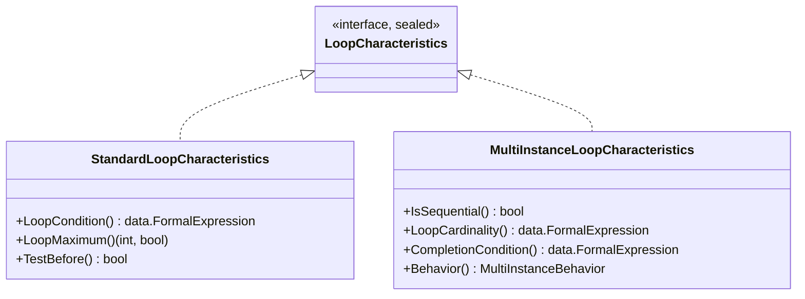

# Activity iteration

Any activity — a task, a sub-process, a call activity — can run more than once.
gobpm models this with a **loop characteristics** marker attached to the
activity: a **Standard Loop** repeats the inner activity while a condition holds,
and a **Multi-Instance** runs it a fixed number of times over a cardinality or a
collection. This page is the family reference — the marker interface, its two
members, how you attach one, and the shape they share. Each member has its own
page for the option catalog and runtime behavior.

## The family



`LoopCharacteristics` is a **sealed** marker — its only method is unexported, so
just these two concrete kinds implement it, and the concrete kind selects the
execution mechanism (ADR-025 §2.1–§2.2). An activity carries **at most one**.

## Members

| Kind | Type | Role | Page |
|---|---|---|---|
| Standard Loop | `activities.StandardLoopCharacteristics` | sequential, condition-driven repetition (while / do-while) — BPMN §13.3.6 | [Standard Loop](standard-loop.md) |
| Multi-Instance | `activities.MultiInstanceLoopCharacteristics` | fixed fan-out over a cardinality or a collection, one run per element — BPMN §13.3.7 | [Multi-Instance](multi-instance.md) |

Which to reach for: use **Standard Loop** when the repetition count is unknown up
front and driven by a condition re-tested each pass; use **Multi-Instance** when
the count is fixed at activation (an integer cardinality or a collection size)
and each run handles one element.

## Attaching a marker

Both kinds attach through the same activity option — `WithLoop`, which takes any
`LoopCharacteristics`:

```go
func WithLoop(lc LoopCharacteristics) ActivityOption
```

Build the marker with its constructor, then pass it to any activity constructor.
A Standard Loop:

```go
loop, _ := activities.NewStandardLoop(cond,
    activities.WithLoopMaximum(10))

task, _ := activities.NewServiceTask("retry", op,
    activities.WithLoop(loop),
    activities.WithoutParams())
```

A Multi-Instance attaches the same way — `MultiInstanceLoopCharacteristics` also
implements `LoopCharacteristics`:

```go
mi, _ := activities.NewMultiInstance(
    activities.WithInputCollection("orders", "order"),
    activities.WithSequential())

task, _ := activities.NewServiceTask("process", op,
    activities.WithLoop(mi),
    activities.WithoutParams())
```

> An activity holds a single marker — a later `WithLoop` **replaces** an earlier
> one (`WithLoop` doc). The activity exposes the marker back via
> `LoopCharacteristics()`.

> A separate `WithMultyInstance() options.Option` exists as a legacy boolean flag
> on the task; the real Multi-Instance model is the `WithLoop(NewMultiInstance(…))`
> path above, not that flag.

## Constructors

Each kind has its own constructor; both return an error — never panic — on an
invalid combination:

```go
func NewStandardLoop(
    loopCondition data.FormalExpression,
    opts ...StandardLoopOption,
) (*StandardLoopCharacteristics, error)

func NewMultiInstance(
    opts ...MultiInstanceOption,
) (*MultiInstanceLoopCharacteristics, error)
```

| Constructor | Required | Errors on |
|---|---|---|
| `NewStandardLoop` | a non-nil boolean `loopCondition` | a nil / non-boolean condition, or a bad option. |
| `NewMultiInstance` | exactly one cardinality source (`WithCardinality` **XOR** `WithInputCollection`) | zero or both sources, a non-integer cardinality, or a non-boolean completion condition. |

## Shared shape

Every marker embeds `foundation.BaseElement`, so it carries the common id /
documentation attributes of any BPMN element. Beyond that the two kinds share
nothing structurally — Standard Loop is a condition + optional maximum + a
pre/post-test flag; Multi-Instance is a cardinality/collection + per-instance
data items + a completion condition + a completion **behavior** (whether and when
it throws an event as instances finish). Those member-specific attributes and
their full option sets live on the two pages.

A taste of each option set (curated — the complete catalogs are on the member
pages):

| Standard Loop option | Effect |
|---|---|
| `WithLoopMaximum(n int)` | cap the number of iterations. |
| `WithTestBefore()` | pre-test the condition (while); default is post-test (do-while). |

| Multi-Instance option | Effect |
|---|---|
| `WithCardinality(expr)` | fixed instance count from an integer expression. |
| `WithInputCollection(ref, item)` | one instance per element of the `ref` collection, bound as `item`. |
| `WithOutputCollection(ref, item)` | assemble each instance's `item` back into the `ref` collection. |
| `WithSequential()` | run instances one at a time; without it a Multi-Instance is parallel. |
| `WithCompletionCondition(expr)` | short-circuit the remaining instances when the condition holds. |
| `WithBehavior(b)` | event-throwing behavior on instance completion — `BehaviorAll` (default, none) / `BehaviorNone` / `BehaviorOne` / `BehaviorComplex`. |

## See also

- Members: [Standard Loop](standard-loop.md) · [Multi-Instance](multi-instance.md)
- Related guides: [Activities taxonomy](../tasks/index.md) · [Embedded Sub-Process](../subprocesses/embedded.md)
- Design: [ADR-025 — Activity Iteration: Standard Loop & Multi-Instance](../../design/ADR-025-activity-iteration-loop-and-multi-instance.md)
- Full API: `go doc github.com/dr-dobermann/gobpm/pkg/model/activities`
</content>
</invoke>
