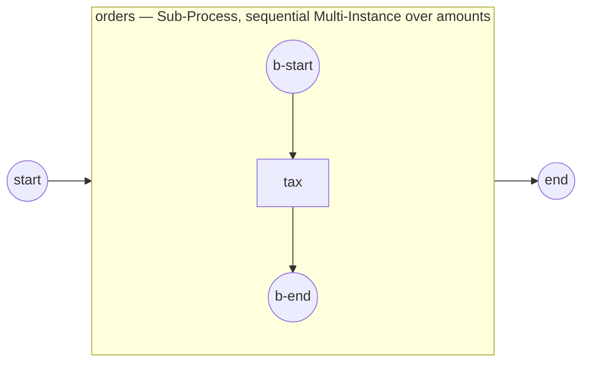

# Multi-Instance

A **Multi-Instance** activity runs a *fixed* number of times — one instance per
element of a collection — decided once at activation. It is the collection
fan-out counterpart of the condition-driven [Standard Loop](standard-loop.md).
Reach for it when you have N items and want the same activity applied to each,
either one after another or all at once. Full program:
[`examples/multi-instance-sequential/`](../../../examples/multi-instance-sequential/).

## What it is

You mark an activity (usually a Sub-Process) with Multi-Instance
characteristics: an **input collection** decides the count, each instance binds
its element to an **item** name, and each instance's output item is assembled —
in order — into an **output collection** published once every instance has
finished (the *visibility barrier*).



## Build it

Build the Multi-Instance characteristics, then attach them to a Sub-Process with
`WithLoop`. This one is **sequential** (`WithSequential()`), taxes each amount,
and assembles the results:

```go
mi, _ := activities.NewMultiInstance(
    activities.WithSequential(),                         // omit for parallel (the default)
    activities.WithInputCollection("amounts", "amount"), // count = len(amounts); element → `amount`
    activities.WithOutputCollection("taxed", "withTax")) // each `withTax` → the `taxed` slice
body, _ := activities.NewSubProcess("orders", activities.WithLoop(mi))
```

Seed the input collection as a process property, and give the body a start →
task → end:

```go
proc, _ := process.New("multi-instance-sequential",
    data.WithProperties(data.MustProperty("amounts",
        data.MustItemDefinition(values.NewArray(100, 250, 80),
            foundation.WithID("amounts")),
        data.ReadyDataState)))
```

The body's task reads its per-instance `amount` **by name** and returns the
`withTax` item the Multi-Instance assembles:

```go
op, _ := gooper.New("tax",
    func(ctx context.Context, r service.DataReader,
        _ *data.ItemDefinition) (*data.ItemDefinition, error) {
        d, _ := r.GetData("amount")            // this instance's element
        amount, _ := d.Value().Get(ctx).(int)
        withTax := amount + amount/5           // +20%
        fmt.Printf("    order: amount=%d → withTax=%d\n", amount, withTax)
        return data.MustItemDefinition(
            values.NewVariable(withTax), foundation.WithID("withTax")), nil
    })
```

## Run it

```bash
cd examples/multi-instance-sequential && go run .
```

The three instances run in order, and the assembled collection appears only
after the last one drains:

```
    order: amount=100 → withTax=120
    order: amount=250 → withTax=300
    order: amount=80 → withTax=96

  completed — taxed amounts: [120 300 96]
```

## How it works

- **Cardinality is fixed at activation** from exactly one source: an integer
  `WithCardinality(expr)` *or* the size of the input collection
  `WithInputCollection(ref, item)`.
- **Sequential vs. parallel** — `WithSequential()` runs the instances one at a
  time (instance *i+1* opens only after *i* drains). Without it, the activity is
  **parallel** (the BPMN §13.3.7 default): all N instances start at activation
  and run concurrently, each in its **own scope**, the activity completing when
  the last drains.
- **The data mediator** binds element *i* to the `item` name inside each
  instance's scope. `WithOutputCollection(ref, item)` assembles each instance's
  `item` output **positionally** (output slot = input ordinal), so the result is
  deterministic even when parallel instances complete out of order. It is
  published **once** at completion — never visible mid-run.
- Each instance publishes runtime attributes readable by name: `loopCounter`,
  `numberOfInstances`, `numberOfActiveInstances`,
  `numberOfCompletedInstances`, and (parallel) `numberOfTerminatedInstances`.

> **Note:** the output collection is invisible until the barrier lifts. Reading
> `taxed` mid-run is not how you observe progress — read the runtime attributes
> or throw a `behavior` event (below) instead.

## Options & variations

**Parallel** — drop `WithSequential()`. One instance per element runs at the
same time in a distinct scope; the print order varies run to run, yet positional
assembly keeps the output in input order
([`examples/multi-instance-parallel/`](../../../examples/multi-instance-parallel/)):

```go
mi, _ := activities.NewMultiInstance(
    // no WithSequential → parallel (the §13.3.7 default)
    activities.WithInputCollection("reviewers", "reviewer"),
    activities.WithOutputCollection("scores", "score"))
```

**Stop early** — `WithCompletionCondition(expr)` re-evaluates a boolean after
each instance completes; `true` finishes the activity now. Sequential *stops
launching* the rest; parallel **cancels** the still-running instances (their
scopes torn down, counted in `numberOfTerminatedInstances`).

**React to progress** — a Multi-Instance can throw a **boundary-catchable**
event as instances complete, selected with `WithBehavior`
([`examples/multi-instance-behavior/`](../../../examples/multi-instance-behavior/)):

- `BehaviorAll` (default) — no event thrown.
- `BehaviorNone` (`WithNoneBehaviorEvent(def)`) — throws on **every** completion.
- `BehaviorOne` (`WithOneBehaviorEvent(def)`) — throws once, on the **first**.
- `BehaviorComplex` (`WithComplexBehavior(defs…)`) — each
  `NewComplexBehaviorDefinition(condition, event)` is evaluated on every
  completion; those whose condition holds throw.

```go
quorum, _ := events.NewImplicitThrowEvent("quorum", signalDef)
cbd, _ := activities.NewComplexBehaviorDefinition(completedAtLeast(2), quorum)
mi, _ := activities.NewMultiInstance(
    activities.WithInputCollection("reviewers", "reviewer"),
    activities.WithBehavior(activities.BehaviorComplex),
    activities.WithComplexBehavior(cbd))
```

Caught by a boundary event on the activity — interrupting (cancels the activity)
or non-interrupting (a progress notification; the activity continues).

> **Note:** the marker works on any activity, but a composite (Sub-Process /
> Call Activity) **opens a child scope per instance**, so the iterations are
> individually observable. An Event Sub-Process cannot carry Multi-Instance — it
> is instantiated by its trigger, not reached by a token and iterated.

## See also

- Full example: [`examples/multi-instance-sequential/`](../../../examples/multi-instance-sequential/)
- Also: [`examples/multi-instance-parallel/`](../../../examples/multi-instance-parallel/) · [`examples/multi-instance-behavior/`](../../../examples/multi-instance-behavior/)
- Related: [Standard Loop](standard-loop.md) · [Embedded Sub-Process](../subprocesses/embedded.md) · [Service Task](../tasks/service-task.md)
