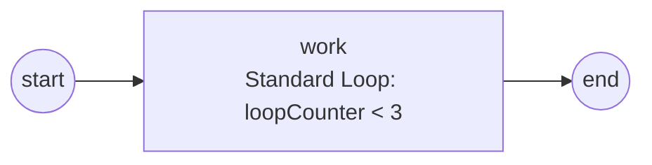

# Standard Loop

A **Standard Loop** re-runs a single activity in place, one pass at a time, for
as long as a boolean condition holds — the BPMN counterpart of a `while` or
`do…while`. You mark the activity with loop characteristics instead of drawing
the same task twice. Full program:
[`examples/standard-loop/`](../../../examples/standard-loop/).

## What it is

One activity, marked with `StandardLoopCharacteristics`, that the engine runs
repeatedly. Before or after each pass the engine evaluates the loop condition;
while it is `true`, the activity runs again. Each pass reads an engine-published
0-based `loopCounter`, so the condition and the activity body can see how far
the loop has gone.



## Build it

Build a `StandardLoop` from the boolean condition, then attach it to the
activity with `WithLoop`:

```go
loop, err := activities.NewStandardLoop(loopCounterBelow(3))

work, err := activities.NewServiceTask("work", op,
    activities.WithLoop(loop), activities.WithoutParams())
```

The condition is an ordinary boolean expression that reads process/scope data by
name — here it reads `loopCounter` and returns `loopCounter < 3`:

```go
func loopCounterBelow(n int) data.FormalExpression {
    return goexpr.Must(nil,
        data.MustItemDefinition(values.NewVariable(false)),
        func(ctx context.Context, ds data.Source) (data.Value, error) {
            d, err := ds.Find(ctx, "loopCounter")
            if err != nil {
                return nil, err
            }
            v, _ := d.Value().Get(ctx).(int)
            return values.NewVariable(v < n), nil
        })
}
```

The activity body reads the same `loopCounter` by name each pass:

```go
op, _ := gooper.New("work",
    func(ctx context.Context, r service.DataReader,
        _ *data.ItemDefinition) (*data.ItemDefinition, error) {
        d, err := r.GetData("loopCounter")
        if err != nil {
            return nil, err
        }
        fmt.Printf("    iteration: loopCounter=%v\n", d.Value().Get(ctx))
        return nil, nil
    })
```

## Run it

```bash
cd examples/standard-loop && go run .
```

The task runs three times (`loopCounter` 0, 1, 2), then the condition goes false
and the instance completes:

```
    iteration: loopCounter=0
    iteration: loopCounter=1
    iteration: loopCounter=2
  process completed — the loop ran to its condition.
```

## How it works

- **`loopCounter`** — a 0-based counter the engine publishes before each pass.
  The condition and the activity read it by name; a `loopCounter < 3` condition
  runs the body three times.
- **Post-tested (default)** — the body runs, *then* the condition is tested
  (`do…while`), so the loop runs at least once. That is why `loopCounter < 3`
  yields passes 0, 1, 2: after pass 2 the counter is 3 and the test fails.
- **In-place iteration** — a leaf activity (a Task) loops without opening a new
  scope; each pass is a fresh execution frame, which is the iteration's
  isolation. A composite (Sub-Process / Call Activity) re-opens its child scope
  per pass, so each iteration's facts carry the `loopCounter` and are
  individually observable.

> **Note:** `NewStandardLoop` validates its inputs up front — a nil or
> non-boolean condition, or a non-positive `WithLoopMaximum`, is rejected at
> build time rather than surfacing as a runtime failure.

## Options & variations

- **`WithTestBefore()`** — makes the loop **pre-tested** (`while`): the condition
  is tested *before* the first pass, so zero iterations are possible when it is
  already false.
- **`WithLoopMaximum(n)`** — a hard cap on the pass count (must be `> 0`),
  applied regardless of the condition; a safety net against a condition that
  never goes false.

  ```go
  loop, _ := activities.NewStandardLoop(cond,
      activities.WithTestBefore(),    // pre-tested (while)
      activities.WithLoopMaximum(10)) // stop after 10 passes at most
  ```

- **Any activity** — the same marker works on a Service Task, Sub-Process, or
  Call Activity. An **Event Sub-Process cannot** carry loop characteristics — it
  is instantiated by its event trigger, not reached by a token and iterated.

## See also

- Full example: [`examples/standard-loop/`](../../../examples/standard-loop/)
- Next: [Multi-Instance](multi-instance.md) — a fixed collection fan-out, sequential or parallel.
- Related: [Service Task](../tasks/service-task.md) · [Expressions](../data/expressions.md)
