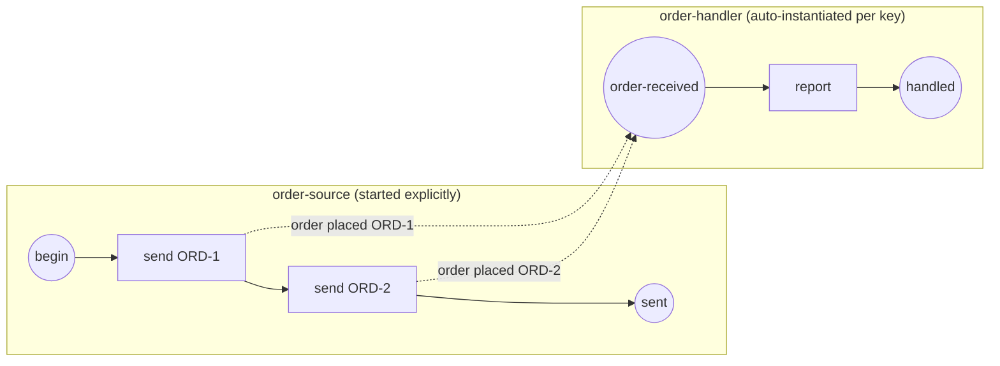

# Correlation & conversations

When many instances of the same process are alive at once, an incoming message
must reach *exactly one* of them — the instance whose business object (an order,
a claim, a ticket) the message belongs to. gobpm resolves this with a
**correlation key**: a value both sides derive from the message payload. On that
key the engine either **instantiates** a fresh handler (a keyed message *start*
event) or **routes** a follow-up back to the running instance that already owns
the key (a keyed in-instance *receiver*). A sequence of keyed messages threaded
through one instance is a **conversation**.

This is a runtime page: it explains the observable routing behavior and the
public contracts you assemble to declare a key. The internal correlation table
and its create-or-route-or-join decision live in
[ADR-016](../../design/ADR-016-message-correlation.md); event-triggered
instantiation lives in [ADR-015](../../design/ADR-015-event-triggered-instantiation.md).



Two distinct order keys ⇒ two handler instances, disambiguated by the `orderId`
both sides derive from the payload.

## The routing model

The broker matches subscribers by message **name** first; the correlation key
then disambiguates *which* instance among same-named subscribers. Given a name
match, the key drives one of three outcomes:

| Situation | Outcome |
|---|---|
| Keyed message start event, no instance owns the key yet | **Instantiate** — the engine spawns one handler for that key (event-triggered, not `StartLatest`). |
| Keyed message start event, an instance already owns the key | **Join** — delivered to the existing owner (see ADR-016). |
| Keyed in-instance receiver (`ReceiveTask` / intermediate catch) | **Route** — delivered to the running instance that seeded the key; never a sibling. |
| No key (only a name) | **Wildcard** — any same-named subscription matches. |

A distinct message *name* per interaction needs no key at all — the key only
earns its keep when instances of the *same* named message compete.

## The correlation contracts

A key is assembled bottom-up from three `bpmncommon` types. Each carries its
`foundation.BaseElement` identity and rejects empty/nil inputs at construction.

| Type | Role |
|---|---|
| `CorrelationPropertyRetrievalExpression` | binds one extraction expression (`data.FormalExpression`) to the `Message` it reads from. |
| `CorrelationProperty` | a named, typed **partial key** — one or more retrieval expressions that extract its value per message. |
| `CorrelationKey` | the composite key — a `Name` plus a slice of `CorrelationProperty` partial keys. |

Their constructors:

```go
func NewCorrelationPropertyRetrievalExpression(
    messagePath data.FormalExpression,
    messageRef *Message,
    baseOpts ...options.Option,
) (*CorrelationPropertyRetrievalExpression, error)

func NewCorrelationProperty(
    name, pType string,
    exprs []CorrelationPropertyRetrievalExpression,
    baseOpts ...options.Option,
) (*CorrelationProperty, error)

func NewCorrelationKey(
    name string,
    props []CorrelationProperty,
    baseOpts ...options.Option,
) (*CorrelationKey, error)
```

| Constructor | Rejects |
|---|---|
| `NewCorrelationPropertyRetrievalExpression` | a nil `messagePath` or nil `messageRef`. |
| `NewCorrelationProperty` | a blank name or an empty expression set. |
| `NewCorrelationKey` | a blank name or an empty property set. |

The key is then declared on both sides with a `WithCorrelationKey` option — one
per side, from the package that owns each end:

| Option | Side | Behavior |
|---|---|---|
| `activities.WithCorrelationKey(key *bpmncommon.CorrelationKey) SndTaskOption` | producer (`SendTask`) | derive the key from the outgoing payload and stamp it onto the published `Envelope`. A nil key is a no-op (name-match only). |
| `events.WithCorrelationKey(key *bpmncommon.CorrelationKey) options.Option` | consumer (message start event) | the engine derives an incoming message's key from it to decide create-or-route-or-join. A nil key is rejected. |

## Build it

The key is the shared contract. It reads one `orderId` out of the `order placed`
payload — a retrieval expression over the message, wrapped in a property,
wrapped in a key:

```go
re, _ := bpmncommon.NewCorrelationPropertyRetrievalExpression(path, msgRef)
prop, _ := bpmncommon.NewCorrelationProperty("orderId", "string",
    []bpmncommon.CorrelationPropertyRetrievalExpression{*re})
key, _ := bpmncommon.NewCorrelationKey("orderKey",
    []bpmncommon.CorrelationProperty{*prop})
```

**Producer side** — each `SendTask` stamps the key derived from *its* payload
onto the outgoing envelope:

```go
send, _ := activities.NewSendTask("send-"+id,
    bpmncommon.MustMessage(messageName,
        data.MustItemDefinition(values.NewVariable(""),
            foundation.WithID(itemID(id)))),
    activities.WithoutParams(),
    activities.WithCorrelationKey(key))
```

**Consumer side** — the message *start* event carries the same key. No
`StartLatest` call is made for it; the engine auto-instantiates one handler per
distinct key:

```go
start, _ := events.NewStartEvent("order-received",
    events.WithMessageTrigger(events.MustMessageEventDefinition(
        bpmncommon.MustMessage(messageName,
            data.MustItemDefinition(values.NewVariable(""),
                foundation.WithID("order_in"))),
        nil)),
    events.WithCorrelationKey(key))
```

Only the producer is started explicitly; the handler is registered and left for
the engine to instantiate:

```go
engine.RegisterProcess(consumer)          // keyed start → auto-instantiated
engine.RegisterProcess(producer)
engine.Run(ctx)
engine.StartLatest(producer.ID())         // only the source is started
```

> Both sides build the key from the **same payload item** with the **same
> retrieval expression**, so their derived values coincide — that match is what
> pairs a message to a key. The payload item *id* may differ by side (the
> producer binds `order_ORD-1`, the consumer reads `order_in`); only the
> *derived value* must be identical.

## Run it

```bash
cd examples/inter-instance-correlation && go run .
```

Each order spawns its own handler, routed by the key:

```
  ✓ order "ORD-1" instantiated its own handler instance
  ✓ order "ORD-2" instantiated its own handler instance
✓ inter-instance correlation: 2 orders ⇒ 2 handler instances, routed by key
```

## Conversations — threading a follow-up

A conversation threads a *second* keyed message back to the instance a *first*
one started. The key is seeded once, on the message start; a later message
carrying the same key routes to that instance's in-instance receiver — and the
receiver does **not** re-declare the key. The running instance already owns it,
so a plain `ReceiveTask` picks up the routed message:

```go
await, _ := activities.NewReceiveTask("await-payment",
    bpmncommon.MustMessage(paymentMsg, data.MustItemDefinition(
        values.NewVariable(""), foundation.WithID(payItem))),
    activities.WithoutParams())
```

The driver publishes both messages straight to the broker. `messaging.Envelope`
carries the routing value in its `CorrelationKey` field (a `string`; empty means
"no key"):

```go
broker.Publish(ctx, messaging.Envelope{
    Name: paymentMsg, Payload: o, CorrelationKey: o})
```

[`conversation-routing`](../../../examples/conversation-routing/) runs two
conversations (`ORD-1`, `ORD-2`) concurrently; each payment routes back to its
originating handler with no cross-talk:

```
handler reported order/payment: ORD-1/ORD-1
handler reported order/payment: ORD-2/ORD-2
OK: each payment routed to its originating handler conversation
```

## Variations

- **Publish straight to the broker.** Instead of a `SendTask`, hand the engine a
  `membroker` and publish envelopes yourself — the `Envelope.CorrelationKey`
  field is the routing value:

  ```go
  broker := membroker.New()
  engine, _ := thresher.New("demo", thresher.WithMessageBroker(broker))
  ```

- **Multi-property keys.** `CorrelationKey.Properties` is a slice — add more than
  one `CorrelationProperty` when a single business object needs several fields
  (e.g. `tenantId` + `orderId`) to be unambiguous.

- **Same name, different key.** With the same message name across competing
  instances, the key is what disambiguates *which* one receives it. Distinct
  names don't need a key.

## See also

- Examples: [`examples/inter-instance-correlation/`](../../../examples/inter-instance-correlation/) · [`examples/conversation-routing/`](../../../examples/conversation-routing/)
- Related guides: [Message](../events/message.md) · [Send / Receive Task](../tasks/send-receive-task.md) · [How events are processed](../concepts/event-processing.md) · [Definition versioning](versioning.md)
- Design: [ADR-016 — Message correlation](../../design/ADR-016-message-correlation.md) · [ADR-015 — Event-triggered instantiation](../../design/ADR-015-event-triggered-instantiation.md)
- Full API: `go doc github.com/dr-dobermann/gobpm/pkg/model/bpmncommon`
