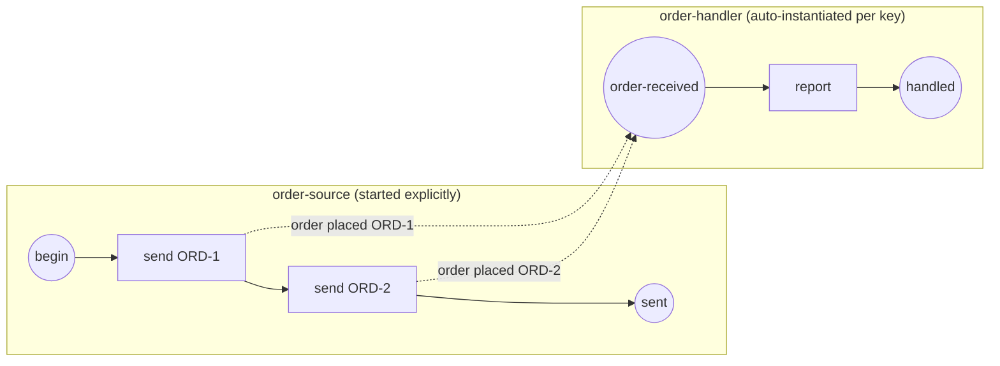

# Correlation & conversations

When many instances of the same process are alive at once, a message must reach
*exactly one* of them — the instance whose business object (an order, a claim, a
ticket) the message belongs to. gobpm does this with a **correlation key**: a
value derived from the message payload that both sides agree on, so the engine
either instantiates a fresh handler for a new key or routes a follow-up back to
the running instance that owns it. Primary example:
[`examples/inter-instance-correlation/`](../../../examples/inter-instance-correlation/).

## What it is

A **correlation key** is a named set of properties, each extracting a value from
a message payload. The producer stamps the key onto the envelope; the consumer
derives the same key from the same payload. Because they match, the engine can:

- **instantiate** one handler per distinct key (a keyed message *start* event —
  no instance exists until its trigger arrives), and
- **route** a later message back to the specific running instance that carries
  that key (a keyed in-instance *receiver*).



Two distinct order keys ⇒ two handler instances, disambiguated by the `orderId`
both sides derive from the payload.

## Build it

The key is the shared contract. It reads one `orderId` property out of the
`order placed` payload — a `CorrelationPropertyRetrievalExpression` over the
message, wrapped in a `CorrelationProperty`, wrapped in a `CorrelationKey`:

```go
path := goexpr.Must(nil,
    data.MustItemDefinition(values.NewVariable("")),
    func(ctx context.Context, ds data.Source) (data.Value, error) {
        d, err := ds.Find(ctx, itemID)
        if err != nil {
            return nil, fmt.Errorf("read %q from payload: %w", itemID, err)
        }
        return values.NewVariable(fmt.Sprint(d.Value().Get(ctx))), nil
    })

re, _ := bpmncommon.NewCorrelationPropertyRetrievalExpression(path, msgRef)
prop, _ := bpmncommon.NewCorrelationProperty("orderId", "string",
    []bpmncommon.CorrelationPropertyRetrievalExpression{*re})
key, _ := bpmncommon.NewCorrelationKey("orderKey",
    []bpmncommon.CorrelationProperty{*prop})
```

**Producer side** — each `SendTask` stamps the key derived from *its* payload
onto the outgoing envelope with `WithCorrelationKey`:

```go
send, _ := activities.NewSendTask("send-"+id,
    bpmncommon.MustMessage(messageName,
        data.MustItemDefinition(values.NewVariable(""),
            foundation.WithID(itemID(id)))),
    activities.WithoutParams(),
    activities.WithCorrelationKey(key))
```

**Consumer side** — the message *start* event carries the same key. The engine
instantiates one handler per distinct key; no `StartLatest` call is made for it:

```go
start, _ := events.NewStartEvent("order-received",
    events.WithMessageTrigger(events.MustMessageEventDefinition(
        bpmncommon.MustMessage(messageName,
            data.MustItemDefinition(values.NewVariable(""),
                foundation.WithID("order_in"))),
        nil)),
    events.WithCorrelationKey(key))
```

Only the producer is started explicitly; the handler is registered and left for
the engine to auto-instantiate:

```go
engine.RegisterProcess(consumer)          // keyed start → auto-instantiated
engine.RegisterProcess(producer)
engine.Run(ctx)
engine.StartLatest(producer.ID())         // only the source is started
```

## Run it

```bash
cd examples/inter-instance-correlation && go run .
```

After the engine's startup banner, each order spawns its own handler:

```
  ✓ order "ORD-1" instantiated its own handler instance
  ✓ order "ORD-2" instantiated its own handler instance
✓ inter-instance correlation: 2 orders ⇒ 2 handler instances, routed by key
```

## How it works

- Both sides build the key from the **same payload item** with the **same
  retrieval expression**, so their derived values coincide. That match is what
  lets the engine pair a message to a key.
- A **keyed message start event** instantiates: when a `order placed` arrives
  and no instance yet owns its key, the engine spawns one — one instance per
  distinct key. This is *event-triggered instantiation*, not `StartLatest`.
- A **keyed in-instance receiver** (a `ReceiveTask` or intermediate catch)
  routes: a follow-up message carrying the same key is delivered to the running
  instance that seeded it — never to a sibling. This is how a **conversation**
  stays isolated; see `conversation-routing` below.
- The correlation `path` runs against the message payload (a `data.Source`),
  reading the item by id (`ds.Find(ctx, itemID)`). Keep the item id consistent
  between producer and consumer.

> **Note:** the payload item id differs by side by design — the producer binds
> its outgoing item (`order_ORD-1`), the consumer reads its incoming item
> (`order_in`) — but the *derived value* is identical, and that value is the key.

## Options & variations

- **Follow-up routing (conversations).** To thread a *second* message back to
  the instance a *first* one started, seed the key on the message start, then
  subscribe an in-instance receiver keyed to the same conversation.
  [`conversation-routing`](../../../examples/conversation-routing/) publishes
  `payment received` after `order placed`; each payment routes to its own
  order's handler with no cross-talk:

  ```go
  broker.Publish(ctx, messaging.Envelope{
      Name: paymentMsg, Payload: o, CorrelationKey: o})
  ```

- **Publishing straight to the broker.** Instead of a `SendTask`, you can hand
  the engine a `membroker` and publish envelopes directly — the
  `CorrelationKey` field on the `messaging.Envelope` carries the routing value:

  ```go
  broker := membroker.New()
  engine, _ := thresher.New("demo", thresher.WithMessageBroker(broker))
  ```

- **Multi-property keys.** A `CorrelationKey` takes a slice of
  `CorrelationProperty`; add more than one when a single business object needs
  several fields (e.g. `tenantId` + `orderId`) to be unambiguous.

- **Same message name, different key.** The broker matches subscribers by
  message *name* first (`messageName`); the correlation key then disambiguates
  *which* instance among same-named subscribers. Distinct names don't need a key.

## See also

- Full example: [`examples/inter-instance-correlation/`](../../../examples/inter-instance-correlation/)
- Follow-up routing: [`examples/conversation-routing/`](../../../examples/conversation-routing/)
- Related: [Message](../events/message.md) · [Process, instance, track, token](../concepts/execution-model.md) · [Definition versioning](versioning.md)
