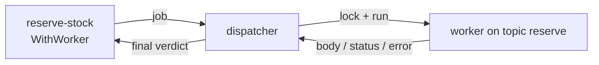

# External workers

A `ServiceTask` can run its work **outside the engine**. Instead of calling a Go
functor in-process, the task is dispatched to a **worker** that fetches the job,
locks it, does the work, and reports a result. This is how you keep slow, flaky,
or independently-deployed work off the process track. Full program:
[`examples/service-task-worker/`](../../../examples/service-task-worker/).

## What it is

You wire a task to a **worker topic** with `activities.WithWorker("reserve")`.
When the instance reaches that task, the engine hands the job to a **dispatcher**;
a worker registered on the topic picks it up under a lock, runs, and returns
either a completion body, a **Business Status**, a **Business Error**, or a plain
technical error. The instance only ever sees the *final* verdict — retries and
classification happen in the worker, off the track.



The example uses the built-in **local dispatcher** — an in-process worker pool.
The same wiring drives a remote dispatcher (durable job queue) unchanged; only
the dispatcher implementation differs.

## Build it

Wire the task to a topic and describe how its result maps back into process data.
`WithOutputMapping` reaches **into** the worker's structured body by path, and
`WithRetryPolicy` lets a transient fault retry inside the worker:

```go
st, err := activities.NewServiceTask("reserve-stock",
    service.MustOperation("reserve-op", nil, nil, nil),
    activities.WithWorker("reserve"),
    activities.WithOutputMapping(
        tasks.OutputRule{Path: bodyPath("body.reservationId"), Var: "reservationId"},
        tasks.OutputRule{Path: bodyPath("body.warehouse.zone"), Var: "warehouseZone"}),
    activities.WithRetryPolicy(tasks.FixedDelay(3, 300*time.Millisecond)),
    activities.WithoutParams())
```

The worker itself is a `WorkerFunc`: it receives a **`LockedJob`** and returns a
result. Report a business outcome as a `tasks.WorkerError` (a **Status** or a
**BpmnErrorCode**), and a technical fault as a plain `error`:

```go
func authorizeWorker() localdispatcher.WorkerFunc {
    return func(ctx context.Context, lj tasks.LockedJob) (*data.ItemDefinition, error) {
        amount := 0
        if lj.Input != nil {
            amount, _ = lj.Input.Structure().Get(ctx).(int)
        }
        switch {
        case amount < 0:
            return nil, &tasks.WorkerError{
                BpmnErrorCode: "PaymentGatewayDown",
                Message:       "payment gateway unreachable"}
        case amount > 1000:
            return nil, &tasks.WorkerError{Status: values.NewVariable("DECLINED")}
        default:
            return nil, &tasks.WorkerError{Status: values.NewVariable("AUTHORIZED")}
        }
    }
}
```

Build the dispatcher, register a handler per topic, and hand it to the engine:

```go
disp := localdispatcher.New(nil, 0)
_ = disp.RegisterWorker(ctx, "reserve", reserveWorker())
_ = disp.RegisterWorker(ctx, "authorize", authorizeWorker())

engine, _ := thresher.New("order-engine", thresher.WithWorkerDispatcher(disp))
```

## Run it

```bash
cd examples/service-task-worker && go run .
```

Three orders walk every worker outcome. `reserve-stock` fails twice and retries
in-process before succeeding; `authorize-payment` reports a Status or a Business
Error that routes the instance:

```
order-normal (amount 50):
  reserve attempt 1: inventory timeout — worker retries in-process…
  reserve attempt 2: inventory timeout — worker retries in-process…
  reserve attempt 3: reserved (reservationId=R-1001, zone=A-3)
  authorize: AUTHORIZED (Business Status)
  ✓ completed (Completed) → shipped [paymentStatus=AUTHORIZED, reservationId=R-1001, warehouseZone=A-3]

order-over-limit (amount 5000):
  ...
  authorize: DECLINED (Business Status)
  ✓ completed (Completed) → held [paymentStatus=DECLINED, reservationId=R-1002, warehouseZone=A-3]

order-gateway-down (amount -1):
  ...
  authorize: PaymentGatewayDown (Business Error) → boundary
  ✓ completed (Completed) → payment-failed (Business Error caught by the boundary)
```

## How it works

- **Fetch-and-lock.** The dispatcher hands a **`LockedJob`** to the worker: the
  job is locked for the duration of the work, so no other worker picks it up. The
  worker reads its bound input via `lj.Input`.
- **Four outcomes.** A completion **body**, a Business **Status**, a Business
  **Error**, or a technical **error** — the instance receives only the final one.
- **Retries stay in the worker.** Under the default **`WorkerTrusted`** mode a
  transient technical fault retries in-process (holding the lock, no re-enqueue)
  per `WithRetryPolicy`. The track never sees the failed attempts.
- **Output mapping reaches into the body.** `WithOutputMapping` extracts nested
  fields from the worker's structured result by path — `body.warehouse.zone` →
  `warehouseZone` — the same resolver conditions use.
- **Status is state, not an error.** `WithStatus("paymentStatus", …)` names the
  variable a Business Status writes; a downstream gateway routes on it. A Business
  Error, by contrast, is interrupting — an Error boundary catches it.

> **Note:** No trust mode is configured in the example, so every task resolves to
> `WorkerTrusted` — the worker self-classifies and retries. This is the engine
> default.

## Options & variations

- **`WithWorker(topic)`** — dispatch the task to `topic` instead of running an
  in-process functor. This is what makes the task external.
- **`WithWorkerTrust(tasks.EngineAuthoritative)`** (per task) or
  **`thresher.WithWorkerTrustDefault(...)`** (engine-wide) — flip the trust mode.
  The worker then returns raw and the **engine** classifies + retries by
  re-enqueue, rather than the worker retrying in-process.
- **`WithRetryPolicy(tasks.FixedDelay(n, d))`** — bound the retry count and
  backoff for transient technical faults.
- **`WithStatus(varName, …)`** — capture a Business Status verdict into a named
  variable for a gateway to route on.
- **Local vs remote dispatcher** — `localdispatcher.New` is an in-process pool for
  a single deployment; a remote dispatcher backs a durable, cross-process job
  queue with the same task-side wiring.

## See also

- Full example: [`examples/service-task-worker/`](../../../examples/service-task-worker/)
- Related: [Service Task](../tasks/service-task.md) · [Error](../events/error.md) · [Structural data](../data/structural.md)
